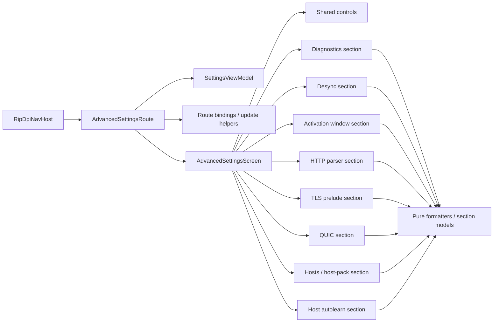

# AdvancedSettingsScreen Refactor Design

## Overview

`AdvancedSettingsScreen.kt` already contains reasonable composable seams, but they are trapped inside one file and mixed with route-side event translation and non-UI logic. The safest design is an incremental decomposition that keeps `SettingsUiState` and `SettingsViewModel` semantics intact while moving code into smaller files behind characterization coverage.

This design deliberately avoids a single large rewrite. The screen should keep rendering from the same source-of-truth state throughout the refactor, while pure logic and section UIs are extracted one slice at a time.

## Design Principles

- Preserve behavior before improving structure.
- Keep the route as the only layer that knows about `SettingsViewModel`, flow collection, and effect handling.
- Keep `SettingsUiState` as the source of truth; do not introduce a speculative replacement state model.
- Extract immutable per-section UI models only where they remove logic from composables and improve unit testability.
- Keep ephemeral editor state local to the smallest useful composable.
- Prefer file moves and adapter extraction before semantic rewrites.

## Current Extraction Seams

The inspected file naturally breaks into four layers:

1. Route/container
- flow collection
- effect collection
- event-to-view-model translation

2. Screen shell
- scaffold
- top-level section ordering
- screen-local dialog state
- shared screen-wide flags and options

3. Feature sections
- diagnostics
- overrides
- proxy
- desync / adaptive split / fake payload / fake TLS
- activation window
- protocol toggles
- host autolearn
- network strategy memory
- HTTP parser
- TLS prelude
- QUIC
- hosts / host-pack catalog

4. Pure-ish logic
- formatting helpers
- status derivation
- option builders
- chain/range normalization helpers

## Target Architecture

Keep the package as `com.poyka.ripdpi.ui.screens.settings` to minimize import churn, but split files under an `advanced/` subfolder if desired.

### Route layer

`AdvancedSettingsRoute.kt`
- Public nav entry point.
- Collects `uiState` and `hostPackCatalog`.
- Collects `SettingsEffect.Notice`.
- Wires callbacks into a binder/adapter object or pure helper functions.

`AdvancedSettingsRouteBindings.kt`
- Pure or near-pure event translation helpers.
- Owns normalization and `updateSetting` key/value selection.
- Becomes the unit-test target for route behavior currently hidden inside `when` blocks.

### Pure screen layer

`AdvancedSettingsScreen.kt`
- Pure content entry point.
- Receives `uiState`, `hostPackCatalog`, `notice`, and grouped callbacks.
- Owns only screen-shell composition and screen-local ephemeral state.
- Delegates each feature area to a section composable in its own file.

### Shared UI building blocks

`AdvancedSettingsSharedControls.kt`
- `SettingsSection`
- `AdvancedDropdownSetting`
- `AdvancedTextSetting`
- `ActivationRangeEditorCard`
- `ActivationBoundaryField`
- `ProfileSummaryLine`
- `SummaryCapsuleFlow`

These are reusable UI primitives and should be testable in isolation.

### Feature section files

Recommended split:
- `AdvancedDiagnosticsSection.kt`
- `AdvancedOverridesSection.kt`
- `AdvancedProxySection.kt`
- `AdvancedDesyncSection.kt`
- `AdvancedActivationWindowSection.kt`
- `AdvancedProtocolsSection.kt`
- `AdvancedHttpParserSection.kt`
- `AdvancedTlsPreludeSection.kt`
- `AdvancedQuicSection.kt`
- `AdvancedHostsSection.kt`
- `AdvancedHostAutolearnSection.kt`
- `AdvancedNetworkStrategyMemorySection.kt`

For the larger desync area, nested section files are acceptable:
- adaptive split
- adaptive fake TTL
- fake payload library
- fake TLS
- fake approximation
- host fake

### Pure logic and model files

Introduce pure files only when a section is extracted:
- `AdvancedSettingsFormatters.kt`
- `AdvancedSettingsHostPackModels.kt`
- `AdvancedSettingsTlsPreludeLogic.kt`
- `AdvancedSettingsActivationWindowModels.kt`
- `AdvancedSettingsAdaptiveSplitModels.kt`
- `AdvancedSettingsAdaptiveFakeTtlModels.kt`
- `AdvancedSettingsFakePayloadModels.kt`
- `AdvancedSettingsFakeTlsModels.kt`
- `AdvancedSettingsHttpParserModels.kt`
- `AdvancedSettingsQuicModels.kt`
- `AdvancedSettingsHostAutolearnModels.kt`

The naming can be consolidated later, but each new file should have one clear responsibility.

## State Ownership Rules

### State that stays in the route

- `SettingsViewModel`
- `collectAsStateWithLifecycle()` calls
- `LaunchedEffect(viewModel)` effect collection
- callback binding to view-model updates and resets

### State that stays in the pure screen shell

- host-pack dialog open/close state
- selected host-pack target/apply mode
- any shell-only state needed to coordinate section visibility or dialog display

### State that stays in section/shared UI composables

- draft text input in `AdvancedTextSetting`
- draft range values in `ActivationRangeEditorCard`
- any future section-local expansion or dialog state that does not represent business state

### State that must not move into local UI state

- persisted setting values
- feature-flag and visibility rules derived from `SettingsUiState`
- host-pack catalog state
- runtime/service-driven status

## Immutable UI Model Strategy

Do not create a single giant replacement for `SettingsUiState`.

Instead, for each complex section:
- keep `SettingsUiState` as input at the shell boundary
- extract a pure mapper that builds a small immutable section model
- let the section composable render from that section model plus explicit event lambdas

Example model responsibilities:
- status label/body/tone
- badge list
- summary lines
- option-card content
- enablement flags already derived from state

Prefer models that carry resource IDs or stable semantic values rather than pre-rendered `stringResource(...)` output inside pure code.

## Callback Shape

Use grouped lambdas or a small callback holder for readability, but keep the API flat enough to avoid broad rewrites.

Preferred direction:
- `onToggleChanged(setting, value)`
- `onTextConfirmed(setting, value)`
- `onOptionSelected(setting, value)`
- explicit action lambdas for reset/apply/refresh/back

This keeps section composables stateless and previewable while preserving the existing event contract.

## Testing Design

### Characterization baseline

Add a test seam to render the pure content without Hilt/navigation friction. The seam must be non-functional only:
- make the content composable `internal`, or
- add an internal preview/test scene wrapper that forwards the existing arguments unchanged

Once that seam exists, add characterization coverage for the current screen before extracting files.

### Compose UI test matrix

Use representative states rather than exhaustive combinatorics:
- default visual-editor state
- command-line override state
- adaptive fake TTL active state
- TLS prelude random-records state
- QUIC host override state
- hosts blacklist/whitelist state
- host-pack dialog-open state

### Screenshot strategy

Because Roborazzi already exists, add an advanced-screen scene and snapshot at a stable screen size. This is optional for every step, but valuable once the screen is decomposed enough to keep the baseline stable.

### Unit-test strategy

Every extracted pure file gets direct tests before or with the extraction:
- formatters
- chain/range normalization helpers
- section-model builders
- route binding helpers

## Migration Diagram

## Risk Controls

- Do not change nav-host wiring during section extraction.
- Keep event enums and callback contracts stable until the end.
- Extract low-risk sections before the large desync cluster.
- Leave `SettingsUiState` fields untouched unless a later, separately scoped cleanup is required.
- Land each slice with green characterization tests so every checkpoint is revertable without data-shape fallout.
