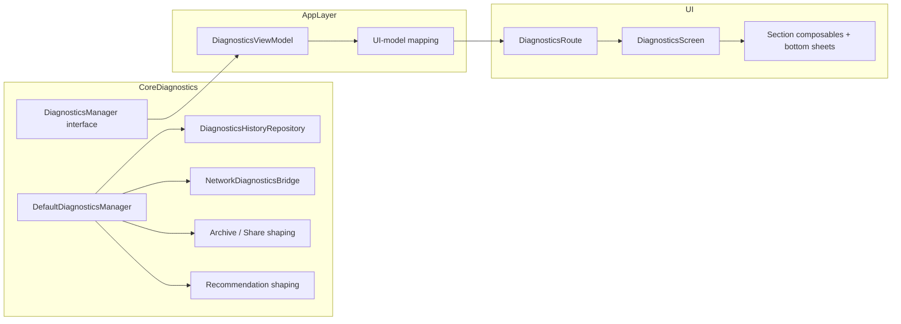
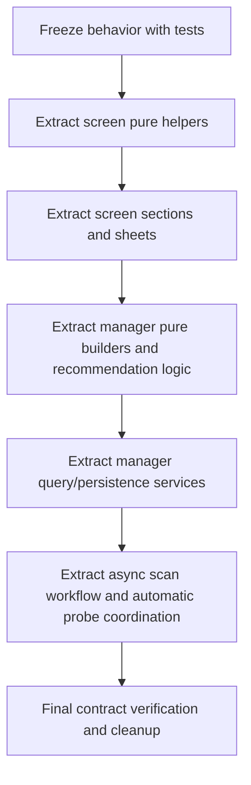

# Diagnostics Feature Refactor Design

## Overview

This design describes a safe refactor of the diagnostics feature across two primary files:

- `DiagnosticsManager.kt` in `:core:diagnostics`
- `DiagnosticsScreen.kt` in `:app`

The refactor is behavior-preserving by default. It uses the current repository code and tests as the source of truth. The design intentionally treats these files as one feature boundary, while recognizing that the actual runtime path also passes through `DiagnosticsViewModel`.

## Detailed Requirements

- preserve current externally observable behavior for diagnostics scans, history, recommendations, share/export, and UI flows
- keep `DiagnosticsManager` as the public feature entry point while reducing its implementation to a narrow coordination layer
- keep `DiagnosticsScreen` as the public screen entry point while reducing it to route/container composition plus focused UI files
- avoid speculative interface extraction
- keep UI state immutable and passed downward
- keep event lambdas flowing upward
- hoist only the state that genuinely needs a higher owner
- preserve current archive, share-summary, and recommendation semantics unless a clear defect is intentionally fixed
- protect every structural change with tests added before the extraction

## Current Architecture Problems

### DiagnosticsManager

Observed problems in `DiagnosticsManager.kt`:

- one concrete class owns initialization, scan workflow, hidden automatic probes, persistence, detail loading, recommendation logic, share summary, archive generation, CSV/JSON shaping, redaction helpers, and analytics aggregation
- high-risk asynchronous workflow code is mixed directly with pure builder logic
- archive/share builders and recommendation engines are embedded in the same class as bridge lifecycle management
- persistence and query behavior are intermixed with orchestration behavior
- multiple internal mutable maps track session state directly inside the top-level manager

This creates three concrete risks:

- changes to pure shaping logic can accidentally destabilize scan orchestration
- behavior regressions are harder to localize because failures can originate in any concern inside the same file
- the top-level manager is difficult to reason about as an ownership boundary

### DiagnosticsScreen

Observed problems in `DiagnosticsScreen.kt`:

- route logic, scaffold wiring, pager switching, section rendering, bottom sheets, diagnostics-specific rows/cards, event-list local state, chart animation, and palette helpers all live in one file
- the top-level `DiagnosticsScreen` function has a very wide parameter list, which is currently survivable but becomes harder to evolve when every section lives in the same file
- screen-specific helper logic is mixed with section rendering, which makes focused testing and previews harder
- local UI behavior such as event auto-scroll is buried in the same file as unrelated share and scan UI

This creates three concrete risks:

- section-level refactors require touching an oversized central file
- test additions are harder to target because most UI concerns are not isolated
- the easiest way to shrink the file would be to push logic upward into the viewmodel, which would be the wrong tradeoff

## Dependency And Coupling Analysis

The actual feature path is:

### Important Current Coupling Facts

- the screen is not coupled directly to the manager; it is coupled to `DiagnosticsUiState`
- the viewmodel is the current feature translation layer, combining manager flows, repositories, local state, and imperative detail-loading methods
- because `DiagnosticsManager` emits mixed feature concerns and `DiagnosticsViewModel` performs heavy shaping, manager refactors can still destabilize screen behavior indirectly
- the share/export feature is split conceptually:
  - manager creates actual shareable/exportable artifacts
  - viewmodel builds the share-preview copy shown in the screen

### Design Decision

The refactor will not redesign the manager-to-app contract in its early slices. Instead it will:

- preserve `DiagnosticsManager` public methods and flows
- preserve `DiagnosticsUiState`
- extract new collaborators behind the existing manager
- extract new screen files behind the existing screen contract
- only introduce app-layer mappers or screen-focused helper files when needed to keep the manager refactor from leaking into UI code

## Target Architecture

### Core Diagnostics Target

`DefaultDiagnosticsManager` should remain the public coordinator, but delegate to cohesive collaborators such as:

- `DiagnosticsScanWorkflow`
  - owns request preparation, bridge polling, progress updates, and scan completion/failure paths
- `AutomaticProbeCoordinator`
  - owns handover-triggered hidden probe scheduling and cooldown checks
- `ResolverRecommendationEngine`
  - owns resolver ranking, endpoint parsing, and DNS candidate selection
- `ConnectivityDnsTargetPlanner`
  - owns expansion of connectivity DNS targets from active and preferred resolver paths
- `DiagnosticsSessionQueries`
  - owns `loadSessionDetail` and `loadApproachDetail`
- `DiagnosticsReportPersister`
  - owns session/result/event persistence and history bridging after a finished report
- `DiagnosticsArchiveBuilder`
  - owns archive payload assembly, summary building, manifest writing, and zip population
- `DiagnosticsShareSummaryBuilder`
  - owns the share-summary text/body/compact-metric construction
- `BundledProfileImporter`
  - owns profile import-on-initialize behavior

These should default to concrete internal classes. Introduce interfaces only if a collaborator becomes a real module boundary or testing seam that cannot be protected otherwise.

### App UI Target

The diagnostics screen target structure is:

- `DiagnosticsRoute`
  - effect collection
  - pager synchronization
  - route-to-screen callback wiring
- `DiagnosticsScreen`
  - scaffold shell
  - section host
  - modal host
- section files
  - `DiagnosticsOverviewSection.kt`
  - `DiagnosticsScanSection.kt`
  - `DiagnosticsLiveSection.kt`
  - `DiagnosticsSessionsSection.kt`
  - `DiagnosticsEventsSection.kt`
  - `DiagnosticsShareSection.kt`
- modal and shared UI files
  - `DiagnosticsBottomSheets.kt`
  - `DiagnosticsRows.kt`
  - `DiagnosticsMetrics.kt`
  - `DiagnosticsCharts.kt`
  - `DiagnosticsTonePalette.kt`

The top-level screen signature may remain stable initially. Internally, each section should receive only the state slice and callbacks it needs.

### Ownership Boundaries

- `:core:diagnostics` owns diagnostics domain orchestration, history persistence/query behavior, share/export artifact building, and recommendation logic
- `:app` owns UI-model shaping, screen state composition, and Compose rendering
- `DiagnosticsScreen` owns local UI-only state such as event-list scroll behavior
- `DiagnosticsViewModel` remains the feature adapter, but this refactor must avoid turning it into the new dumping ground

## Proposed File And Module Breakdown

### Core Diagnostics

- keep in `core/diagnostics/src/main/java/com/poyka/ripdpi/diagnostics/`
- target breakdown:
  - `DiagnosticsManager.kt`
  - `DiagnosticsScanWorkflow.kt`
  - `AutomaticProbeCoordinator.kt`
  - `ResolverRecommendationEngine.kt`
  - `ConnectivityDnsTargetPlanner.kt`
  - `DiagnosticsSessionQueries.kt`
  - `DiagnosticsReportPersister.kt`
  - `DiagnosticsArchiveBuilder.kt`
  - `DiagnosticsShareSummaryBuilder.kt`
  - `BundledProfileImporter.kt`

### App Diagnostics Screen

- keep in `app/src/main/java/com/poyka/ripdpi/ui/screens/diagnostics/`
- target breakdown:
  - `DiagnosticsRoute.kt` or retain route in `DiagnosticsScreen.kt`
  - `DiagnosticsScreen.kt`
  - `DiagnosticsSections.kt` split into focused files
  - `DiagnosticsBottomSheets.kt`
  - `DiagnosticsCharts.kt`
  - `DiagnosticsSectionShared.kt`
  - optional `DiagnosticsPreviewScenes.kt` for screenshot coverage

### App-Layer Mapping

Only if needed during refactor, add app-layer helpers such as:

- `DiagnosticsUiMappers.kt`
- `DiagnosticsStrategyProbeUiMapper.kt`
- `DiagnosticsSharePreviewBuilder.kt`

These remain app-owned. They are not manager collaborators.

## Data Models

The refactor should preserve the existing key data contracts during early slices:

- manager contract:
  - `ScanProgress`
  - `DiagnosticSessionDetail`
  - `BypassApproachDetail`
  - `ShareSummary`
  - `DiagnosticsArchive`
- app contract:
  - `DiagnosticsUiState`
  - existing `Diagnostics*UiModel` data classes

Internal collaborator DTOs may be introduced if they reduce mixed responsibilities, but they should remain internal until there is a proven benefit to exposing them more widely.

## Error Handling

The refactor must preserve current user-visible and test-visible failure semantics:

- start failures still mark the session failed and clean bridge state
- progress/report/passive-event failures still persist failure state and clear progress
- archive creation still succeeds when optional logcat capture fails
- unavailable actions remain disabled or no-op according to current constraints

Design rule:

- extract failure-prone code with its current tests first
- keep exception-to-session-state behavior in one collaborator instead of scattering it across new files

## Testing Strategy

The testing strategy is layered and explicit.

### Characterization Tests

Extend existing tests before structural moves:

- `DiagnosticsManagerTest`
  - add missing coverage for share summary, session detail, approach detail, and recommendation no-op/apply edges
- `DiagnosticsViewModelTest`
  - keep manager-to-screen contract stable by freezing the UI-model output and effect behavior that matter to the screen
- `DiagnosticsScreenTest`
  - add section, bottom-sheet, busy-state, and empty-state coverage

### Focused Unit Tests For Extracted Collaborators

After characterization is in place, add targeted tests for:

- resolver recommendation engine
- DNS target planner
- archive/share builders
- chart interpolation helpers
- any extracted app-layer mapper introduced by this refactor

### UI Tests

Use Compose tests for:

- section switching and visibility
- screen interaction affordances
- modal presentation and dismissal rules
- share-action enabled/disabled behavior
- event auto-scroll controls

### Screenshot Tests

Screenshot tooling exists already. Add diagnostics-specific screenshots only where they protect stable visual structure:

- overview hero + summary state
- scan state with resolver recommendation
- live state with trends/highlights
- share state with busy and success message variants

### Integration / Contract Tests

Use integration-style tests only when they protect the feature boundary:

- manager public API behavior
- viewmodel contract translating manager outputs into UI state/effects

## Migration Strategy

The migration must proceed in narrow slices:

Key rules:

- do not change manager public API and screen public contract in the same early slice
- extract pure code before asynchronous orchestration
- move code first, then simplify call sites after tests are green
- keep each slice shippable and revertable

## Risk Analysis And Rollback Strategy

### Primary Risks

- async workflow regressions in scan lifecycle
- archive or golden output drift
- recommendation ranking drift
- subtle screen regressions in section visibility or bottom-sheet behavior
- accidental transfer of new responsibilities into `DiagnosticsViewModel`

### Risk Controls

- add characterization tests before extraction
- use existing golden coverage as a hard contract for archive outputs
- keep public manager and screen contracts stable until collaborator boundaries are proven
- land each extraction in a separate commit with a targeted validation gate

### Rollback Strategy

- every extraction step ends with a green targeted test suite
- every extraction step is committed separately
- if a regression is found, revert only the last slice rather than unwinding the entire feature
- do not delete previous call paths until the delegating replacement is green

## Appendices

### Technology Choices

- keep Kotlin/Compose/Hilt structure intact
- use existing unit, Compose, Robolectric, Roborazzi, and golden support already present in the repo
- prefer internal concrete collaborators over new interfaces

### Research Findings

- manager already has strong behavioral tests, especially around archive and recommendation behavior
- screen has some Compose coverage but needs broader state and interaction characterization before extraction
- screenshot tooling already exists in `app`, so diagnostics-specific screenshots are a practical addition
- `DiagnosticsViewModel` is already a large feature mapper; this refactor must avoid pushing more responsibilities into it

### Alternative Approaches Considered

- refactor only the manager first
  - rejected because screen extraction would still rediscover feature-boundary assumptions later
- refactor only the screen first without manager-boundary analysis
  - rejected because it risks hiding manager-driven behavior coupling behind UI moves
- redesign the manager/screen contract up front
  - rejected because it is not rollback-safe for a behavior-preserving refactor
