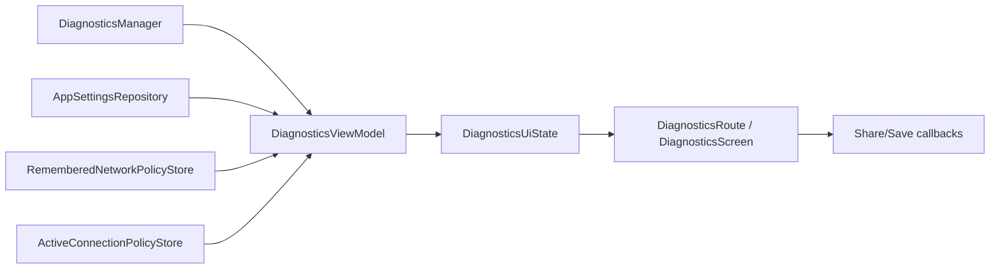

# Diagnostics Feature Analysis

## Scope Observed In Code

- Primary files:
  - `core/diagnostics/src/main/java/com/poyka/ripdpi/diagnostics/DiagnosticsManager.kt` at 2309 lines
  - `app/src/main/java/com/poyka/ripdpi/ui/screens/diagnostics/DiagnosticsScreen.kt` at 2461 lines
- Closely related feature boundary files inspected to understand real responsibilities:
  - `app/src/main/java/com/poyka/ripdpi/activities/DiagnosticsViewModel.kt` at 2662 lines
  - `core/diagnostics/src/test/java/com/poyka/ripdpi/diagnostics/DiagnosticsManagerTest.kt`
  - `app/src/test/java/com/poyka/ripdpi/activities/DiagnosticsViewModelTest.kt`
  - `app/src/test/java/com/poyka/ripdpi/ui/screens/diagnostics/DiagnosticsScreenTest.kt`

## Current Manager Responsibilities

`DefaultDiagnosticsManager` is a single implementation that currently owns all of the following:

- feature initialization and bundled profile import
- scan request shaping for connectivity and strategy-probe modes
- active scan lifecycle and bridge ownership
- hidden automatic handover probe scheduling and cooldown checks
- history persistence for sessions, snapshots, contexts, probe results, and native events
- detail loading for sessions and bypass approaches
- resolver recommendation computation, temporary application, and persistence
- remembered DNS-path and remembered network policy writes
- share summary text construction
- archive cache cleanup, archive payload assembly, zip writing, CSV generation, and export record creation
- JSON decoding, redaction shaping, and approach analytics aggregation

Representative code regions:

- initialization and scan orchestration: lines 199-449
- detail loaders and share summary: lines 458-662
- archive creation and human-readable export shaping: lines 664-1125
- recommendation and persistence logic: lines 1264-1860

## Current Screen Responsibilities

`DiagnosticsScreen.kt` currently mixes:

- route/container logic with pager synchronization and effect collection
- top-level scaffold and section switching
- every major diagnostics section composable
- every bottom sheet composable
- event auto-scroll local state
- sparkline animation and interpolation helpers
- palette/tone helper logic
- reusable rows/cards that are only diagnostics-specific

Representative code regions:

- route and top-level screen contract: lines 104-521
- section bodies: lines 532-1900
- diagnostics-specific reusable cards and rows: lines 1902-2330
- chart/palette/helper logic: lines 1993-2458

## Coupling Through The Feature Boundary

The screen does not depend on the manager directly. The real path is:

Important observations:

- `DiagnosticsManager` exposes a wide surface of flows plus imperative methods, which makes `DiagnosticsViewModel` a large feature-composition layer rather than a thin adapter.
- `DiagnosticsViewModel` combines 29 streams/state holders into a single `DiagnosticsUiState`, then performs a very large amount of domain-to-UI shaping.
- `DiagnosticsScreen` already receives immutable UI state and event lambdas, which is good. The structural problem is not basic UDF; it is that too many distinct screen concerns live in one file.
- Share/export language is shaped in two places today:
  - manager builds the actual shareable summary body
  - viewmodel builds the share-preview copy shown in the Share section

## Boundary Risks Relevant To Refactor Planning

- Manager decomposition can accidentally leak new concepts into the app layer if the public manager API changes too early.
- Screen decomposition can accidentally move UI-only logic upward into `DiagnosticsViewModel`, which is already oversized.
- Archive and share flows are behavior-heavy and partially protected by golden-style tests; they should be treated as contract surfaces.
- Automatic probe and scan lifecycle code is asynchronous and stateful; it should be refactored after pure builders and pure recommendation logic, not before.

## Architectural Conclusion

The safest plan is:

1. Freeze the current feature behavior with tests at the manager, viewmodel-contract, and screen layers.
2. Keep the public `DiagnosticsManager` interface and `DiagnosticsUiState` contract stable at the start.
3. Extract pure and near-pure collaborators first.
4. Refactor asynchronous orchestration only after characterization coverage is in place.
5. Keep UI-only extractions in the UI package; do not shift more responsibilities into `DiagnosticsViewModel`.
