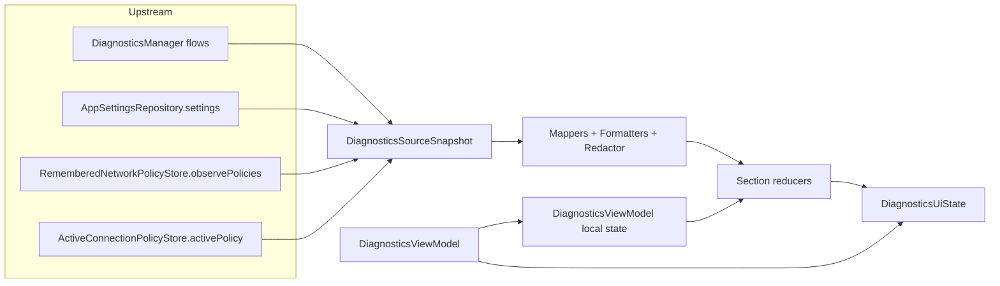
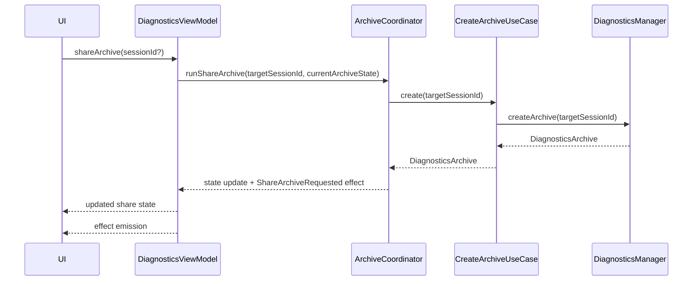

# Design

## Overview

`DiagnosticsViewModel.kt` is currently both the screen contract and the implementation for state aggregation, formatting, mapping, redaction, filtering, and workflow orchestration. The refactor target is a thin ViewModel that wires data sources and intent handlers while delegating presentation shaping and domain workflows to explicit collaborators.

The design keeps the current screen API stable during the migration:

1. `DiagnosticsUiState` and `DiagnosticsEffect` remain the screen contract.
2. Public ViewModel methods such as `selectSession`, `shareArchive`, and `toggleEventFilter` remain the intent surface until the refactor is complete.
3. The diagnostics screen continues to observe one `uiState` flow and one `effects` flow.

## Design Goals

1. Replace positional `combine` casts with typed inputs.
2. Move pure presentation logic out of the ViewModel first.
3. Keep domain calls behind small use cases or coordinators.
4. Preserve current behavior slice by slice with characterization tests preceding each extraction.
5. Avoid introducing one new monolith.

## Current Pain Points

1. The file is too large and mixes unrelated concerns.
2. `buildUiState` and the supporting helpers contain most of the screen logic in one place, which raises regression risk.
3. The current `combine { values -> ... }` array-cast pattern is brittle and hard to review.
4. Formatting and mapping logic is hard to reuse and already appears partially duplicated in `HistoryViewModel`.
5. Share/archive workflow state is embedded in the ViewModel instead of being modeled as a dedicated collaborator.

## Target Structure

The refactor keeps the package stable at first to minimize import churn. Files may be split, but the package stays under `com.poyka.ripdpi.activities` until the behavior is fully preserved.

### Core Screen Layer

1. `DiagnosticsContract.kt`
   Holds `DiagnosticsUiState`, `DiagnosticsEffect`, enums, and screen-facing UI models. This is a file split only, not a behavior change.

2. `DiagnosticsViewModel.kt`
   Retains:
   - Public intent methods
   - Local selection and filter state
   - `uiState` and `effects` exposure
   - Wiring between inputs, reducers, and use cases

3. `DiagnosticsSourceSnapshot.kt`
   A typed aggregate of all upstream data needed to build screen state:
   - `DiagnosticsManager` flows
   - settings
   - remembered policies
   - active connection policy
   - any loaded detail models or workflow state the reducer needs

### Reducers

Reducers are pure presentation builders. They do not call `DiagnosticsManager`.

1. `DiagnosticsOverviewReducer`
2. `DiagnosticsScanReducer`
3. `DiagnosticsLiveReducer`
4. `DiagnosticsSessionsReducer`
5. `DiagnosticsApproachesReducer`
6. `DiagnosticsEventsReducer`
7. `DiagnosticsShareReducer`
8. `DiagnosticsUiStateReducer`
   A small orchestrator that delegates section building to the section reducers and composes the final `DiagnosticsUiState`.

### Filters

1. `DiagnosticsSessionFilter`
   Applies path-mode, status, and text-query filtering to session rows.

2. `DiagnosticsEventFilter`
   Applies source, severity, and text-query filtering to event rows.

These classes stay pure and receive already-mapped row models plus filter values.

### Mappers

Mappers convert domain models or decoded payloads into UI models. They can depend on formatters and redactors.

1. `DiagnosticsProfileOptionMapper`
2. `DiagnosticsSessionRowMapper`
3. `DiagnosticsSessionDetailMapper`
4. `DiagnosticsApproachRowMapper`
5. `DiagnosticsApproachDetailMapper`
6. `DiagnosticsStrategyProbeMapper`
7. `DiagnosticsSnapshotMapper`
8. `DiagnosticsContextMapper`
9. `DiagnosticsEventMapper`
10. `DiagnosticsRememberedNetworkMapper`
11. `DiagnosticsResolverRecommendationMapper`
12. `DiagnosticsSharePreviewBuilder`

The intent is not to create every file immediately. The implementation can start with the largest seams and combine closely related mappers where it keeps the boundary clear.

### Formatters and Redactors

1. `DiagnosticsValueFormatter`
   Owns bytes, durations, timestamps, pluralization, and generic human-readable value formatting.

2. `DiagnosticsToneMapper`
   Owns outcome-to-tone mapping and similar status normalization rules.

3. `DiagnosticsStrategyLabelFormatter`
   Owns strategy-signature humanization, fake-profile labels, autolearn copy, and other diagnostics-specific text rules.

4. `DiagnosticsRedactor`
   Owns sensitive-field redaction for snapshots and context models.

### Use Cases and Coordinators

Use cases are the boundary between screen code and `DiagnosticsManager`.

1. `SetActiveDiagnosticsProfile`
2. `StartDiagnosticsScan`
3. `CancelDiagnosticsScan`
4. `LoadDiagnosticsSessionDetail`
5. `LoadDiagnosticsApproachDetail`
6. `KeepResolverRecommendation`
7. `SaveResolverRecommendation`

Workflow coordinators group multi-step screen workflows:

1. `DiagnosticsArchiveCoordinator`
   Owns busy-state, success/failure state transitions, and the share/save archive effect payload.

2. `DiagnosticsShareSummaryCoordinator`
   Builds a summary effect from the selected or provided session id.

3. `DiagnosticsAuditAutoOpenCoordinator`
   Watches pending audit session id plus upstream scan completion signals and decides when to load the finished detail.

## Boundaries And Dependency Rules

| Responsibility | Depends on | Must not depend on |
| --- | --- | --- |
| ViewModel | reducers, use cases, coordinators, local `StateFlow`s | formatting internals, JSON decoding details, large mapping functions |
| Reducers | typed snapshot, mapped rows/details, filters | `DiagnosticsManager`, coroutine scope, effect channel |
| Mappers | domain entities, decoded payloads, formatters, redactor | `viewModelScope`, `Channel`, `StateFlow` |
| Filters | mapped UI rows and filter values | manager, JSON, Android APIs |
| Formatters | primitives and simple domain values | flows, ViewModel lifecycle |
| Use cases | `DiagnosticsManager` | screen models, Compose state |
| Coordinators | use cases, simple workflow state/result types | full-screen reducer logic |

## Proposed Data Flow

## Proposed Intent Flow

## Migration Strategy

### 1. Lock behavior before moving logic

Start by expanding characterization tests around all public intent methods that still have coverage gaps. The current test suite is already large enough to serve as the behavioral spec.

### 2. Extract typed inputs before deep logic moves

The first production change should introduce a typed `DiagnosticsSourceSnapshot` and a helper that removes positional array indexing from the `combine` block. This is low-risk and makes later reducer extraction safer.

### 3. Extract pure logic before effectful logic

Move filters, formatters, redaction, and mappers before share/archive and audit auto-open workflows. That yields fast unit tests and reduces the size of the ViewModel without changing control flow yet.

### 4. Extract workflow orchestration last

Once state building is externalized and well tested, move archive/share and audit auto-open orchestration to dedicated coordinators or use cases.

### 5. Keep ViewModel API stable throughout

Do not force a screen rewrite mid-refactor. Public methods can keep their current names and signatures while the implementation behind them becomes thinner.

## Design Decisions

1. Keep contract types stable first.
   Splitting data classes and effects into a separate file reduces file size quickly and safely.

2. Prefer typed snapshots to giant state holders.
   The reducer pipeline should consume a typed upstream snapshot, not a new catch-all mutable object.

3. Prefer many small collaborators to one presenter.
   A single `DiagnosticsStateManager` would recreate the current problem. Section reducers and targeted mappers keep reviews local.

4. Preserve screen behavior before chasing reuse.
   There is likely mapper overlap with `HistoryViewModel`, but reuse should be a later optimization once diagnostics behavior is stable under tests.

## Testing Strategy

1. Keep `DiagnosticsViewModelTest` as the top-level characterization suite.
2. Add direct unit tests for every extracted pure collaborator.
3. Use coroutine test rules already present in `app/src/test` for `uiState` and `effects` behavior.
4. Add integration-style tests only for flows that intentionally span coordinator plus ViewModel behavior, such as audit auto-open and archive state transitions.

## Risks And Mitigations

1. Risk: accidental copy or label changes in formatted text.
   Mitigation: characterize current strings before moving formatters.

2. Risk: focus or filter regressions caused by state split.
   Mitigation: add public ViewModel tests for every uncovered intent first.

3. Risk: redaction bugs when session detail mapping moves out.
   Mitigation: add explicit visible-versus-redacted detail assertions before extraction.

4. Risk: another oversized collaborator replaces the ViewModel.
   Mitigation: keep reducers and mappers section-specific and document dependency limits.

5. Risk: touching adjacent screens during reuse.
   Mitigation: keep the first refactor local to diagnostics, and treat `HistoryViewModel` sharing as an optional final pass only.
