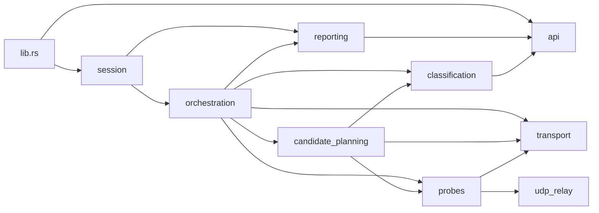

# Design

## Overview

`ripdpi-monitor` currently exposes a stable serde-facing API but implements nearly the entire crate inside one oversized `lib.rs`. The refactor target is a thin crate root with cohesive internal modules, explicit ownership, and preserved runtime behavior.

The design keeps the external surface stable:

1. Public types continue to be available from `ripdpi_monitor::...`.
2. `MonitorSession` keeps the current constructor, worker lifecycle, and JSON polling methods.
3. Existing JSON shapes and golden files remain valid.
4. Internal extraction favors free functions, concrete structs, and `pub(crate)` boundaries instead of trait-heavy indirection.

## Design Goals

1. Reduce `lib.rs` to a readable entry point.
2. Separate orchestration from low-level probe and transport logic.
3. Isolate candidate planning and classification from scan loops.
4. Keep hot-path code concrete and allocation-conscious.
5. Preserve current external behavior while improving reviewability and testability.

## Proposed File Structure

The exact split can stay incremental, but the target structure should converge on:

```text
native/rust/crates/ripdpi-monitor/src/
  lib.rs
  api.rs
  session.rs
  orchestration.rs
  candidate_planning.rs
  classification.rs
  reporting.rs
  transport.rs
  udp_relay.rs
  probes/
    mod.rs
    dns.rs
    domain.rs
    tcp.rs
    quic.rs
  test_support.rs          # cfg(test)
```

`lib.rs` should only:

1. declare internal modules,
2. re-export the public API and `MonitorSession`,
3. optionally host a few tiny crate-wide constants if that materially improves readability.

## Module Responsibilities

### `api.rs`

Owns the public serde-facing contracts and crate-root defaults:

1. `ScanPathMode`, `ScanKind`
2. request/target structs
3. progress/report/result/event structs
4. strategy-probe summary and recommendation types
5. default helper functions such as `default_http_path`, `default_quic_port`, and `default_scan_kind`

This module should have no dependency on orchestration or transport internals.

### `session.rs`

Owns the FFI-facing session shell:

1. `MonitorSession`
2. `SharedState`
3. worker join/cancel lifecycle
4. JSON polling methods that serialize stored progress, reports, and passive events

`session.rs` depends on `api`, `orchestration`, and `reporting`, but not on low-level probe details.

### `orchestration.rs`

Owns scan control flow:

1. `run_scan`
2. `validate_scan_request`
3. `run_connectivity_scan`
4. `run_strategy_probe_scan`
5. cancellation finalization and scan-summary assembly

This is the top-level coordinator. It should depend on planning, probes, classification, reporting, and transport selection helpers, but those modules should not depend back on orchestration.

### `candidate_planning.rs`

Owns strategy-probe candidate mechanics:

1. suite definitions
2. candidate catalogs and config builders
3. deterministic ordering and pacing helpers
4. candidate warmup and scoring structs
5. temporary embedded runtime startup helpers
6. recommendation support such as winner selection inputs

This module may expose small `pub(crate)` structs used by orchestration, but it should not know about shared session state or JSON polling.

### `classification.rs`

Owns interpretation logic:

1. DNS tampering baseline detection
2. transport and TLS failure text classification
3. strategy baseline result classification
4. failure weighting and priority
5. candidate skipping and recommendation-ranking helpers
6. fat-header outcome interpretation if it proves cleaner here than in `probes::tcp`

This module should remain pure or near-pure wherever possible.

### `reporting.rs`

Owns state update and user-visible shaping helpers:

1. `set_progress`, `set_report`, `push_event`
2. probe summary formatting for passive events
3. event level mapping
4. result/detail lookup helpers
5. generic output formatting helpers that affect JSON-stable summaries

This keeps user-visible shaping in one place and prevents orchestration from inlining message assembly everywhere.

### `transport.rs`

Owns reusable connection machinery:

1. `TransportConfig`
2. `TargetAddress`
3. `ConnectionStream`
4. direct and SOCKS5 TCP connection setup
5. TLS client setup and certificate-verification policy
6. address resolution helpers

This module should stay concrete. Keep the current enum-based stream representation; do not replace it with trait objects.

### `udp_relay.rs`

Owns UDP-specific transport logic:

1. direct UDP relay
2. SOCKS5 UDP ASSOCIATE and relay address normalization
3. UDP frame encoding and decoding
4. `relay_udp_payload`

Keeping UDP relay separate prevents probe modules from owning SOCKS protocol details.

### `probes/*`

Own probe-specific execution and parsing:

1. `probes::dns`
   DNS query build/parse, UDP and encrypted resolver probes, endpoint shaping.

2. `probes::domain`
   HTTP observation, TLS handshake observation, HTTP parsing, blockpage detection, domain reachability result shaping.

3. `probes::tcp`
   Fat-header attempt loop, cutoff/reset classification, whitelist-SNI fallback behavior.

4. `probes::quic`
   QUIC Initial payload probing and response interpretation.

Shared helpers may stay in `probes::mod` only if they are genuinely shared and do not re-create a second monolith.

### `test_support.rs`

Owns `#[cfg(test)]` fixture infrastructure currently buried in `lib.rs`:

1. local UDP DNS server
2. local HTTP and DoH server
3. TLS server
4. SOCKS5 relay fixture
5. fat-header fixture servers
6. report/progress wait helpers
7. golden scrubbers and scan-report helpers

Soak tests under `tests/soak.rs` can either keep their own local helpers or reuse only narrowly scoped shared helpers if that does not create awkward test-only dependencies.

## Dependency Rules

The target dependency direction should be:



Key rules:

1. `api` is dependency-light and never depends on orchestration.
2. `orchestration` is the highest-level internal module.
3. `udp_relay` and `transport` stay below probes and planning.
4. `reporting` shapes user-visible outputs but does not own probe logic.
5. `test_support` is `#[cfg(test)]` only and must not leak into production APIs.

## Public API Preservation Strategy

The refactor should preserve the crate-root surface by re-export, not by forcing downstream import churn.

Recommended approach:

1. Move public enums and structs into `api.rs`.
2. Re-export them from `lib.rs` with `pub use api::{...};`.
3. Move `MonitorSession` into `session.rs`.
4. Re-export it from `lib.rs` with `pub use session::MonitorSession;`.
5. Keep helper functions and internal structs `pub(crate)` or private unless a real cross-module need exists.

This keeps `ripdpi-android` and future Rust consumers unchanged while letting the internals move freely.

## Error Handling Strategy

Use the current style as the refactor boundary:

1. Keep `Result<T, String>` for existing probe/orchestration boundaries where the string content already feeds reports, details, or logs.
2. Use small private enums and structs for internal state when they improve clarity.
3. Avoid introducing broad error-wrapper layers or trait objects during the decomposition.
4. Preserve existing error text where it is user-visible, serialized, or asserted by tests.

## Performance Strategy

The refactor should not change performance-sensitive behavior accidentally.

1. Keep probe execution as direct function calls.
2. Keep `ConnectionStream` as an enum, not a boxed trait.
3. Avoid cloning large configs unless the current behavior already does so.
4. Preserve current timeout constants, threshold constants, and deterministic pacing logic.
5. Prefer moving code verbatim into modules before making local cleanups.

## Migration Notes

The safest extraction order is bottom-up:

1. stabilize tests and formatting baseline,
2. move public contracts,
3. move low-level transport and pure helpers,
4. move probes,
5. move planning and classification,
6. move orchestration last,
7. slim `lib.rs` only after the moved modules are already green.

This order minimizes large cross-cutting diffs and keeps review slices narrow.

## Validation Gates

Use crate-targeted commands so the work stays isolated from unrelated concurrent refactors:

1. `cargo test --manifest-path native/rust/Cargo.toml -p ripdpi-monitor`
2. `cargo clippy --manifest-path native/rust/Cargo.toml -p ripdpi-monitor --all-targets`
3. `cargo fmt --manifest-path native/rust/Cargo.toml -p ripdpi-monitor --check`

Because the current baseline is not fully green, the first implementation slice must restore these gates before any structural extraction starts.
