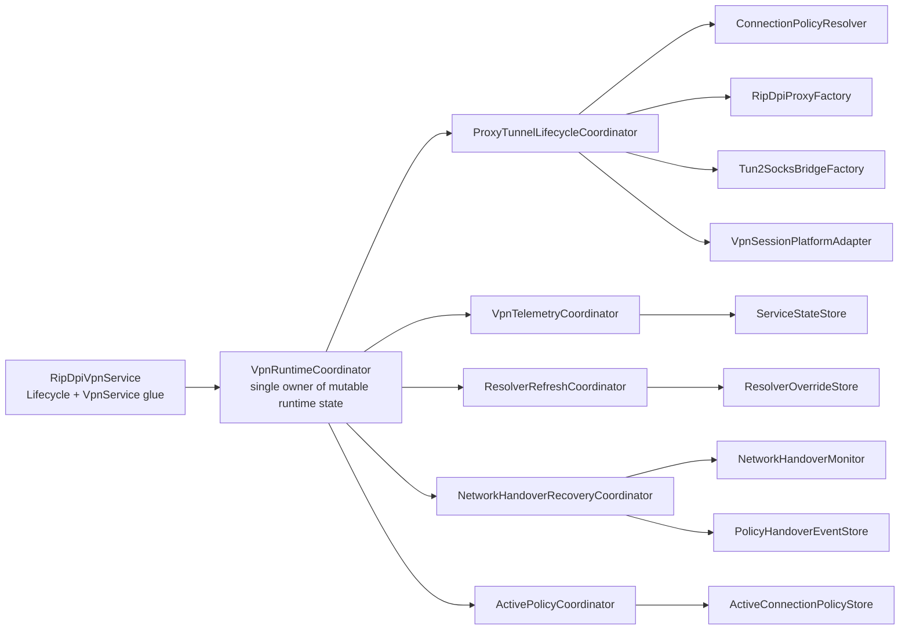
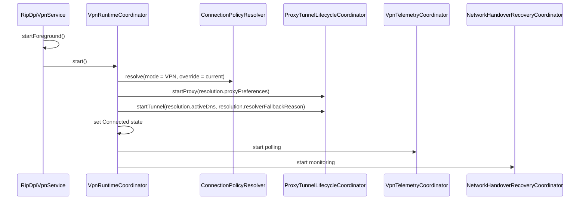

# Design

## Overview

This design narrows `RipDpiVpnService` to Android lifecycle and platform glue while moving runtime orchestration into dedicated collaborators. The main design constraint is safety: extraction must not weaken the current serialized start, stop, refresh, and handover behavior.

The design therefore uses a single runtime owner for mutable state and locking, with smaller dedicated collaborators handling lifecycle subdomains and pure runtime decisions.

## Detailed Requirements

The refactor must preserve the current observable service contract:

- Intent-driven start and stop behavior.
- `onRevoke()` shutdown semantics.
- Foreground startup timing.
- Proxy and tunnel startup and shutdown order.
- Failure classification and failure emission.
- Telemetry publication semantics.
- Resolver override precedence and clearing behavior.
- Network handover cooldown, restart, and event-publication behavior.
- Active connection policy store behavior.
- Existing `VpnService.Builder` behavior.

The refactor must also improve internal structure:

- The service should stop owning runtime handles and most mutable runtime state.
- Lock ownership and state ownership must be explicit.
- Runtime collaborators must be unit-testable with fake dependencies.

## Architecture Overview



## Design Principles

1. One runtime owner: only one collaborator should own mutable runtime state and the mutex.
2. Explicit side-effect boundaries: planners and policy logic should be mostly pure, while lifecycle coordinators perform side effects.
3. Android boundary at the edge: the service keeps notification and `VpnService.Builder` concerns; collaborators should not depend on `android.app.Service` APIs directly.
4. Preserve contracts first: every major extraction step must be preceded by tests that lock the current behavior.

## Components And Interfaces

### `RipDpiVpnService`

Keep only:

- `onCreate()`
- `onStartCommand()`
- `onRevoke()`
- foreground notification wiring
- `createNotification()`
- `createBuilder(dns, ipv6)`
- delegation to runtime coordinator

Service-owned state should shrink to:

- injected runtime coordinator
- possibly lightweight platform adapter implementation for tunnel establishment

It should no longer directly own proxy runtime handles, tunnel handles, runtime jobs, resolver signatures, handover cooldown fields, or `stopping`.

### `VpnRuntimeCoordinator`

Role:

- Single owner of runtime state and transition serialization.
- Entry point for `start`, `stop`, `handleProxyExit`, `refreshResolverIfNeeded`, and `handleHandover`.
- Starts and cancels telemetry and handover-monitor jobs.
- Applies high-level lifecycle rules before delegating to narrower collaborators.

Expected interface shape:

```kotlin
interface VpnRuntimeCoordinator {
    suspend fun start()
    suspend fun stop(skipProxyShutdown: Boolean = false)
    suspend fun onProxyExit(result: Result<Int>)
    suspend fun refreshResolverIfNeeded()
    suspend fun onNetworkHandover(event: NetworkHandoverEvent)
}
```

Important constraint:

- This component owns the mutex and the mutable `VpnRuntimeState`.
- Other collaborators may return decisions or execute side effects against provided handles, but they should not own competing locks.

### `VpnRuntimeState`

Create an explicit state model to replace the service field cluster.

Suggested shape:

```kotlin
data class VpnRuntimeState(
    val status: ServiceStatus = ServiceStatus.Disconnected,
    val stopInProgress: Boolean = false,
    val proxyRuntime: RipDpiProxyRuntime? = null,
    val proxyJob: Job? = null,
    val tunnelBridge: Tun2SocksBridge? = null,
    val tunnelSession: VpnTunnelSession? = null,
    val telemetryJob: Job? = null,
    val handoverMonitorJob: Job? = null,
    val currentDnsSignature: String? = null,
    val tunnelStartCount: Int = 0,
    val tunnelRecoveryRetryCount: Long = 0,
    val pendingNetworkHandoverClass: String? = null,
    val lastSuccessfulHandoverFingerprintHash: String? = null,
    val lastSuccessfulHandoverAt: Long = 0L,
)
```

This state model is not about making the system "functional" for its own sake. It is about preventing hidden lifecycle coupling from surviving the refactor.

### `ProxyTunnelLifecycleCoordinator`

Role:

- Start and stop proxy runtime.
- Start and stop tunnel runtime.
- Contain runtime-handle construction and cleanup details.
- Preserve current start-order and stop-order behavior.

Important rules:

- It should execute under `VpnRuntimeCoordinator` serialization.
- It may expose smaller methods like `startProxy`, `stopProxy`, `startTunnel`, `stopTunnel`.
- It should not decide whether to restart or rebuild; that remains with the runtime coordinator and planners.

### `VpnSessionPlatformAdapter`

Role:

- Bridge platform-specific session establishment without forcing collaborators to depend directly on the service class.

Suggested shape:

```kotlin
interface VpnSessionPlatformAdapter {
    fun establishSession(dns: String, ipv6: Boolean): VpnTunnelSession
}
```

`RipDpiVpnService` can implement or provide this adapter using its existing `createBuilder()` path. This keeps `VpnService.Builder` logic inside the service while allowing the lifecycle coordinator to remain Android-light.

### `VpnTelemetryCoordinator`

Role:

- Own telemetry polling logic and snapshot assembly.
- Convert proxy and tunnel snapshots into `ServiceTelemetrySnapshot` updates.
- Detect telemetry-driven failures and report them back to `VpnRuntimeCoordinator`.

Important rule:

- It should not stop the service directly. It should return or emit a failure outcome so that the runtime coordinator can drive the transition.

This avoids another source of hidden re-entrancy.

### `ResolverRefreshCoordinator`

Role:

- Encapsulate effective-resolver refresh logic.
- Use existing `planResolverRefresh` and `dnsSignature` rules.
- Decide whether an override should be cleared and whether a tunnel rebuild is required.

Suggested result shape:

```kotlin
data class ResolverRefreshDecision(
    val shouldClearOverride: Boolean,
    val requiresTunnelRebuild: Boolean,
    val resolution: ConnectionPolicyResolution,
)
```

The runtime coordinator remains responsible for executing the rebuild inside its serialized transition.

### `NetworkHandoverRecoveryCoordinator`

Role:

- Own service-facing subscription to `NetworkHandoverMonitor`.
- Enforce actionability and cooldown.
- Resolve policy for the new fingerprint.
- Drive in-place restart through the runtime coordinator.
- Publish `PolicyHandoverEvent` after successful recovery.

Design constraint:

- The cooldown state belongs in `VpnRuntimeState`.
- Post-restart event publication should happen only after the runtime has been successfully re-established.

### `ActivePolicyCoordinator`

Role:

- Apply active connection policy store updates from `ConnectionPolicyResolution`.
- Provide winning strategy family values used for telemetry enrichment.

This extracts policy-store details from the service and keeps policy logic cohesive with runtime telemetry context.

## Runtime Flow

### Start Sequence



### Stop Sequence

- Cancel handover monitoring first.
- Stop tunnel and close VPN session.
- Stop proxy unless it already exited.
- Clear resolver override and active policy stores.
- Publish disconnected state.
- Cancel telemetry job.
- Call `stopSelf()` from the service layer.

This order must remain stable because the current integration tests already depend on it.

## Data Models

### `VpnRuntimeState`

The coordinator state model described above becomes the source of truth for all runtime transitions.

### `ResolverRefreshDecision`

Captures:

- the latest resolution
- whether override clearing is needed
- whether tunnel rebuild is required

### `HandoverRecoveryDecision`

Suggested fields:

- `shouldIgnore`
- `fingerprintHash`
- `previousFingerprintHash`
- `now`
- `resolution`

This keeps cooldown and restart intent explicit and testable before side effects run.

## Error Handling

1. Startup failures still map to the same `FailureReason` classification and still halt the service.
2. Proxy exit must still avoid double-failing during explicit stop or in-place handover restart.
3. Tunnel start failures must still close the session before bubbling failure.
4. Telemetry failures and unexpected idle tunnel states must still produce the same halt behavior.
5. Handover restart failures must still be treated as VPN failures and must fall back to full stop.
6. Collaborators should report structured outcomes back to the runtime coordinator instead of directly mutating global service state.

## Testing Strategy

### Characterization Tests

Keep and expand service-level tests for:

- start and stop ordering
- duplicate start and duplicate stop behavior
- startup failure cleanup
- proxy exit handling
- unexpected tunnel exit handling
- resolver override observable behavior
- handover restart observable behavior

### Unit Tests

Add focused tests for:

- `VpnRuntimeState` transition helpers
- `ActivePolicyCoordinator`
- `ResolverRefreshCoordinator`
- `ProxyTunnelLifecycleCoordinator`
- `VpnTelemetryCoordinator`
- `NetworkHandoverRecoveryCoordinator`

### Contract Tests

Add lifecycle interaction tests to prove:

- the service delegates lifecycle events to the runtime coordinator correctly
- the runtime coordinator invokes collaborators in the correct order
- collaborator failures are translated into the same state-store effects as today

### Instrumentation Boundary

Keep Android-specific testing only where needed:

- `VpnService` builder behavior
- foreground-service startup
- `onRevoke()` behavior

## Appendices

### Technology Choices

- Keep coroutines and `Mutex` as the transition-serialization mechanism, because the current service already relies on them and the test stack already supports them well.
- Prefer fake-driven unit tests for runtime collaborators rather than introducing heavier instrumentation for coordinator logic.

### Research Findings

- The service already has useful seams in `ConnectionPolicyResolver`, `NetworkHandoverMonitor`, `ResolverOverrideStore`, and `VpnResolverRuntime`, but orchestration still lives in the service.
- Existing integration tests already cover many service-level contracts, so the plan should extend those tests rather than replacing them.

### Alternative Approaches Considered

1. Extract many small stateful collaborators that each manage their own jobs.
   Rejected because it would spread lifecycle ownership and increase race risk.
2. Move all logic into one giant "manager" class.
   Rejected because it would preserve the same complexity under a new name.
3. Rewrite to a reactive state machine in one step.
   Rejected because it is too large a behavioral jump for a safe refactor.
