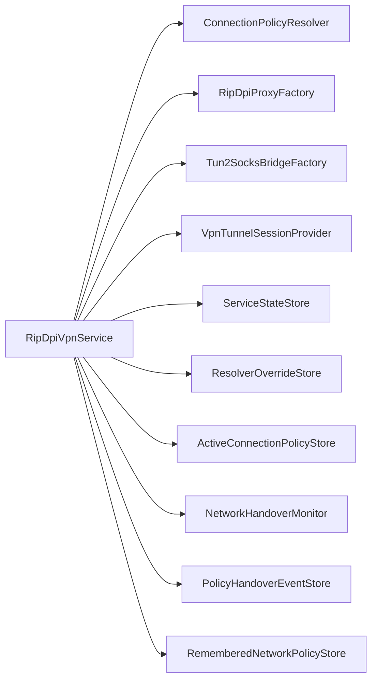

# Current Service Analysis

## Sources Inspected

- `core/service/src/main/java/com/poyka/ripdpi/services/RipDpiVpnService.kt`
- `core/service/src/main/java/com/poyka/ripdpi/services/ConnectionPolicyResolver.kt`
- `core/service/src/main/java/com/poyka/ripdpi/services/NetworkHandoverMonitor.kt`
- `core/service/src/main/java/com/poyka/ripdpi/services/ResolverOverrideStore.kt`
- `core/service/src/main/java/com/poyka/ripdpi/services/ActiveConnectionPolicyStore.kt`
- `core/service/src/main/java/com/poyka/ripdpi/services/PolicyHandoverEventStore.kt`
- `core/service/src/main/java/com/poyka/ripdpi/services/VpnResolverRuntime.kt`
- `core/service/src/main/java/com/poyka/ripdpi/services/AppStateManager.kt`
- `app/src/androidTest/java/com/poyka/ripdpi/integration/ServiceLifecycleIntegrationTest.kt`
- `app/src/androidTest/java/com/poyka/ripdpi/e2e/DiagnosticsNetworkE2ETest.kt`
- `.github/skills/service-lifecycle/SKILL.md`

No external web research was required. The codebase already contains the relevant runtime helpers and existing test coverage needed for the refactor plan.

## Verified Responsibility Map

| Responsibility | Evidence | Notes |
| --- | --- | --- |
| Android lifecycle entry points | `RipDpiVpnService.kt:116-152` | `onCreate`, `onStartCommand`, and `onRevoke` directly trigger runtime work. |
| Foreground service setup | `RipDpiVpnService.kt:197-208` | Notification creation and API-level-specific `startForeground` behavior are in the service. |
| Proxy lifecycle | `RipDpiVpnService.kt:252-342` | Service owns proxy runtime instance, job, ready wait, exit callback, and shutdown logic. |
| Tunnel lifecycle | `RipDpiVpnService.kt:344-443` | Service owns tunnel config construction, VPN session establishment, bridge start, and teardown. |
| Telemetry updates and failure detection | `RipDpiVpnService.kt:445-619` | Service builds telemetry snapshots, classifies failures, and runs the polling loop. |
| Resolver override refresh handling | `RipDpiVpnService.kt:621-656` | Service re-resolves DNS, clears temporary overrides, and rebuilds the tunnel when DNS signature changes. |
| Network handover monitoring and recovery | `RipDpiVpnService.kt:689-768` | Service subscribes to monitor events, enforces cooldown, re-resolves policy, restarts runtime, and publishes handover events. |
| Policy application | `RipDpiVpnService.kt:668-792` | Service applies active policy store state and uses it to enrich telemetry. |
| VpnService platform glue | `RipDpiVpnService.kt:659-838` | Notification intent and `Builder` construction remain service-specific platform concerns. |

## Mutable Runtime State Currently Owned by the Service

- `ripDpiProxy`
- `tun2SocksBridge`
- `proxyJob`
- `telemetryJob`
- `handoverMonitorJob`
- `tunSession`
- `mutex`
- `stopping`
- `currentDnsSignature`
- `tunnelStartCount`
- `tunnelRecoveryRetryCount`
- `pendingNetworkHandoverClass`
- `lastSuccessfulHandoverFingerprintHash`
- `lastSuccessfulHandoverAt`
- `status`

This is the core refactor pressure point: Android service glue and runtime orchestration state are coupled in one class.

## Existing Observable Behavior Already Covered by Tests

`ServiceLifecycleIntegrationTest` already covers:

- VPN start and stop ordering.
- Tunnel telemetry publication.
- Startup failures in proxy, VPN establish, and tunnel start.
- Proxy exit failure handling.
- Unexpected tunnel exit handling.
- Repeated stop idempotency.
- Tunnel stop failure cleanup behavior.
- Telemetry failure fallback behavior.

`DiagnosticsNetworkE2ETest` additionally covers:

- Temporary resolver override propagation into VPN runtime behavior and tunnel telemetry.

`VpnResolverRuntimeTest` and `NetworkHandoverMonitorTest` already cover:

- DNS override precedence and clearing rules.
- Resolver refresh planning.
- Network handover classification and debounce behavior.

## Important Coverage Gaps For The Refactor

- The service-level contract around resolver refresh causing tunnel rebuild is not directly characterized at the service boundary.
- The service-level contract around network handover restart sequencing and cooldown is not directly characterized.
- The `job.invokeOnCompletion` path for proxy exit races with explicit `stop()` and restart flows, but that interaction is not isolated in collaborator-level tests.
- The one-shot use of `pendingNetworkHandoverClass` is embedded inside the service and lacks direct contract tests.

## Lifecycle and Concurrency Risks

1. `status`, `stopping`, and the runtime handles are read both inside and outside `mutex.withLock`, so extraction must not accidentally widen race windows.
2. `start()` checks `status` before entering the mutex. Duplicate starts are currently tolerated by observable behavior, but that behavior is fragile if state ownership moves.
3. `stop()` cancels monitoring inside the mutex, resets multiple stores in `finally`, then cancels telemetry and calls `stopSelf()` outside the mutex. That order must remain stable.
4. `startProxy()` installs an `invokeOnCompletion` callback that launches new coroutine work back onto `lifecycleScope`. This is a high-risk edge when shutdown and unexpected exit happen near each other.
5. `refreshEffectiveResolverIfNeeded()` performs a speculative resolution outside the mutex and a second guarded resolution inside the mutex. Refactoring should preserve the double-check pattern.
6. `handleNetworkHandover()` temporarily sets `stopping = true` during an in-place restart. If that flag changes semantics when moved, proxy-exit or telemetry loops may misinterpret the restart as a final shutdown.
7. `pendingNetworkHandoverClass` is consumed exactly once by telemetry/status updates. If that becomes shared across collaborators, the value could be lost or duplicated.

## Current Interaction Shape

