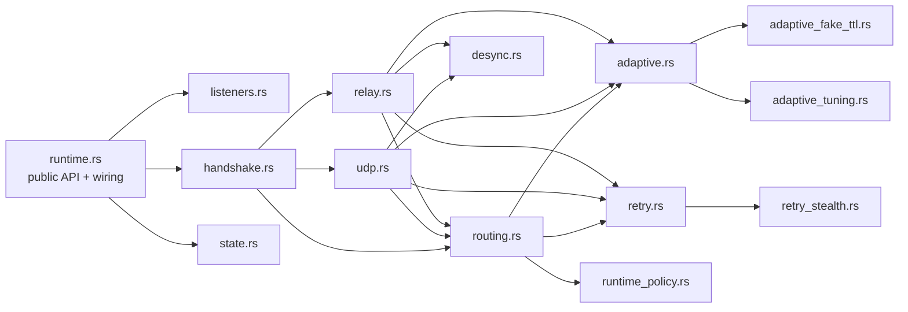
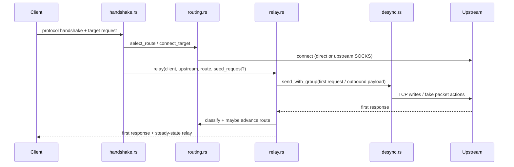

# Runtime Refactor Design

## Overview

`native/rust/crates/ripdpi-runtime/src/runtime.rs` currently mixes listener lifecycle, handshake parsing, route orchestration, adaptive/retry glue, UDP flow handling, TCP relay logic, and desync execution inside a single file. The refactor will split those responsibilities into internal modules while keeping:

- the public runtime API unchanged
- the current thread model unchanged
- current protocol bytes and failure semantics unchanged
- the hot path free of trait dispatch and extra synchronization

The end state is a thin `runtime.rs` that wires together focused internal modules.

## Detailed Requirements

The design must satisfy these consolidated requirements:

1. Keep the current exported runtime entry points and call signatures.
2. Preserve listener accept-loop behavior, shutdown cadence, telemetry order, and `max_open` enforcement.
3. Preserve protocol handshake and reply semantics for transparent, SOCKS4, SOCKS5, HTTP CONNECT, Shadowsocks, and SOCKS5 UDP associate.
4. Preserve route selection, route advancement, retry pacing, adaptive tuning feedback, and autolearn/cache flush behavior.
5. Preserve TCP/UDP desync execution semantics, including TTL handling, urgent writes, fake packet paths, and wait stages.
6. Keep the performance-sensitive outbound relay and UDP loops free of needless allocations, traits, or extra lock contention.
7. Sequence extraction so characterization tests land before moving risky code.

## Architecture Overview

### Proposed module layout

```text
src/
  runtime.rs                  # public API + thin wiring
  runtime/
    state.rs                  # RuntimeState, guards, shared constants
    listeners.rs              # listener creation and accept loop
    handshake.rs              # protocol dispatch, parsing, delayed connect
    routing.rs                # route select/connect/advance glue
    adaptive.rs               # runtime-facing adaptive wrappers
    retry.rs                  # runtime-facing retry signature/pacing wrappers
    udp.rs                    # UDP associate worker and packet codec
    relay.rs                  # first request/response handling and stream relay
    desync.rs                 # TCP/UDP desync execution helpers
```

### Component diagram



### Runtime flow overview



## Components And Interfaces

### `runtime.rs`

Responsibilities:

- keep the public API functions
- define `mod` declarations
- build the initial `RuntimeState`
- forward into `listeners::run_proxy_with_listener_internal`

Rules:

- no business logic beyond public entry-point wiring
- no large helper functions left in this file

### `runtime/state.rs`

Responsibilities:

- `RuntimeState`
- `RuntimeCleanup`
- `ClientSlotGuard`
- shared constants such as handshake timeout and UDP idle timeout

Why this exists:

- these pieces are used across most extracted modules
- centralizes shared ownership rules without adding abstraction layers

### `runtime/listeners.rs`

Responsibilities:

- `build_listener`
- listener nonblocking configuration
- `mio::Poll` accept loop
- telemetry lifecycle events
- client thread spawning and shutdown polling

Key interface:

- `pub(super) fn run_proxy_with_listener_internal(...) -> io::Result<()>`

### `runtime/handshake.rs`

Responsibilities:

- `handle_client`
- transparent/SOCKS4/SOCKS5/HTTP CONNECT/Shadowsocks handlers
- request readers and protocol parsing helpers
- `maybe_delay_connect`
- handshake success replies and early request capture

Key interface:

- `pub(super) fn handle_client(client: TcpStream, state: &RuntimeState) -> io::Result<()>`

Design note:

- keep byte parsing helpers in the same module as protocol entry flows so handshake semantics stay local and easy to audit

### `runtime/routing.rs`

Responsibilities:

- `select_route*`
- `connect_target*`
- connect-via-group and upstream SOCKS helpers
- failure classification glue
- route advancement and route success persistence
- cache/autolearn flush points

Key interface:

- free functions taking `&RuntimeState`
- no new route manager trait or object wrapper

Design note:

- `runtime_policy.rs` remains the authoritative home for pure selection policies
- `routing.rs` owns only runtime-specific orchestration around sockets, telemetry, and cache locks

### `runtime/adaptive.rs`

Responsibilities:

- resolve/note adaptive fake TTL
- resolve/note adaptive TCP hints
- resolve/note adaptive UDP hints

Why separate from `routing.rs`:

- keeps lock-taking glue around adaptive resolvers isolated and easy to test
- prevents relay/UDP code from reaching directly into multiple `Mutex`-protected subsystems

### `runtime/retry.rs`

Responsibilities:

- build retry signatures
- compute retry penalties for route selection
- note retry success/failure
- apply retry sleep before reconnect
- emit candidate diversification telemetry

Design note:

- keep this as a thin wrapper over `retry_stealth.rs`
- preserve the current signature inputs exactly

### `runtime/udp.rs`

Responsibilities:

- SOCKS5 UDP associate setup
- UDP relay worker thread
- `UdpFlowActivationState`
- flow expiry handling
- SOCKS5 UDP packet encode/decode
- UDP host-cache decision helper

Design note:

- move UDP as a mostly self-contained unit because its worker lifecycle and flow map are tightly coupled

### `runtime/relay.rs`

Responsibilities:

- first request capture
- `relay`
- `relay_streams`
- `read_first_response`
- `TlsRecordTracker`
- `reconnect_target`
- `copy_inbound_half` / `copy_outbound_half`

Design note:

- this is the highest-risk extraction because it owns response classification, reconnect, and the steady-state hot path
- move it late, and move its helpers together

### `runtime/desync.rs`

Responsibilities:

- `activation_context_from_progress`
- `send_with_group`
- TCP/UDP desync execution helpers
- OOB send, TTL set/restore, and special fake/fake-split flows

Design note:

- keep direct platform calls here; do not hide them behind traits

## Data Models

### `RuntimeState`

The shared runtime state stays as a clonable internal struct backed by `Arc` and the existing `Mutex`/atomic members:

- `config: Arc<RuntimeConfig>`
- `cache: Arc<Mutex<RuntimeCache>>`
- `adaptive_fake_ttl: Arc<Mutex<AdaptiveFakeTtlResolver>>`
- `adaptive_tuning: Arc<Mutex<AdaptivePlannerResolver>>`
- `retry_stealth: Arc<Mutex<RetryPacer>>`
- `active_clients: Arc<AtomicUsize>`
- `telemetry: Option<Arc<dyn RuntimeTelemetrySink>>`
- `runtime_context: Option<ProxyRuntimeContext>`

This shape should remain unchanged unless an extraction proves a narrower, zero-cost helper type is useful.

### UDP flow state

`UdpFlowActivationState` remains owned by `udp.rs` and continues to track:

- per-flow `SessionState`
- `last_used`
- selected `ConnectionRoute`
- optional host string
- copied first payload for adaptive/retry feedback
- `awaiting_response`

### First-response state

`relay.rs` owns:

- `FirstResponse`
- `TlsRecordTracker`

They should move together because timeout choice, partial TLS handling, and failure classification are coupled.

## Error Handling

The refactor must preserve current error handling style:

- keep `io::Result` as the dominant boundary type
- keep protocol handlers responsible for deciding when to swallow errors and emit failure replies
- keep connect/first-response failures classified into `ClassifiedFailure` before route advancement
- preserve the difference between:
  - terminal errors returned to the caller
  - recoverable route advancement inside runtime
  - best-effort cleanup/telemetry/cache flush behavior

Specific invariants to preserve:

- `delay_conn` replies before reading the first payload only when payload-aware routing requires it
- `apply_retry_pacing_before_connect` sleeps only on reconnect paths, not on the first connect
- UDP expiry only records retry/adaptive failure when the flow was still awaiting a response
- `relay` records route success only after observed inbound data

## Testing Strategy

### Test pyramid for the refactor

1. Characterization first

- expand tests around public runtime behavior before moving code
- prefer existing public entry points and `network_e2e` fixtures over white-box assertions when possible

2. Pure logic next

- keep using existing tests in `runtime_policy.rs`, `adaptive_tuning.rs`, `adaptive_fake_ttl.rs`, and `retry_stealth.rs`
- add unit tests for new runtime-facing glue extracted into `routing.rs`, `adaptive.rs`, and `retry.rs`

3. Flow tests for risky seams

- UDP associate flow tests
- reconnect / route advance tests
- first-response classification tests

4. Optional final soak confidence

- once extraction is complete, run ignored soak tests as a higher-cost regression pass

### Verification commands

Core verification:

- `cargo test -p ripdpi-runtime runtime::tests --manifest-path native/rust/Cargo.toml`
- `cargo test -p ripdpi-runtime --test network_e2e socks5_tcp_udp_tls_domain_chain_and_filtering_are_covered_end_to_end --manifest-path native/rust/Cargo.toml`

High-cost confidence pass after the refactor:

- `RIPDPI_RUN_SOAK=1 cargo test -p ripdpi-runtime --test network_soak -- --ignored --manifest-path native/rust/Cargo.toml`

## Appendices

### Technology choices

- Use Rust submodules under `src/runtime/`.
  - Pros: zero runtime cost, straightforward visibility, easy code review.
  - Cons: more file hopping than today.
- Keep free functions over traits.
  - Pros: no dynamic dispatch, no mock-only abstractions, easier performance reasoning.
  - Cons: explicit parameter passing remains verbose.
- Keep thread-per-client and thread-per-relay-half model.
  - Pros: behavior-preserving and already characterized.
  - Cons: not the most modern architecture, but changing it would expand risk far beyond this refactor.

### Alternatives considered

- Async rewrite with Tokio.
  - Rejected because it changes scheduling, backpressure, socket ownership, and performance characteristics.
- Single `RuntimeEngine` object with trait-based collaborators.
  - Rejected because it adds indirection without solving the primary problem.
- Extracting whole concerns into new crates.
  - Rejected because the immediate need is local decomposition of one oversized file, not new package boundaries.

### Key constraints

- preserve hot-path call order and lock scope
- keep module APIs internal (`pub(super)` where possible)
- do not duplicate algorithms already housed in `runtime_policy.rs`, `adaptive_tuning.rs`, `adaptive_fake_ttl.rs`, or `retry_stealth.rs`
