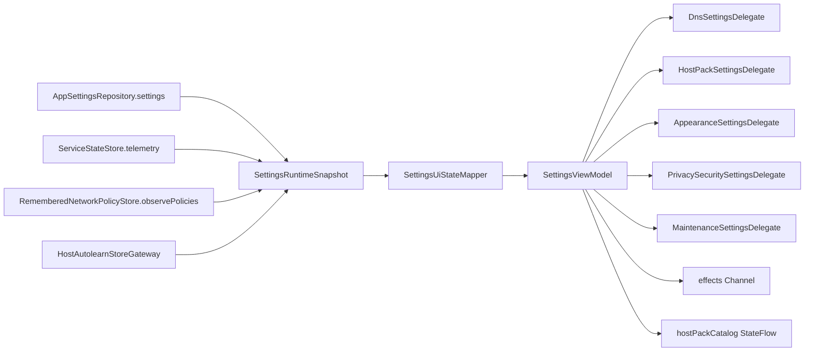
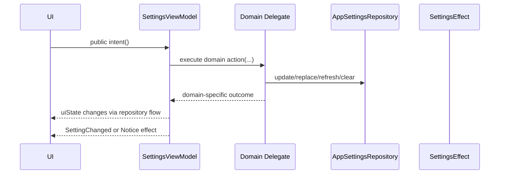

# Design

## Overview

[SettingsViewModel.kt](/Users/po4yka/GitRep/RIPDPI/app/src/main/java/com/poyka/ripdpi/activities/SettingsViewModel.kt) is currently responsible for three different layers at once:

1. Screen contract and derived state mapping.
2. State-flow wiring across settings, runtime telemetry, remembered networks, and host-autolearn refresh.
3. Multiple unrelated write and side-effect domains such as DNS, curated host packs, launcher icons, biometrics, cleanup, and reset workflows.

The refactor target is a thinner ViewModel that keeps one state flow, one effect flow, and the current public intent surface, while delegating unrelated domains to explicit collaborators with narrow dependencies.

## Detailed Requirements

This design must satisfy the following:

1. Preserve `uiState`, `effects`, `hostPackCatalog`, `update(...)`, and `updateSetting(...)` semantics.
2. Preserve all current public named intents and current screen call sites.
3. Preserve exact behavior for DNS selection, host pack refresh, launcher icon changes, biometrics and backup PIN, remembered-network cleanup, learned-host cleanup, profile resets, and personalization/privacy settings.
4. Keep `SettingsViewModel` as the state holder and intent coordinator.
5. Prefer named domain collaborators over generic “settings command” abstractions.
6. Add a test seam for host-autolearn store access so cleanup behavior is directly testable.

## Architecture Overview

### Target responsibilities

`SettingsViewModel` keeps:

1. `uiState`, `hostPackCatalog`, `effects`, and local refresh triggers.
2. The generic `update(...)` and `updateSetting(...)` hooks used by the advanced settings editor.
3. Public named intent methods, but only as orchestration entry points.
4. Coroutine launching and effect publication.

Extracted collaborators own:

1. Pure state mapping from upstream data to `SettingsUiState`.
2. DNS normalization and related repository writes.
3. Host pack catalog load, preset application, refresh, and refresh-result notice mapping.
4. Appearance behavior for theme and launcher icon changes.
5. Privacy/security behavior for WebRTC protection, biometrics, and backup PIN.
6. Maintenance behavior for learned-host cleanup, remembered-network clearing, and all reset flows.

### Component relationship

### Intent flow

## Components And Interfaces

### 1. `SettingsRuntimeSnapshot`

A typed upstream aggregate that replaces the anonymous `combine` payload:

- `settings: AppSettings`
- `telemetry: ServiceTelemetrySnapshot`
- `hostAutolearnStorePresent: Boolean`
- `rememberedNetworkCount: Int`

Purpose:

1. Remove ad-hoc runtime assembly from the ViewModel.
2. Make `uiState` mapping an explicit pure operation.
3. Give tests a stable input model for mapper coverage.

### 2. `SettingsUiStateMapper`

Responsibility:

1. Move `AppSettings.toUiState(...)` and related derived-state logic out of the ViewModel file.
2. Keep mapper behavior pure and fully protected by the existing [SettingsUiStateTest.kt](/Users/po4yka/GitRep/RIPDPI/app/src/test/java/com/poyka/ripdpi/activities/SettingsUiStateTest.kt).

Must not do:

1. Repository writes.
2. Side effects.
3. Effect emission.

### 3. `HostAutolearnStoreGateway`

Responsibility:

1. Wrap `hasHostAutolearnStore(...)` and `clearHostAutolearnStore(...)`.
2. Keep Android file-system behavior behind a small interface or concrete gateway.

Why it exists:

1. The current ViewModel directly reaches static file helpers.
2. Cleanup and initial hydration tests become much easier once the file boundary is explicit.

### 4. `DnsSettingsDelegate`

Responsibility:

1. Own the repository-write logic for:
   - built-in provider selection
   - encrypted protocol switching
   - plain DNS selection
   - custom DoH
   - custom DoT
   - custom DNSCrypt
2. Preserve key/value effect metadata for the ViewModel to emit.

Dependencies:

1. `AppSettingsRepository`

Must preserve:

1. Resolver normalization rules.
2. Bootstrap IP normalization.
3. Protocol-specific cleanup semantics.
4. Invalid provider id no-op behavior.

### 5. `HostPackSettingsDelegate`

Responsibility:

1. Load the initial host pack snapshot.
2. Apply curated host pack presets to settings.
3. Refresh the remote catalog and map exceptions to current notice copy and tone.

Dependencies:

1. `AppSettingsRepository`
2. `HostPackCatalogRepository`

ViewModel keeps:

1. The `MutableStateFlow<HostPackCatalogUiState>`.
2. The refresh-in-progress toggle and effect emission.

### 6. `AppearanceSettingsDelegate`

Responsibility:

1. Save app theme changes.
2. Normalize and save app icon variant.
3. Apply themed icon style.
4. Coordinate `LauncherIconController.applySelection(...)`.

Dependencies:

1. `AppSettingsRepository`
2. `LauncherIconController`

Must preserve:

1. Normalized icon key behavior.
2. Current effect keys.
3. Themed-style selection logic.

### 7. `PrivacySecuritySettingsDelegate`

Responsibility:

1. Save WebRTC protection.
2. Save biometric enablement.
3. Save backup PIN.

Dependencies:

1. `AppSettingsRepository`

Rationale:

These settings are simple, but they form a coherent privacy/security slice and remove unrelated write logic from the ViewModel without changing the generic settings editor path.

### 8. `MaintenanceSettingsDelegate`

Responsibility:

1. Reset all settings.
2. Clear learned hosts.
3. Clear remembered networks.
4. Reset fake TLS profile.
5. Reset adaptive fake TTL profile.
6. Reset fake payload library.
7. Reset HTTP parser evasions.
8. Reset activation window.

Dependencies:

1. `AppSettingsRepository`
2. `RememberedNetworkPolicyStore`
3. `ServiceStateStore`
4. `HostAutolearnStoreGateway`

Must preserve:

1. Running-versus-halted notice copy.
2. Error-versus-info tone for learned-host deletion.
3. The exact settings fields each reset changes.

## Public API Preservation

The ViewModel’s public method names stay stable during the refactor. Each method becomes a thin wrapper around the relevant collaborator.

| Public method group | Target owner behind the ViewModel |
| --- | --- |
| `update`, `updateSetting` | ViewModel |
| DNS methods | `DnsSettingsDelegate` |
| `applyHostPackPreset`, `refreshHostPackCatalog` | `HostPackSettingsDelegate` |
| `setAppTheme`, `setAppIcon`, `setThemedAppIconEnabled` | `AppearanceSettingsDelegate` |
| `setWebRtcProtectionEnabled`, `setBiometricEnabled`, `setBackupPin` | `PrivacySecuritySettingsDelegate` |
| `resetSettings`, cleanup, and reset-profile methods | `MaintenanceSettingsDelegate` |

## Data Models

The design intentionally keeps helper models small and explicit:

1. `SettingsRuntimeSnapshot`
   Typed input to the UI-state mapper.

2. `HostPackRefreshResult`
   A host-pack-specific result carrying the next snapshot plus the notice to emit.

3. `LearnedHostCleanupResult`
   A cleanup-specific result carrying delete success and the service-aware notice.

4. `SettingsResetResult`
   A reset-specific result carrying the exact `Notice` or `SettingChanged` effect to emit after repository writes.

These are specific to their domains. The design deliberately rejects a generic “settings action result” type that would blur domain boundaries.

## Error Handling

The refactor must preserve current behavior in all error-sensitive branches:

1. Invalid DNS provider ids remain no-ops.
2. Custom DoH URI parsing continues to fall back safely when host or port parsing fails.
3. Host pack refresh keeps the previous snapshot on failure.
4. Host pack refresh preserves distinct notices for:
   - checksum mismatch or malformed checksum
   - parse/build failures
   - generic download or network failures
5. Learned-host cleanup preserves:
   - error notice on failed delete
   - “next start” notice when service is running
   - regular success notice when halted
6. Sensitive resets preserve different notice copy depending on whether the service is running.
7. Icon updates continue to write settings and apply launcher selection before the visible effect is emitted.

## Testing Strategy

### Top-level characterization suite

Add a new `SettingsViewModelTest` that validates public behavior only:

1. Collect `uiState`, `hostPackCatalog`, and `effects`.
2. Drive public ViewModel methods.
3. Assert repository state, emitted effects, and visible state transitions.

### Direct collaborator tests

Each extracted collaborator gets direct unit coverage:

1. `SettingsUiStateMapperTest`
   Existing `SettingsUiStateTest` remains the main guardrail.
2. `DnsSettingsDelegateTest`
3. `HostPackSettingsDelegateTest`
4. `AppearanceSettingsDelegateTest`
5. `PrivacySecuritySettingsDelegateTest`
6. `MaintenanceSettingsDelegateTest`
7. `HostAutolearnStoreGatewayTest` if non-trivial behavior is added beyond simple forwarding

### Flow and coroutine coverage

Use:

1. `MainDispatcherRule`
2. `runTest`
3. Turbine
4. Robolectric only where Android `Context` or filesystem behavior is truly needed

## Appendices

### Technology Choices

1. Concrete delegates over interfaces by default.
   The codebase already uses straightforward injected concrete collaborators in several places, and this refactor does not need interface-heavy indirection.

2. Typed runtime snapshot over large reducer object.
   A typed snapshot clarifies the `combine` contract without creating a second monolith.

3. Specific result models over generic command buses.
   This keeps each extracted domain understandable in review.

### Key Findings From Local Research

1. The advanced settings screen directly depends on `updateSetting(...)` in dozens of places.
   The plan therefore keeps that generic mutation hook in the ViewModel instead of trying to extract every low-level builder mutation.

2. The largest `SettingsViewModel` risks are the named domain flows, not the generic advanced-editor writes.
   DNS, host pack refresh, launcher icon changes, cleanup, and reset flows have the most stateful behavior and user-visible side effects.

3. `SettingsUiStateTest` already gives a strong safety net for derived-state logic.
   That makes `SettingsUiStateMapper` one of the safer early extractions.

### Alternative Approaches Rejected

1. One large `SettingsCoordinator`.
   Rejected because it would simply recreate the current monolith under a new class name.

2. Removing `update(...)` and `updateSetting(...)`.
   Rejected because the advanced settings route already uses these as a stable editing surface.

3. A generic `SettingsCommand` or `SettingsAction` framework.
   Rejected because it would obscure which domain owns which side effects and would make regressions harder to review.
