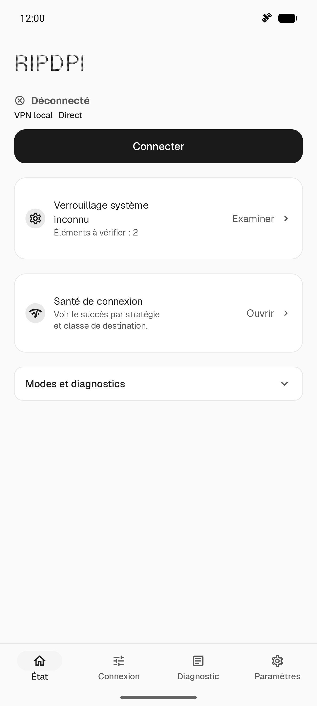
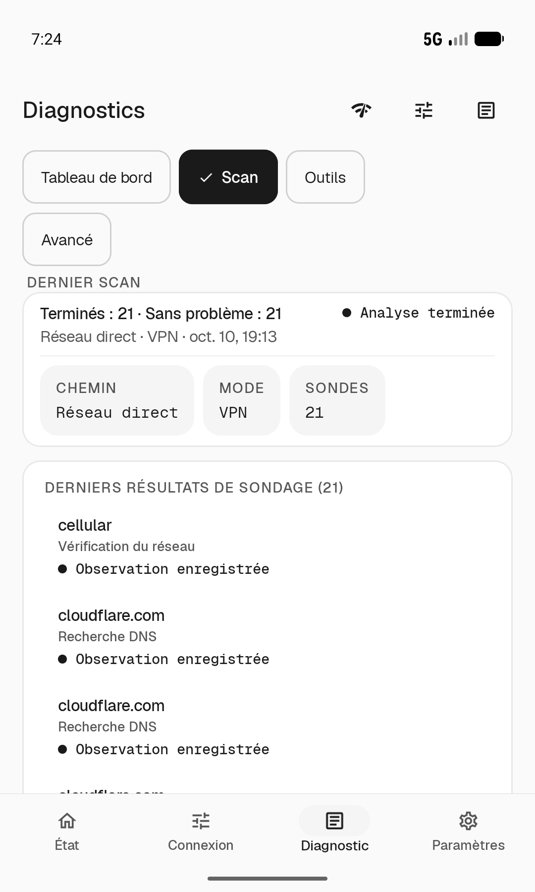
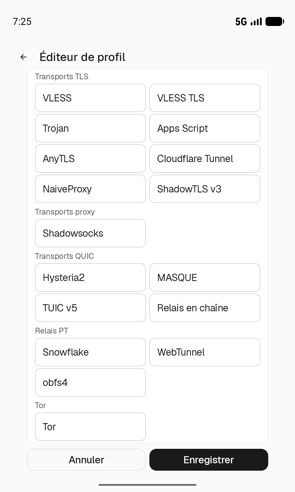

<p align="center">
  
</p>

<h1 align="center">RIPDPI</h1>
<p align="center"><b>Routing & Internet Performance Diagnostics Platform Interface</b></p>

<p align="center">
  <a href="https://github.com/po4yka/RIPDPI/actions/workflows/ci.yml"></a>
  <a href="https://github.com/po4yka/RIPDPI/releases/latest"></a>
  <a href="LICENSE"></a>
  &nbsp;
  
  
  
</p>

<p align="center"><a href="README.md">English</a> | <a href="README-ru.md">Русский</a> | <a href="README-es.md">Español</a> | <a href="README-de.md">Deutsch</a> | <b>Français</b> | <a href="docs/fa/README.md">فارسی</a> | <a href="README-zh-CN.md">简体中文</a> | <a href="README-hi.md">हिन्दी</a> | <a href="README-pt-BR.md">Português (Brasil)</a></p>

> [!WARNING]
> **Le projet est en phase active de développement.** De nouvelles fonctionnalités sont ajoutées et des refactorisations d'envergure sont fréquemment effectuées pour améliorer la qualité de la base de code. Des agents de codage sont intensivement utilisés pour ce travail, donc sur `main` sont actuellement possibles **des changements incompatibles (breaking changes), des migrations de schéma et des fonctionnalités partiellement cassées**. Si vous rencontrez une régression, [ouvrez une issue](https://github.com/po4yka/RIPDPI/issues) — vos retours aident à stabiliser le projet.

RIPDPI est une boîte à outils Android de diagnostic et d'optimisation des chemins réseau. Elle applique des stratégies de paquets configurables sur l'appareil, peut se connecter à des serveurs relais que vous contrôlez et exécute des diagnostics par connexion afin d'identifier la raison pour laquelle chaque cible échoue ou se dégrade. Les trois capacités fonctionnent indépendamment ou en combinaison.

## Trois piliers

### Stratégies de paquets sur l'appareil

Applique des transformations configurables au niveau paquet, sur l'appareil, sans router le trafic vers un serveur relais. Aucun accès root n'est requis pour le chemin principal.

Techniques prises en charge : découpage et désordre de segments TCP, injection de faux paquets, OOB (pointeur urgent), fragmentation d'enregistrements TLS, faux premier vol TLS, variation de handshake QUIC, variation du champ de longueur UDP, insertion d'en-têtes d'extension IPv6, envois de paquets bruts définis en Lua, et marqueurs sémantiques adaptatifs qui résolvent la position en fonction de `TCP_INFO` en direct. Les chaînes de stratégies sont construites à partir de crates Rust de ce dépôt, sans binaire de stratégie externe.

Lorsqu'aucun relais n'est configuré, le trafic quitte l'appareil directement — les mutations sur l'appareil sont le seul changement apporté au chemin.

### Relais VPN

Chaîne le trafic du proxy local ou du VPN via des protocoles de relais chiffrés vers un serveur que vous configurez :

> [!NOTE]
> La matrice protocolaire reflète les registres actuels du code source. La prose traduite environnante peut être en retard sur `README.md` jusqu'à la révision humaine.

| Kind / protocol | Integration tier | Scope | Traffic |
| --- | --- | --- | --- |
| `vless_reality` / VLESS Reality TCP | Native relay-core backend (`ripdpi-vless`) | Client relay | TCP + UDP (XUDP) |
| `vless_reality` / xHTTP transport | Native relay-core backend (`ripdpi-xhttp`) | Client relay | TCP |
| `cloudflare_tunnel` | Native xHTTP relay path plus optional Cloudflare publish runtime | Client relay / local-origin publish | TCP |
| `hysteria2` | Native relay-core backend (`ripdpi-hysteria2`) | Client relay | TCP + UDP |
| `tuic_v5` | Native relay-core backend (`ripdpi-tuic`) | Client relay | TCP + UDP |
| `masque` | Native relay-core backend (`ripdpi-masque`): HTTP/2 classic CONNECT for TCP, HTTP/3 CONNECT-UDP for UDP | Client relay | TCP + UDP |
| `shadowtls_v3` | Native relay-core backend (`ripdpi-shadowtls`) with a profile-backed inner relay | Client relay | TCP |
| `trojan` | Native relay-core backend (`ripdpi-trojan`) | Client relay | TCP + UDP |
| `anytls` | Native relay-core backend (`ripdpi-anytls`) | Client relay | TCP + UDP |
| `shadowsocks` | Native relay-core backend (`ripdpi-shadowsocks`) | Client relay | TCP + UDP |
| `tor` | Native Arti-backed relay-core backend (`ripdpi-tor`) with bridge/PT bootstrap | Opt-in client anonymity relay | TCP |
| `naiveproxy` | External helper process (`ripdpi-naiveproxy`) supervised by Android service code | Client relay | TCP |
| `google_apps_script` | In-repository Rust Apps Script relay runtime (`ripdpi-apps-script-core`) selected by `libripdpi-relay.so` | Client relay path | TCP |
| `snowflake` | External Go pluggable-transport binary (`ripdpi-snowflake`) | Client PT relay | TCP |
| `webtunnel` | In-repository Rust pluggable-transport helper binary (`ripdpi-webtunnel`) | Client PT relay | TCP |
| `obfs4` | External pluggable-transport binary (`ripdpi-obfs4`) | Client PT relay | TCP |
| `chain_relay` | Native relay-core composition over referenced relay profiles | Ordered 2-4 hop client relay | TCP |
| `mieru` | Native relay-core backend (`ripdpi-mieru`); UDP relay gated off pending the custom UDP/TCP wire engine | Client relay | TCP |
| `ssh` | Native relay-core backend (`ripdpi-ssh`) | Client relay | TCP |
| `vless` / xHTTP transport | Native relay-core backend (`ripdpi-xhttp`), xHTTP/TLS | Client relay | TCP |

Le `vless` simple possède un backend natif xHTTP/TLS ; ce backend ne prend pas en charge les autres transports VLESS simples. VLESS Reality utilise XUDP uniquement si UDP est activé, le transport est `reality_tcp` et le flow est `xtls-rprx-vision` ou `xtls-rprx-vision-udp443`. xHTTP prend uniquement en charge TCP.

Snowflake intentionally remains an external Go binary; see the [Snowflake native Rust no-go decision](docs/architecture/snowflake-native-rust-decision.md). VLESS Reality does not use real ECH; see [ADR 0001](docs/adr/0001-reality-ech.md) for the GREASE-only policy.

WARP and AmneziaWG are separate VPN/tunnel profile surfaces, not `relay_kind` values in the relay-core registry.

Le mode proxy local et le mode redirection VPN Android fonctionnent tous deux avec ou sans relais configuré.

### Diagnostics

Analyse chaque cible séparément et produit un résultat parmi trois variantes typées :

- `TRANSPARENT_WORKS` — un chemin transparent testé fonctionne, avec ou sans stratégies sur l'appareil
- `OWNED_STACK_ONLY` — fonctionne uniquement via la pile TLS détenue par l'application
- `NO_DIRECT_SOLUTION` — aucune solution directe testée n'a réussi dans le budget de cette exécution ; envisager un relais ou un autre test

Le blocage suspecté est enregistré séparément dans `transportClass`, par exemple `IP_BLOCK_SUSPECT`, `SNI_TLS_SUSPECT` ou `QUIC_BLOCK_SUSPECT`. Ces classes décrivent des indices d'une cause possible ; elles ne sont ni des variantes supplémentaires du résultat ni une preuve de blocage.

Les verdicts sont stockés par empreinte de réseau et rejoués automatiquement lorsque le même réseau est revu. L'écran de diagnostic ajoute le sondage des stratégies TCP et QUIC à partir des suites `ripdpi-diagnostics-candidates` (quick/full-matrix), la détection d'altération DNS, des recommandations de résolveurs DoH/DoT/DNSCrypt/DoQ et des archives de diagnostic exportables.

## Pourquoi RIPDPI

Les réseaux Android modernes appliquent régulièrement un fingerprinting L7 (TLS JA3/JA4, QUIC), une QoS agressive sur les réseaux cellulaires et le Wi-Fi public, un désynchronisation MTU et ECN et des abandons de handshake TLS induits par les middleboxes — ce qui fait échouer certaines cibles tandis que d'autres fonctionnent très bien sur le même réseau. Un unique réglage global ne peut pas couvrir tous les cas.

Principe de conception de RIPDPI : classifier chaque cible et chaque réseau séparément, appliquer la solution la plus légère qui fonctionne et la mémoriser.

1. **Une réponse par cible et par réseau** — pas une politique globale unique. Les diagnostics classifient chaque autorité et stockent le verdict indexé sur un hash d'empreinte de réseau.
2. **Mutez le chemin local lorsque le réseau est le problème.** Marqueurs sémantiques, placement adaptatif des découpages, chaînes de faux payloads, OOB/désordre, enregistrements TLS aléatoires, variation d'empreinte QUIC — assemblés à partir de crates Rust internes au dépôt.
3. **Repliez-vous sur un relais tunnelé lorsque le chemin direct est dégradé.** La matrice de relais ci-dessus distingue native relay-core backends, helper subprocesses, external pluggable transports et surfaces VPN/tunnel séparées.
4. **Rapports honnêtes.** Les verdicts sont typés et affichés ; les résultats du classifieur d'échec sont mis en évidence plutôt que supprimés ; les paquets d'export de diagnostic masquent les secrets.

## Captures d'écran

<p align="center">
  <a href="docs/screenshots/ui/fr/home.png"></a>
  &nbsp;
  <a href="docs/screenshots/ui/fr/diagnostics.png"></a>
  &nbsp;
  <a href="docs/screenshots/ui/fr/relay.png"></a>
</p>

L'écran principal est déconnecté. Diagnostics montre la configuration du scan. Les paramètres du relais montrent une modification non enregistrée dans l'éditeur. Sélectionnez une image pour l'ouvrir en pleine résolution. Les [illustrations promotionnelles](play-store-screenshots/README.md) sont conservées séparément.

## Fonctionnalités

- **Mode proxy** : proxy SOCKS5 local sur le port localhost configuré.
- **Mode VPN** : route le trafic de l'appareil Android via un pont local TUN-vers-SOCKS au moyen de `VpnService`.
- **Import de profil** : scan et génération de QR code, ainsi qu'import par presse-papiers et feuille de partage. L'analyse du presse-papiers et de la feuille de partage utilise le codec URI proxy, qui accepte `vless://`, `ss://`, `trojan://`, `hysteria2://`, `hy2://`, `anytls://`, `tuic://`, `mieru://` et `ssh://` ; le scan QR réussit actuellement pour `vless://`, `ss://`, `trojan://`, `hysteria2://`, `hy2://`, `tuic://` et `mieru://`. AmneziaWG utilise le codec distinct `amneziawg://`. Les filtres d'intention Android exposent également `ssh://` au trampoline d'import, et le codec URI proxy le parse et le sérialise dans les deux sens.
- **Abonnements** : formats d'abonnement base64, Clash / Clash.Meta YAML, sing-box JSON et WireGuard-INI avec mise à jour automatique en arrière-plan, détection des profils en double, groupes selector/urltest et livraison multi-miroir.
- **DNS chiffré** : prise en charge des résolveurs DoH, DoT, DNSCrypt et DoQ dans les chemins liés au VPN.
- **Contrôles de stratégie** : familles TCP split/disorder/fake, fragmentation d'enregistrements TLS et faux profils, variation de handshake QUIC, variation du champ de longueur UDP, en-têtes d'extension IPv6, `rawsend` Lua, filtres d'activation par étape, contrôle de l'ID IPv4 et injection OOB.
- **Mémoire de politique par réseau** : verdicts validés par autorité indexés sur une empreinte de réseau ; rejoués automatiquement à la reconnexion.
- **Sondage adaptatif** : sondage automatique des stratégies pour les réseaux vus pour la première fois ; revérification `quick_v1` en arrière-plan lors d'un handover réseau.
- **Redémarrage conscient du handover** : réévaluation en direct de la politique lors des transitions entre Wi-Fi, cellulaire et roaming.
- **Navigateur RIPDPI** : navigateur détenu par l'application pour les cibles HTTPS qui nécessitent la pile TLS détenue ; chemin `SecureHttpClient` partagé pour les requêtes émises par l'application.
- **Télémétrie et journaux d'exécution** : cycle de vie du proxy, décisions de route, événements de bascule DNS, progression des diagnostics et événements du moteur natif — disponibles en historique intégré à l'application et en export d'assistance.
- **Helper root optionnel** : sur les appareils rootés, débloque les opérations sur sockets bruts (FakeRst, MultiDisorder, fragmentation IP, SeqOverlap complet, émission de paquets IPv4/IPv6 bruts) via un processus auxiliaire privilégié.

## Modes d'exécution

### Proxy

Proxy SOCKS5 sur un port localhost configuré. Pour les applications qui prennent en charge la configuration de proxy. Les mutations de stratégie et le chaînage de relais s'appliquent à tout le trafic qui entre par le proxy.

### VPN

Utilise `VpnService` Android pour rediriger le trafic de l'appareil via le moteur local de RIPDPI. Lorsqu'aucun relais n'est configuré, le mode VPN applique les mutations sur l'appareil sans changer l'IP de sortie. Lorsqu'un relais est configuré, le trafic est transféré chiffré vers le point de terminaison configuré.

## Confidentialité

RIPDPI enregistre des métadonnées opérationnelles à des fins de diagnostic et de dépannage : instantanés du réseau, état des résolveurs, décisions de route, résultats d'analyse, état du service et événements du moteur natif.

En fonctionnement normal, RIPDPI ne capture pas les paquets, ne conserve pas les charges utiles du trafic et n'enregistre pas les secrets TLS. La capture avancée de paquets est un outil de diagnostic activé explicitement : les octets bruts sont conservés localement avec une rétention limitée et ne sont inclus dans une archive que lorsque l'utilisateur choisit délibérément de la partager.

La confidentialité du trafic de relais dépend du point de terminaison et du profil de relais que vous configurez.

## Compilation

Prérequis : JDK 17, Android SDK (platform `37`, CMake `3.31.6`), Android NDK `29.0.14206865`, chaîne d'outils Rust `1.98.1`, cibles Rust Android pour les ABI nécessaires.

Un checkout neuf nécessite aussi le vrai AAR libXray avec les correctifs du projet avant de créer l'APK. Préparez Go amd64, les versions fixées de `gomobile` et `gobind`, ainsi que `ANDROID_NDK_HOME` selon [la procédure libXray](docs/native/libxray-packaging.md#build). Le producteur nécessite un dossier `native/xray/artifacts/` neuf ou vide et un accès aux sources fixées. Pour réutiliser un dossier vérifié conforme aux versions actuelles, passez `-Pripdpi.prebuiltXrayAarDir=/absolute/path/to/artifacts` à Gradle ; la vérification avant empaquetage reste active.

Installez les paquets SDK requis avec Android CLI 1.0+ :

```bash
android sdk install platforms/android-37 ndk/29.0.14206865 cmake/3.31.6
```

```bash
git clone https://github.com/po4yka/RIPDPI.git
cd RIPDPI
bash scripts/native/build-libxray.sh
bash scripts/native/verify-libxray-artifacts.sh
./gradlew assembleDebug
```

Les compilations locales utilisent par défaut `host` (`ripdpi.localNativeAbisDefault`) : l'ABI est dérivée de l'architecture de l'hôte (par ex. `arm64-v8a` sur Apple Silicon). Pour l'émulateur : `./gradlew assembleDebug -Pripdpi.localNativeAbis=x86_64`.

Les APK sont produits dans des répertoires propres aux variantes, par exemple `app/build/outputs/apk/githubFull/debug/` ; consultez [distribution.md](docs/distribution.md) pour les tâches et chemins de release.

Les builds debug locaux utilisent des lanceurs stub pour Snowflake, obfs4, WebTunnel et le helper de publication Cloudflare. Ces helpers ne transmettent pas de trafic dans cet APK debug. Pour produire les vrais helpers, installez Go et Git en plus des outils Rust/NDK ci-dessus ; il faut accéder aux dépôts fixés et aux modules Go. Les versions de Go sont dans [le manifeste des sources](native/pluggable-transports/sources.json). Activez les erreurs strictes pour arrêter le build si un helper ne peut pas être compilé :

```bash
./gradlew assembleDebug \
  -Pripdpi.pluggableTransportAssetsMode=source \
  -Pripdpi.pluggableTransportAssetsStrictFailures=true
```

## Tests

```bash
./gradlew testDebugUnitTest
bash scripts/ci/run-rust-native-checks.sh
bash scripts/ci/run-rust-network-e2e.sh
python3 -m unittest scripts.tests.test_offline_analytics_pipeline
```

Détails : [docs/testing.md](docs/testing.md)

## Documentation

- [Intégration native et modules](docs/native/README.md)
- [Runtime des stratégies de paquets](docs/packet-strategy-runtime.md)
- [Moteur de proxy et surface des stratégies](docs/native/proxy-engine.md)
- [Pont TUN-vers-SOCKS](docs/native/tunnel.md)
- [Opérations du pack de stratégies et du catalogue TLS](docs/strategy-pack-operations.md)
- [Exemples de profils de relais](docs/relay-profile-examples.md)
- [Notes d'architecture](docs/architecture/README.md)
- [Feuille de route](ROADMAP.md)

## Traduire RIPDPI

Les traductions sont des contributions de la communauté via des pull requests GitHub. Consultez [docs/localization.md](docs/localization.md) pour ajouter ou améliorer une langue et [le registre de provenance](docs/localization-provenance.md) pour les statuts et dates de révision. Les contrôles structurels ne prouvent pas la justesse linguistique ; l'arabe, le hindi et le portugais brésilien attendent encore une révision par des locuteurs natifs.
