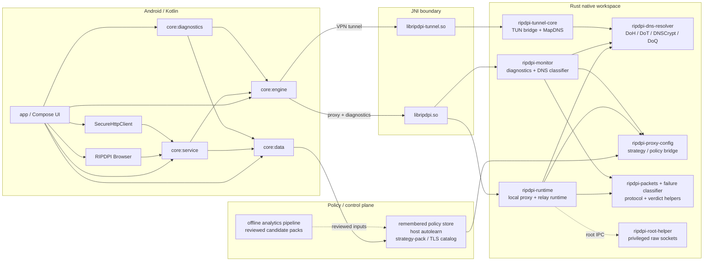

<p align="center">
  
</p>

<h1 align="center">RIPDPI</h1>
<p align="center"><b>Routing & Internet Performance Diagnostics Platform Interface</b></p>

<p align="center">
  <a href="https://github.com/po4yka/RIPDPI/actions/workflows/ci.yml"></a>
  <a href="https://github.com/po4yka/RIPDPI/releases/latest"></a>
  <a href="LICENSE"></a>
  &nbsp;
  
  
  
</p>

<p align="center"><a href="README.md">English</a> | <b>Русский</b></p>

Android-инструментарий диагностики и оптимизации сетевого пути. RIPDPI измеряет, классифицирует и оптимизирует прохождение отдельных потоков через локальную сеть и путь до origin — полезно, когда middleboxes, перегруженные сотовые каналы, рассинхронизация MTU или middlebox-induced TLS handshake aborts ухудшают соединение с конкретными authority, оставляя остальные здоровыми. RIPDPI поставляется с:

- **VLESS Reality и xHTTP** в качестве основного tunneled outbound для производительности и приватности, реализованных нативно в `ripdpi-vless` / `ripdpi-relay-core` / `ripdpi-relay-mux` без Go-рантайма; `ripdpi-relay-android` обеспечивает JNI surface и Android socket protection
- дополнительные tunneled-outbound протоколы на том же пути: WARP, Cloudflare Tunnel, MASQUE, Hysteria2, TUIC v5, ShadowTLS v3 и NaiveProxy
- local proxy mode и local VPN redirection mode для маршрутизации трафика приложений — с подключённым tunneled outbound или без
- шифрованным DNS в VPN-режиме через DoH/DoT/DNSCrypt/DoQ
- расширенной стратегической настройкой: semantic markers, adaptive split placement, разделением TCP/QUIC/DNS strategy lanes, per-network policy memory и automatic probing/audit
- handover-aware live policy re-evaluation при переходах между Wi-Fi, cellular и roaming
- strategy-pack и TLS catalog rollout control для feature flags, transport defaults и fingerprint rotation
- direct-path DNS classification, transport verdicts и transport-specific remediation, которая разветвляется между on-device оптимизацией пути, owned-stack browser, browser-camouflage туннелем, QUIC-heavy туннелем и manual review для каждого authority
- owned-stack RIPDPI Browser и общий `SecureHttpClient` path для app-originated traffic, который контролирует само приложение
- repo-local offline analytics pipeline для clustering middlebox/device fingerprints и reviewed signature catalog generation
- xHTTP-side Finalmask для поддерживаемых tunnel profiles и Cloudflare Tunnel path
- встроенной диагностикой и пассивной telemetry
- in-repository Rust native modules

RIPDPI локально запускает SOCKS5-прокси из встроенных Rust-модулей. В proxy mode он использует настроенный фиксированный localhost-порт. В VPN mode приложение поднимает внутренний ephemeral localhost endpoint с per-session auth и направляет Android-трафик через локальный TUN-to-SOCKS bridge. При настройке tunneled outbound (VLESS Reality, xHTTP, WARP, MASQUE, Hysteria2, TUIC v5, ShadowTLS v3, NaiveProxy или Cloudflare Tunnel) локальный прокси chains к этому outbound внутри того же Rust-workspace — шифруя трафик end-to-end до настроенного endpoint. Без туннеля тот же путь применяет on-device оптимизацию пути (мутации TCP / TLS / QUIC) и выходит в сеть напрямую.

## Зачем RIPDPI

Современные Android-сети регулярно применяют активный L7-fingerprinting (TLS JA3/JA4, QUIC, DTLS), агрессивный QoS на сотовых и общедоступных Wi-Fi сетях, рассинхронизацию MTU и ECN, middlebox-induced TLS handshake aborts, неравномерное внедрение ECH — всё это может ухудшать соединение с конкретными authority, в то время как другие работают нормально. Одна глобальная настройка не отвечает на все эти случаи. Конструкция RIPDPI исходит из:

1. **Подбирать ответ для каждой сети и для каждого authority**, а не одной глобальной политикой. Диагностика классифицирует каждый сайт как healthy raw, recoverable on-device, owned-stack-only или tunneled-only — и запоминает verdict per network fingerprint.
2. **Мутировать локальный путь, когда сеть решается на устройстве.** Semantic markers, adaptive split placement, fake-payload chains, OOB / disorder, randomized TLS records, вариация QUIC- и DTLS-handshake — собираются из in-repo Rust crates, без внешнего strategy-binary.
3. **Откатываться на туннелированный outbound, когда прямой путь деградирован.** Native-Rust VLESS Reality / xHTTP outbound (а также WARP, MASQUE, Hysteria2, TUIC v5, ShadowTLS v3, NaiveProxy, Cloudflare Tunnel) обрабатывает authority, восстановить которые на локальном пути не удалось.
4. **Быть честным в отчётах.** Verdicts типизированы (`TRANSPARENT_WORKS`, `OWNED_STACK_ONLY`, `NO_DIRECT_SOLUTION`, `IP_BLOCK_SUSPECT`); результаты failure classifier выводятся, а не глотаются; диагностические export-bundle редактируют секреты.

## Скриншоты

<p align="center">
  
  &nbsp;
  
  &nbsp;
  
  &nbsp;
  
</p>
<p align="center">
  
  &nbsp;
  
</p>

## Архитектура



## Диагностика

В RIPDPI есть встроенный экран диагностики для активных сетевых проверок и пассивного runtime-мониторинга.

Реализованные механизмы диагностики:

- Ручные сканы в режимах `RAW_PATH` и `IN_PATH`
- `Automatic probing` в режиме `RAW_PATH`, плюс скрытые `quick_v1` перепроверки после first-seen network handover
- `Automatic audit` в режиме `RAW_PATH` с rotating curated target cohorts, полным TCP/QUIC matrix-прогоном, confidence/coverage-оценкой и ручной рекомендацией
- 4-stage home composite analysis: automatic audit, default connectivity, DPI full (`ru-dpi-full`) и DPI strategy probe (`ru-dpi-strategy`) с отдельными timeout
- 24 TCP + 6 QUIC strategy probe candidates covering semantic split families, TLS record families, transparent TLS first-flight families, disorder, OOB, disoob, fake packets, hostfake, parser-tolerant variants и ECH techniques
- Проверка целостности DNS через UDP DNS и шифрованные резолверы (DoH/DoT/DNSCrypt/DoQ)
- Authority-scoped DNS classification: clean, poisoned, divergent, ECH-capable и no-HTTPS-RR, которая feeding direct-mode resolver/transport hints
- Проверка доступности доменов с классификацией TLS и HTTP
- Детект ограничений на пороге 16-20 КБ через fat-header requests
- Поиск альтернативного маршрута через allowlist-SNI для constrained TLS-path
- Рекомендации по резолверу с diversified DoH/DoT/DNSCrypt path candidates, bootstrap validation, временным session override и сохранением в настройки DNS
- Strategy-probe progress с live TCP/QUIC lane, номером кандидата и текущей candidate label во время automatic probing/audit
- Persisted direct-mode verdicts с confirm-before-pin / revalidation semantics и honest outcomes: `TRANSPARENT_WORKS`, `OWNED_STACK_ONLY`, `NO_DIRECT_SOLUTION`, `IP_BLOCK_SUSPECT`
- Transport-specific remediation: переход в owned-stack browser, browser-camouflage relay, QUIC-heavy relay или manual review вместо одной generic relay recommendation
- Явная remediation-подсказка, если automatic probing/audit недоступен из-за включенной опции `Use command line settings`
- Пассивная native-телеметрия во время работы proxy или VPN service
- Экспорт bundle с `summary.txt`, `report.json`, `telemetry.csv`, `app-log.txt` и `manifest.json`

Что приложение сохраняет:

- Android network snapshot: transport, capabilities, DNS, MTU, локальные адреса, public IP/ASN, captive portal, validation state
- Native-телеметрию proxy runtime: lifecycle listener-а, принятых клиентов, выбор и переключение route, retry pacing/diversification, host-autolearn state и native-ошибки
- Native-телеметрию tunnel runtime: lifecycle туннеля, счётчики пакетов и байтов, resolver id/protocol/endpoint, DNS latency и failure counters, fallback reason, network handover class

Что приложение не сохраняет:

- Полные packet capture
- Payload пользовательского трафика
- TLS secrets

## Расширенные стратегии

Strategy stack в RIPDPI композируется по уровням TCP, TLS, QUIC/UDP и DTLS, с policy memory и адаптивным scheduling сверху. Android UI покрывает полный typed strategy surface за пределами command-line пути.

**TCP**

- semantic markers (`host`, `endhost`, `midsld`, `sniext`, `extlen`) и adaptive markers (`auto(balanced)`, `auto(host)`), резолвящиеся по live `TCP_INFO`
- ordered TCP chain steps с per-step `ActivationFilter` predicates (timestamp, ECH, window, MSS) и runtime TCP-state branching
- circular mid-connection rotation, которая переключает fallback chains между outbound rounds на одном сокете
- zapret-style fake ordering (`altorder=0..3`) и `duplicate` / `sequential` fake sequence control для `fake`, `fakedsplit`, `fakeddisorder`, `hostfake`
- per-step TCP flag crafting (named masks, chip editor для visually representable chains) и для fake, и для original payload пакетов
- group-wide IPv4 ID control с точным `seqgroup` promotion: смешанные fake/original flows используют один реальный ID-sequence
- standalone disorder (TTL-based segment reordering), OOB (TCP urgent pointer injection) и disoob (disorder + OOB)
- host-targeted fake chunks (`hostfake`) и Linux/Android-focused приближения `fakedsplit` / `fakeddisorder`

**TLS**

- randomized record fragmentation (`tlsrandrec`) с настраиваемыми fragment count и size bounds
- richer fake TLS mutations: `orig`, `rand`, `rndsni`, `dupsid`, `padencap`, size tuning
- встроенные fake payload profile libraries для HTTP, TLS, UDP и QUIC Initial трафика

**QUIC / UDP**

- QUIC handshake variation: SNI split, fake version field, dummy packet prepend, fake burst profiles
- DTLS handshake fingerprint normalization: WebRTC-Chrome / WebRTC-Firefox-shape ClientHello и слот рандомизированного JA4-equivalent fingerprint (cipher и extension multiset-preserving shuffles, GREASE-aware) для WebRTC/DTLS-транспортов, взаимодействующих со строгими middlebox-политиками

**Policy и scheduling**

- replay валидированных per-network policies через hash-only network fingerprint и optional VPN-only DNS override
- per-network host autolearn scoping с фильтрацией telemetry/system-хостов, activation windows и adaptive fake TTL для TCP fake sends
- отдельные TCP, QUIC и DNS strategy families для diagnostics, telemetry и remembered-policy scoring
- handover-aware full restart с фоновыми `quick_v1` strategy probes для first-seen networks
- retry-stealth pacing с jitter, diversified candidate order и adaptive tuning beyond fake TTL
- diagnostics-side automatic probing и automatic audit с candidate-aware progress, confidence-scored report и winners-first review

**Runtime hardening**

- VPN-only localhost hardening: telemetry-resolved ephemeral SOCKS5 bind ports и per-session auth rotation, общая для UI-config и command-line-config sessions

Подробности по native call path и текущей strategy surface: [docs/native/proxy-engine.md](docs/native/proxy-engine.md).

## Android 17 (API 37)

### Owned-stack ECH path

В RIPDPI есть отдельный owned-stack path для трафика, который инициирует само приложение.

- RIPDPI Browser и repo-local `SecureHttpClient` используют общий сервисный owned-stack request path в `:core:service`.
- На Android 17 / API 37 platform `HttpEngine` считается confirmed ECH-capable только для authority с свежим `ECH_CAPABLE` DNS evidence или явным `xml-v37` override.
- Платформенный path сначала пробует QUIC-capable `HttpEngine`, затем автоматически повторяет запрос с отключённым QUIC (H2-only) и только потом откатывается к native owned TLS path.
- На более старых Android, либо без подтверждённого ECH evidence, owned-stack mode деградирует до non-platform owned TLS. Это полезно для `OWNED_STACK_ONLY` hosts, но не означает универсальный ECH.

### Готовность платформы

Manifest, NSC и runtime-permission scaffolding занесены до bump'а `targetSdk` до 37, чтобы сам bump был просто property edit и smoke test, а не рефакторингом.

- `ACCESS_LOCAL_NETWORK` объявлен в манифесте (NEARBY_DEVICES группа, обязателен под API 37 для non-loopback LAN-bind); runtime-permission helper закрывает любой будущий LAN-bind site без перерисовки activity host.
- `network_security_config.xml` (base + `xml-v37`) содержит явный `<domain-config cleartextTrafficPermitted="true">` для `127.0.0.1`, `localhost` и `::1` — чтобы loopback SOCKS / HTTP inbound пережил deprecation `usesCleartextTraffic` в API 37.
- Шаблон `<trust-anchors>` плюс per-domain `<certificate-transparency enforced="false">` задокументирован для pinned-cert flows, идущих через platform stack; native rustls flows (relay, Reality, MASQUE, Hysteria2) не задействуют platform CT и не требуют изменений NSC.

## FAQ

**Приложение требует root?** Нет. На rooted-устройствах opt-in root mode разблокирует дополнительные packet-mutation примитивы (FakeRst, MultiDisorder, IP fragmentation, full SeqOverlap) через привилегированный helper-процесс.

**Это VPN?** RIPDPI использует Android `VpnService` API для системной маршрутизации трафика. При настроенном tunneled outbound трафик шифруется end-to-end до того endpoint, который вы настроили — это стандартная схема туннелированного VPN; выбор endpoint остаётся за вами. Без настроенного tunneled outbound `VpnService` API используется исключительно как локальный traffic-redirector к on-device движку оптимизации пути; в этом режиме RIPDPI не меняет egress IP, и только DNS-запросы при включённом encrypted DNS идут через DoH/DoT/DNSCrypt/DoQ.

**Как использовать вместе с AdGuard?**

1. Запустите RIPDPI в proxy mode.
2. Добавьте RIPDPI в исключения AdGuard.
3. В настройках AdGuard укажите proxy: SOCKS5, хост `127.0.0.1`, порт `1080`.

## Генератор пользовательского руководства

В репозитории есть скрипт для автоматического создания PDF-руководств с аннотированными скриншотами приложения.

```bash
# Установка зависимостей (один раз)
uv venv scripts/guide/.venv
uv pip install -r scripts/guide/requirements.txt --python scripts/guide/.venv/bin/python

# Генерация руководства (устройство или эмулятор должны быть подключены)
scripts/guide/.venv/bin/python scripts/guide/generate_guide.py \
  --spec scripts/guide/specs/user-guide.yaml \
  --output build/guide/ripdpi-user-guide.pdf
```

Скрипт запускает приложение через debug automation contract, делает скриншоты через ADB, добавляет красные стрелки/круги/скобки (Pillow) и собирает всё в PDF формата A4 с пояснительным текстом (fpdf2). Содержание руководства задаётся в YAML-спецификациях в `scripts/guide/specs/` с относительными координатами для переносимости между разными разрешениями.

Опции: `--device <serial>` для выбора устройства, `--skip-capture` для повторной аннотации без пересъёмки, `--pages <id,id>` для фильтрации страниц.

## Документация

**Native Libraries**
- [Native integration и модули](docs/native/README.md)
- [Proxy engine и strategy surface](docs/native/proxy-engine.md)
- [TUN-to-SOCKS bridge](docs/native/tunnel.md)
- [Debug a runtime issue](docs/native/debug-runtime-issue.md)
- [Эксплуатация Cloudflare Tunnel](docs/native/cloudflare-tunnel-operations.md)
- [MASQUE runtime](docs/native/relay-masque-status.md)
- [NaiveProxy runtime](docs/native/relay-naiveproxy-runtime.md)
- [Совместимость Finalmask и примеры конфигурации](docs/native/finalmask-compatibility.md)

**Operations**
- [Эксплуатация strategy-pack и TLS catalog](docs/strategy-pack-operations.md)
- [Offline analytics pipeline](docs/offline-analytics-pipeline.md)
- [Server hardening for self-hosted relays](docs/server-hardening.md)

**Configuration**
- [Примеры relay profiles](docs/relay-profile-examples.md)

**Тестирование и CI**
- [Тесты, E2E, golden contracts и soak coverage](docs/testing.md)

**Укрепление архитектуры**
- [Architecture notes](docs/architecture/README.md)
- [Текущий roadmap](ROADMAP.md)
- [Unsafe audit guide](docs/native/unsafe-audit.md)
- [Service session scope](docs/service-session-scope.md)
- [TCP relay concurrency](docs/native/tcp-concurrency.md)
- [Native size monitoring](docs/native/size-monitoring.md)

**UI и дизайн**
- [Дизайн-система](docs/design-system.md)
- [Host-pack presets](docs/host-pack-presets.md)

**Автоматизация**
- [External UI automation](docs/automation/README.md)
- [Selector contract](docs/automation/selector-contract.md)
- [Appium readiness](docs/automation/appium-readiness.md)

**Руководства**
- [Инструкция по диагностике](docs/user-manual-diagnostics-ru.md)

**Roadmap**
- [Текущий roadmap](ROADMAP.md)

## Сборка

Требования:

- JDK 17
- Android SDK
- Android NDK `29.0.14206865`
- Rust toolchain `1.94.0`
- Android Rust targets для нужных ABI

Базовая локальная сборка:

```bash
git clone https://github.com/po4yka/RIPDPI.git
cd RIPDPI
./gradlew assembleDebug
```

Для локальных non-release сборок по умолчанию используется `ripdpi.localNativeAbisDefault=arm64-v8a`.

Быстрая локальная native-сборка для ABI эмулятора:

```bash
./gradlew assembleDebug -Pripdpi.localNativeAbis=x86_64
```

APK:

- debug: `app/build/outputs/apk/debug/`
- release: `app/build/outputs/apk/release/`

## Тестирование

В проекте есть многоуровневое покрытие для Kotlin, Rust, JNI, services, diagnostics, local-network E2E, Linux TUN E2E, golden contracts и native soak-запусков. Отдельно покрыты per-network policy memory, handover-aware restart logic, encrypted DNS path planning, retry-stealth pacing и telemetry contract goldens.

Основные команды:

```bash
./gradlew testDebugUnitTest
bash scripts/ci/run-rust-native-checks.sh
bash scripts/ci/run-rust-network-e2e.sh
python3 -m unittest scripts.tests.test_offline_analytics_pipeline
```

Подробности и точечные команды: [docs/testing.md](docs/testing.md)

## CI/CD

Проект использует GitHub Actions для непрерывной интеграции и автоматизации релизов.

**CI для push / PR** (`.github/workflows/ci.yml`) сейчас запускает:

- `build`: сборку debug APK, ELF verification, native size verification, JVM unit tests
- `release-verification`: проверка release APK сборки
- `native-bloat`: cargo-bloat проверки размера нативного кода
- `cargo-deny`: сканирование зависимостей на уязвимости
- `rust-lint`: Rust formatting и Clippy проверки
- `rust-cross-check`: кросс-компиляция для Android ABI
- `rust-workspace-tests`: Rust workspace тесты через cargo-nextest
- `gradle-static-analysis`: detekt, ktlint, Android lint
- `rust-network-e2e`: local-network proxy E2E и vendored parity smoke
- `cli-packet-smoke`: поведенческая проверка CLI proxy с pcap capture
- `rust-turmoil`: детерминированные fault-injection сетевые тесты
- `coverage`: JaCoCo и Rust LLVM coverage
- `rust-loom`: исчерпывающая верификация конкурентности
- offline analytics unit tests в `build` job

**Nightly / manual CI** дополнительно запускает:

- `rust-criterion-bench`: Criterion микро-бенчмарки
- `android-macrobenchmark`: Android макро-бенчмарки
- `rust-native-soak`: host-side native endurance тесты
- `rust-native-load`: high-concurrency ramp-up, burst и saturation тесты
- `nightly-rust-coverage`: coverage включая ignored тесты
- `android-network-e2e`: emulator-based instrumentation E2E
- `linux-tun-e2e`: privileged Linux TUN E2E
- `linux-tun-soak`: privileged Linux TUN endurance тесты

Workflow может сохранять golden diffs, Android reports, fixture logs и soak metrics.

**Дополнительный analytics workflow**:

- `offline-analytics.yml`: sample-corpus clustering/signature-mining pipeline и optional private-corpus run при manual dispatch

**Release** (`.github/workflows/release.yml`) запускается при push тегов `v*` или вручную:

- Сборка подписанного release APK
- Создание GitHub Release с прикреплённым APK

### Необходимые GitHub Secrets

Для подписанных релизных сборок настройте секреты репозитория:

| Secret | Описание |
|--------|----------|
| `KEYSTORE_BASE64` | Keystore в Base64 (`base64 -i release.keystore`) |
| `KEYSTORE_PASSWORD` | Пароль keystore |
| `KEY_ALIAS` | Алиас ключа подписи |
| `KEY_PASSWORD` | Пароль ключа подписи |

## Native-модули

- `native/rust/crates/ripdpi-android`: JNI bridge прокси, поверхность proxy runtime telemetry и JNI callbacks для VPN socket protection
- `native/rust/crates/ripdpi-tunnel-android`: JNI bridge TUN-to-SOCKS и поверхность tunnel telemetry
- `native/rust/crates/ripdpi-monitor`: активные diagnostics scans, passive diagnostics events, DNS tampering detection и response parser framework (HTTP/TLS/SSH)
- `native/rust/crates/ripdpi-dns-resolver`: общий encrypted DNS resolver для диагностики и VPN mode
- `native/rust/crates/ripdpi-runtime`: общий proxy runtime layer, используемый `libripdpi.so`, реестр protocol classification и реестр VPN socket protection callback
- `native/rust/crates/ripdpi-packets`: protocol detection, packet mutation, traits протокольной классификации (`ProtocolClassifier`, `ProtocolField`, `FieldObserver`), DTLS ClientHello classifier с JA4-equivalent fingerprint extraction и профили рандомизации fingerprint (WebRTC-Chrome / WebRTC-Firefox / Randomized), интегрированные в strategy evolver как COMBO_POOL slots 33–35
- `native/rust/crates/ripdpi-failure-classifier`: response failure classification, error-page fingerprinting, field-based classification через `FieldCache` и DTLS-fingerprint block detection
- `native/rust/crates/ripdpi-root-helper`: привилегированный standalone-helper-бинарник для rooted-устройств, разрешает raw-socket операции (FakeRst, MultiDisorder, IpFrag2, full SeqOverlap) через Unix-socket IPC с SCM_RIGHTS fd passing
- `native/rust/crates/android-support`: Android logging, JNI support helpers и обобщённые data structures (`BoundedHeap`, `EnumMap`)

Подробности об интеграции native-библиотек и используемых методах: [docs/native/README.md](docs/native/README.md)
