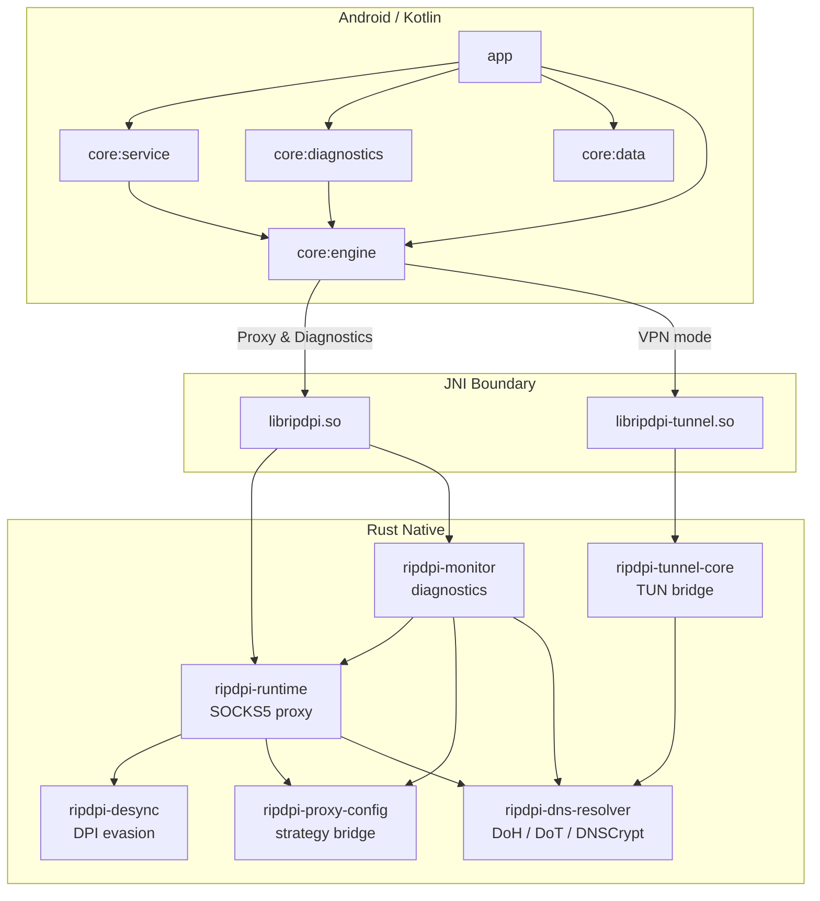

<p align="center">
  
</p>

<h1 align="center">RIPDPI</h1>
<p align="center"><b>Routing & Internet Performance Diagnostics Platform Interface</b></p>

<p align="center">
  <a href="https://github.com/po4yka/RIPDPI/actions/workflows/ci.yml"></a>
  <a href="https://github.com/po4yka/RIPDPI/releases/latest"></a>
  <a href="LICENSE"></a>
  &nbsp;
  
  
  
</p>

<p align="center"><a href="README.md">English</a> | <b>Русский</b></p>

Приложение для Android для оптимизации сетевого соединения с:

- local proxy mode
- local VPN redirection mode
- шифрованным DNS в VPN-режиме через DoH/DoT/DNSCrypt
- расширенной стратегической настройкой: semantic markers, adaptive split placement, разделением TCP/QUIC/DNS strategy lanes, per-network policy memory и automatic probing/audit
- handover-aware live policy re-evaluation при переходах между Wi-Fi, cellular и roaming
- встроенной диагностикой и пассивной telemetry
- in-repository Rust native modules

RIPDPI локально запускает SOCKS5-прокси из встроенных Rust-модулей. В VPN mode Android-трафик перенаправляется в этот локальный прокси через локальный TUN-to-SOCKS bridge.

## Скриншоты

<p align="center">
  
  &nbsp;&nbsp;
  
  &nbsp;&nbsp;
  
</p>

## Архитектура



## Диагностика

В RIPDPI есть встроенный экран диагностики для активных сетевых проверок и пассивного runtime-мониторинга.

Реализованные механизмы диагностики:

- Ручные сканы в режимах `RAW_PATH` и `IN_PATH`
- `Automatic probing` в режиме `RAW_PATH`, плюс скрытые `quick_v1` перепроверки после first-seen network handover
- `Automatic audit` в режиме `RAW_PATH` с rotating curated target cohorts, полным TCP/QUIC matrix-прогоном, confidence/coverage-оценкой и ручной рекомендацией
- Проверка целостности DNS через UDP DNS и шифрованные резолверы (DoH/DoT/DNSCrypt)
- Проверка доступности доменов с классификацией TLS и HTTP
- Детект ограничений на пороге 16-20 КБ через fat-header requests
- Поиск альтернативного маршрута через whitelist SNI для ограниченных TLS-path
- Рекомендации по резолверу с diversified DoH/DoT/DNSCrypt path candidates, bootstrap validation, временным session override и сохранением в настройки DNS
- Strategy-probe progress с live TCP/QUIC lane, номером кандидата и текущей candidate label во время automatic probing/audit
- Явная remediation-подсказка, если automatic probing/audit недоступен из-за включенной опции `Use command line settings`
- Пассивная native-телеметрия во время работы proxy или VPN service
- Экспорт bundle с `summary.txt`, `report.json`, `telemetry.csv` и `manifest.json`

Что приложение сохраняет:

- Android network snapshot: transport, capabilities, DNS, MTU, локальные адреса, public IP/ASN, captive portal, validation state
- Native-телеметрию proxy runtime: lifecycle listener-а, принятых клиентов, выбор и переключение route, retry pacing/diversification, host-autolearn state и native-ошибки
- Native-телеметрию tunnel runtime: lifecycle туннеля, счётчики пакетов и байтов, resolver id/protocol/endpoint, DNS latency и failure counters, fallback reason, network handover class

Что приложение не сохраняет:

- Полные packet capture
- Payload пользовательского трафика
- TLS secrets

## Настройки

Android UI покрывает широкий typed strategy surface за пределами command-line пути.

## Расширенные стратегии

Текущий Android/native strategy stack включает:

- semantic markers: `host`, `endhost`, `midsld`, `sniext`, `extlen`
- adaptive markers вида `auto(balanced)` и `auto(host)`, которые резолвятся по live `TCP_INFO`
- ordered TCP/UDP chain steps и per-step activation filters
- richer fake TLS mutations: `orig`, `rand`, `rndsni`, `dupsid`, `padencap`, size tuning
- built-in fake payload profile library для HTTP, TLS, UDP и QUIC Initial
- host-targeted fake chunks (`hostfake`) и Linux/Android-focused приближения `fakedsplit` / `fakeddisorder`
- replay валидированных per-network policies через hash-only network fingerprint и optional VPN-only DNS override
- per-network host autolearn scoping, activation windows и adaptive fake TTL для TCP fake sends
- отдельные TCP, QUIC и DNS strategy families для diagnostics, telemetry и remembered policy scoring
- full restart при actionable handover с фоновыми `quick_v1` strategy probes для first-seen networks
- retry-stealth pacing с jitter, diversified candidate order и adaptive tuning beyond fake TTL
- diagnostics-side automatic probing и automatic audit с candidate-aware progress, confidence-scored report, winners-first review и ручной рекомендацией

Подробности по native call path и текущей strategy surface: [docs/native/proxy-engine.md](docs/native/proxy-engine.md).

## FAQ

**Приложение требует root?** Нет.

**Это VPN?** Нет. Приложение использует VPN-режим Android для локального перенаправления трафика. Оно не шифрует обычный пользовательский трафик и не скрывает ваш IP-адрес. При включенном encrypted DNS шифруются только DNS-запросы через DoH/DoT/DNSCrypt.

**Как использовать вместе с AdGuard?**

1. Запустите RIPDPI в proxy mode.
2. Добавьте RIPDPI в исключения AdGuard.
3. В настройках AdGuard укажите proxy: SOCKS5, хост `127.0.0.1`, порт `1080`.

## Генератор пользовательского руководства

В репозитории есть скрипт для автоматического создания PDF-руководств с аннотированными скриншотами приложения.

```bash
# Установка зависимостей (один раз)
uv venv scripts/guide/.venv
uv pip install -r scripts/guide/requirements.txt --python scripts/guide/.venv/bin/python

# Генерация руководства (устройство или эмулятор должны быть подключены)
scripts/guide/.venv/bin/python scripts/guide/generate_guide.py \
  --spec scripts/guide/specs/user-guide.yaml \
  --output build/guide/ripdpi-user-guide.pdf
```

Скрипт запускает приложение через debug automation contract, делает скриншоты через ADB, добавляет красные стрелки/круги/скобки (Pillow) и собирает всё в PDF формата A4 с пояснительным текстом (fpdf2). Содержание руководства задаётся в YAML-спецификациях в `scripts/guide/specs/` с относительными координатами для переносимости между разными разрешениями.

Опции: `--device <serial>` для выбора устройства, `--skip-capture` для повторной аннотации без пересъёмки, `--pages <id,id>` для фильтрации страниц.

## Документация

**Native Libraries**
- [Native integration и модули](docs/native/README.md)
- [Proxy engine и strategy surface](docs/native/proxy-engine.md)
- [TUN-to-SOCKS bridge](docs/native/tunnel.md)
- [Debug a runtime issue](docs/native/debug-runtime-issue.md)

**Тестирование и CI**
- [Тесты, E2E, golden contracts и soak coverage](docs/testing.md)

**UI и дизайн**
- [Дизайн-система](docs/design-system.md)
- [Host-pack presets](docs/host-pack-presets.md)

**Автоматизация**
- [External UI automation](docs/automation/README.md)
- [Selector contract](docs/automation/selector-contract.md)
- [Appium readiness](docs/automation/appium-readiness.md)

**Руководства**
- [Инструкция по диагностике](docs/user-manual-diagnostics-ru.md)

## Сборка

Требования:

- JDK 17
- Android SDK
- Android NDK `29.0.14206865`
- Rust toolchain `1.94.0`
- Android Rust targets для нужных ABI

Базовая локальная сборка:

```bash
git clone https://github.com/po4yka/RIPDPI.git
cd RIPDPI
./gradlew assembleDebug
```

Для локальных non-release сборок по умолчанию используется `ripdpi.localNativeAbisDefault=arm64-v8a`.

Быстрая локальная native-сборка для ABI эмулятора:

```bash
./gradlew assembleDebug -Pripdpi.localNativeAbis=x86_64
```

APK:

- debug: `app/build/outputs/apk/debug/`
- release: `app/build/outputs/apk/release/`

## Тестирование

В проекте есть многоуровневое покрытие для Kotlin, Rust, JNI, services, diagnostics, local-network E2E, Linux TUN E2E, golden contracts и native soak-запусков. Отдельно покрыты per-network policy memory, handover-aware restart logic, encrypted DNS path planning, retry-stealth pacing и telemetry contract goldens.

Основные команды:

```bash
./gradlew testDebugUnitTest
bash scripts/ci/run-rust-native-checks.sh
bash scripts/ci/run-rust-network-e2e.sh
```

Подробности и точечные команды: [docs/testing.md](docs/testing.md)

## CI/CD

Проект использует GitHub Actions для непрерывной интеграции и автоматизации релизов.

**CI для push / PR** (`.github/workflows/ci.yml`) сейчас запускает:

- `build`: сборку debug APK, ELF verification, native size verification, JVM unit tests
- `static-analysis`: Rust formatting/clippy/tests, cargo-deny, Android static analysis
- `rust-network-e2e`: repo-owned local-network proxy E2E и focused vendored parity smoke
- `android-network-e2e`: emulator-based instrumentation E2E поверх local fixture stack

**Nightly / manual CI** дополнительно запускает:

- `rust-native-soak`: host-side native soak для proxy и diagnostics runtime
- `linux-tun-e2e`: privileged Linux TUN E2E и TUN soak coverage

Workflow может сохранять golden diffs, Android reports, fixture logs и soak metrics.

**Release** (`.github/workflows/release.yml`) запускается при push тегов `v*` или вручную:

- Сборка подписанного release APK
- Создание GitHub Release с прикреплённым APK

### Необходимые GitHub Secrets

Для подписанных релизных сборок настройте секреты репозитория:

| Secret | Описание |
|--------|----------|
| `KEYSTORE_BASE64` | Keystore в Base64 (`base64 -i release.keystore`) |
| `KEYSTORE_PASSWORD` | Пароль keystore |
| `KEY_ALIAS` | Алиас ключа подписи |
| `KEY_PASSWORD` | Пароль ключа подписи |

## Native-модули

- `native/rust/crates/ripdpi-android`: JNI bridge прокси и поверхность proxy runtime telemetry
- `native/rust/crates/ripdpi-tunnel-android`: JNI bridge TUN-to-SOCKS и поверхность tunnel telemetry
- `native/rust/crates/ripdpi-monitor`: активные diagnostics scans и passive diagnostics events
- `native/rust/crates/ripdpi-dns-resolver`: общий encrypted DNS resolver для диагностики и VPN mode
- `native/rust/crates/ripdpi-runtime`: общий proxy runtime layer, используемый `libripdpi.so`
- `native/rust/crates/android-support`: Android logging и JNI support helpers

Подробности об интеграции native-библиотек и используемых методах: [docs/native/README.md](docs/native/README.md)
