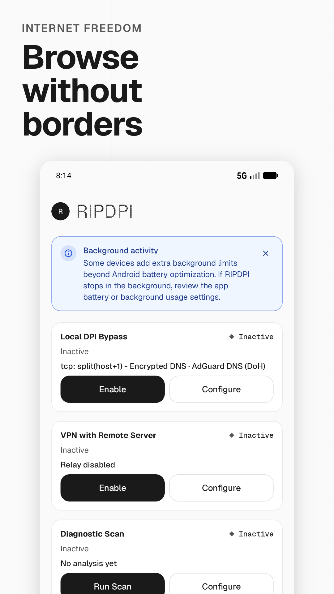
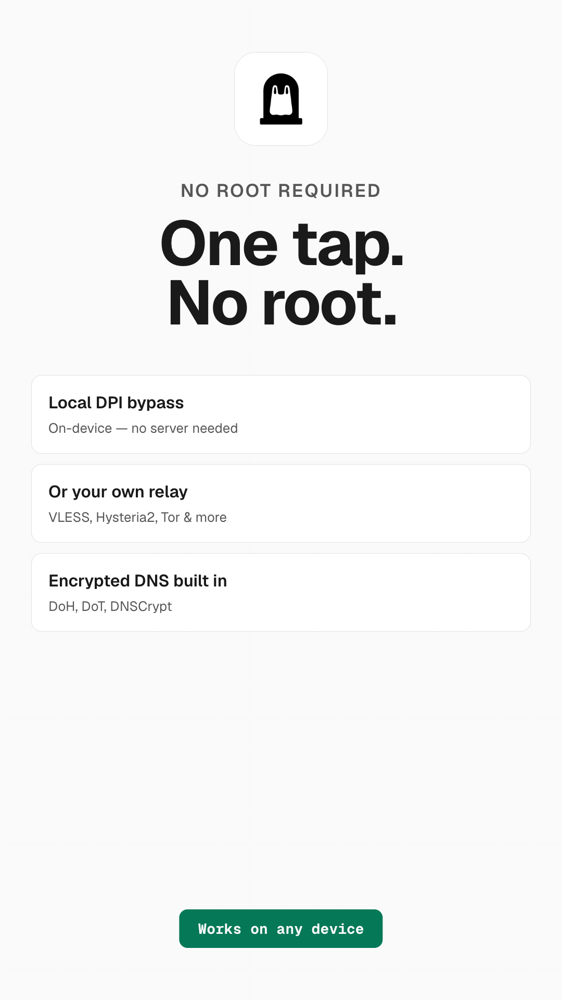
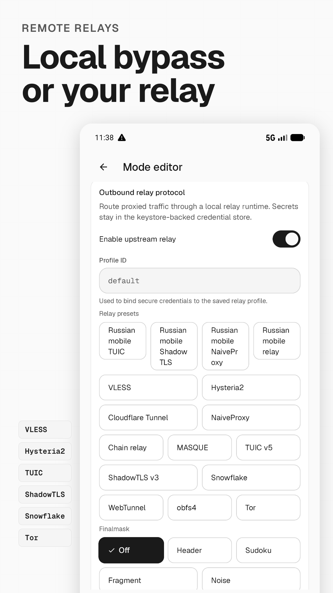
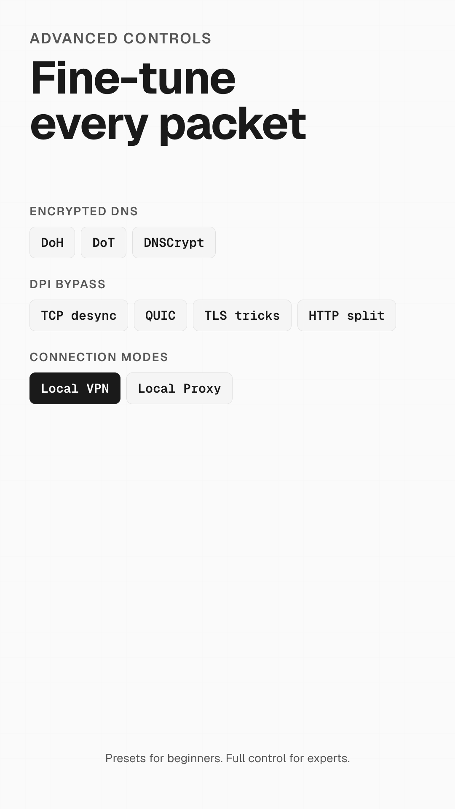
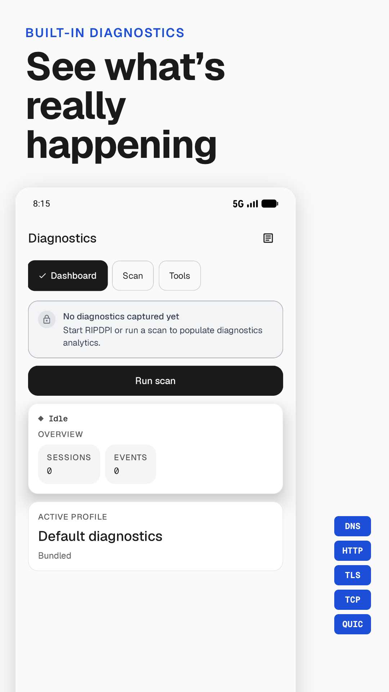
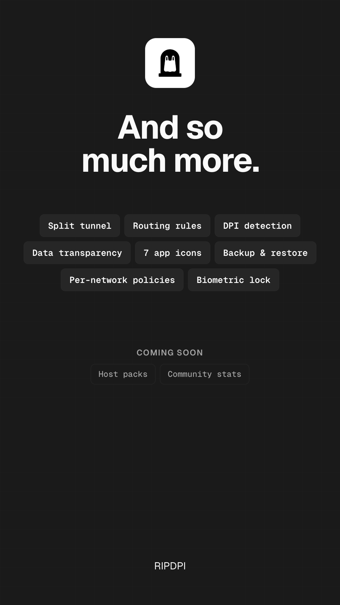

<p align="center">
  
</p>

<h1 align="center">RIPDPI</h1>
<p align="center"><b>路由与互联网性能诊断平台界面</b></p>

<p align="center">
  <a href="https://github.com/po4yka/RIPDPI/actions/workflows/ci.yml"></a>
  <a href="https://github.com/po4yka/RIPDPI/releases/latest"></a>
  <a href="LICENSE"></a>
  &nbsp;
  
  
  
</p>

<p align="center"><a href="README.md">English</a> | <a href="README-ru.md">Русский</a> | <a href="README-es.md">Español</a> | <a href="README-de.md">Deutsch</a> | <a href="README-fr.md">Français</a> | <a href="docs/fa/README.md">فارسی</a> | <b>简体中文</b> | <a href="README-hi.md">हिन्दी</a></p>

> [!WARNING]
> **本项目正处于积极开发阶段。** 我们正在持续添加新功能，并经常进行大规模重构以提升代码库的质量。该工作高度依赖编码代理（coding agents），因此 `main` 分支目前**可能出现破坏性变更（breaking changes）、模式迁移以及部分功能不完整的情况**。如果遇到回归问题，请[提交 issue](https://github.com/po4yka/RIPDPI/issues)——您的反馈有助于稳定项目。

RIPDPI 是一款适用于 Android 的网络路径诊断与优化工具包。它可以在设备端应用可配置的数据包策略，可以连接到您自己控制的中继服务器，并且对每个连接运行诊断，识别每个目标失败或退化的原因。这三种能力可以独立工作，也可以组合使用。

## 三大支柱

### 设备端数据包策略

在设备端应用可配置的数据包级转换，无需将流量路由到中继服务器。核心路径不需要 root 权限。

支持的技术：TCP 段分裂与乱序、伪造数据包注入、OOB（紧急指针）、TLS 记录分片、伪造 TLS 首次发送、QUIC 握手变种、UDP 长度字段变种、IPv6 扩展头注入、Lua 定义的原始数据包发送，以及自适应语义标记（根据实时 `TCP_INFO` 解析位置）。策略链由本仓库中的 Rust crate 构建，无需外部策略二进制文件。

未配置中继时，流量直接从设备出口——设备端变换是路径上唯一的更改。

### VPN 中继

通过加密中继协议将本地代理或 VPN 流量链接到您配置的服务器：

> [!NOTE]
> 协议矩阵反映当前源代码注册表。周围的译文可能滞后于 `README.md`，待人工审核后同步。

| Kind / protocol | Integration tier | Scope | Traffic |
| --- | --- | --- | --- |
| `vless_reality` / VLESS Reality TCP | Native relay-core backend (`ripdpi-vless`) | Client relay | TCP |
| `vless_reality` / xHTTP transport | Native relay-core backend (`ripdpi-xhttp`) | Client relay | TCP |
| `cloudflare_tunnel` | Native xHTTP relay path plus optional Cloudflare publish runtime | Client relay / local-origin publish | TCP |
| `hysteria2` | Native relay-core backend (`ripdpi-hysteria2`) | Client relay | TCP + UDP |
| `tuic_v5` | Native relay-core backend (`ripdpi-tuic`) | Client relay | TCP + UDP |
| `masque` | Native relay-core backend (`ripdpi-masque`): HTTP/2 classic CONNECT for TCP, HTTP/3 CONNECT-UDP for UDP | Client relay | TCP + UDP |
| `shadowtls_v3` | Native relay-core backend (`ripdpi-shadowtls`) with a profile-backed inner relay | Client relay | TCP |
| `trojan` | Native relay-core backend (`ripdpi-trojan`) | Client relay | TCP + UDP |
| `anytls` | Native relay-core backend (`ripdpi-anytls`) | Client relay | TCP + UDP |
| `shadowsocks` | Native relay-core backend (`ripdpi-shadowsocks`) | Client relay | TCP + UDP |
| `tor` | Native Arti-backed relay-core backend (`ripdpi-tor`) with bridge/PT bootstrap | Opt-in client anonymity relay | TCP |
| `naiveproxy` | External helper process (`ripdpi-naiveproxy`) supervised by Android service code | Client relay | TCP |
| `google_apps_script` | In-repository Rust Apps Script relay runtime (`ripdpi-apps-script-core`) selected by `libripdpi-relay.so` | Client relay path | TCP |
| `snowflake` | External Go pluggable-transport binary (`ripdpi-snowflake`) | Client PT relay | TCP |
| `webtunnel` | In-repository Rust pluggable-transport helper binary (`ripdpi-webtunnel`) | Client PT relay | TCP |
| `obfs4` | External pluggable-transport binary (`ripdpi-obfs4`) | Client PT relay | TCP |
| `chain_relay` | Native relay-core composition over referenced relay profiles | Ordered 2-4 hop client relay | TCP |
| `mieru` | Native relay-core backend (`ripdpi-mieru`); UDP relay gated off pending the custom UDP/TCP wire engine | Client relay | TCP |
| `ssh` | Native relay-core backend (`ripdpi-ssh`) | Client relay | TCP |
| `vless` | Recognized profile/settings compatibility kind; not a relay-core descriptor-backed backend | Import/config compatibility | TCP |

Snowflake intentionally remains an external Go binary; see the [Snowflake native Rust no-go decision](docs/architecture/snowflake-native-rust-decision.md). VLESS Reality does not use real ECH; see [ADR 0001](docs/adr/0001-reality-ech.md) for the GREASE-only policy.

WARP and AmneziaWG are separate VPN/tunnel profile surfaces, not `relay_kind` values in the relay-core registry.

本地代理模式和 Android VPN 重定向模式都可在配置或未配置中继时工作。

### 诊断

独立扫描每个连接目标，并生成类型化的判定结果：

- `TRANSPARENT_WORKS` — 原始路径有效，无需干预
- `OWNED_STACK_ONLY` — 仅通过应用的自有 TLS 堆栈工作
- `NO_DIRECT_SOLUTION` — 设备端变换无法恢复此目标；需要中继
- `IP_BLOCK_SUSPECT` — 检测到 IP 级阻塞

判定结果按网络指纹存储，当再次见到同一网络时自动重放。诊断屏幕添加了来自 `ripdpi-diagnostics-candidates` quick/full-matrix 套件的 TCP 和 QUIC 策略探测、DNS 篡改检测、DoH/DoT/DNSCrypt/DoQ 解析器建议，以及可导出的诊断存档。

## 为什么选择 RIPDPI

现代 Android 网络经常应用 L7 指纹识别（TLS JA3/JA4、QUIC）、对蜂窝和公共 Wi-Fi 进行激进的 QoS、MTU 和 ECN 失调，以及中间盒导致的 TLS 握手中止——导致某些目标失败而同一网络上的其他目标却能正常工作。单一的全局设置无法解决所有情况。

RIPDPI 的设计原则：分别对每个目标和每个网络进行分类，应用最轻量级的有效修复，并将其记住。

1. **每目标、每网络的答案** — 而非一个全局策略。诊断对每个权威进行分类并存储与网络指纹哈希关联的判定结果。
2. **当网络是问题时，改变本地路径。** 语义标记、自适应分裂位置、伪造负载链、OOB/乱序、随机化 TLS 记录、QUIC 指纹变种——由仓库内 Rust crate 组装。
3. **当直接路径退化时，退回到隧道中继。** 上方的中继矩阵区分了原生 relay-core 后端、辅助子进程、外部可插拔传输层，以及独立的 VPN/隧道配置文件层。
4. **诚实的报告。** 判定结果是类型化的并显示出来；故障分类器的结果是显示而非抑制；诊断导出包会编辑机密信息。

## 截图

<p align="center">
  
  &nbsp;
  
  &nbsp;
  
  &nbsp;
  
</p>
<p align="center">
  
  &nbsp;
  
</p>

## 功能

- **代理模式**：在配置的本地主机端口上运行本地 SOCKS5 代理。
- **VPN 模式**：通过 `VpnService` 经由本地 TUN-到-SOCKS 桥接路由 Android 设备流量。
- **配置文件导入**：QR 码扫描与生成，以及通过剪贴板和分享表单导入。剪贴板/分享表单解析使用代理 URI 编解码器，支持 `vless://`、`ss://`、`trojan://`、`hysteria2://`、`hy2://`、`anytls://`、`tuic://`、`mieru://` 和 `ssh://`；QR 码扫描目前支持 `vless://`、`ss://`、`trojan://`、`hysteria2://`、`hy2://`、`tuic://` 和 `mieru://`。AmneziaWG 使用独立的 `amneziawg://` 编解码器。Android intent 过滤器还会将 `ssh://` 暴露给导入中转层，代理 URI 编解码器可解析并双向编码该协议。
- **订阅**：支持 base64、Clash / Clash.Meta YAML、sing-box JSON 和 WireGuard-INI 订阅格式，具备后台自动更新、重复配置文件检测、selector/urltest 分组以及多镜像分发。
- **加密 DNS**：在 VPN 相关路径中支持 DoH、DoT、DNSCrypt 和 DoQ 解析器。
- **策略控制**：TCP split/disorder/fake 系列、TLS 记录分片和伪造配置文件、QUIC 握手变种、UDP 长度字段变种、IPv6 扩展头、Lua `rawsend`、每步骤激活过滤器、IPv4 ID 控制以及 OOB 注入。
- **每网络策略记忆**：经过验证的、按权威的判定结果以网络指纹为键；重新连接时自动重放。
- **自适应探测**：首次见到的网络的自动策略探测；网络切换时的后台 `quick_v1` 重新检查。
- **切换感知重启**：在 Wi-Fi、蜂窝和漫游之间过渡时进行实时策略重新评估。
- **RIPDPI 浏览器**：为需要自有 TLS 堆栈的 HTTPS 目标提供应用自有浏览器；为应用发起的请求提供共享 `SecureHttpClient` 路径。
- **运行时遥测和日志**：代理生命周期、路由决策、DNS 故障转移事件、诊断进度和原生运行时事件——作为应用内历史和支持导出可用。
- **可选的 root 助手**：在已 root 的设备上，通过特权助手进程解锁原始套接字操作（FakeRst、MultiDisorder、IP 分片、完整 SeqOverlap、原始 IPv4/IPv6 数据包发送）。

## 运行时模式

### 代理

在配置的本地主机端口上运行 SOCKS5 代理。适用于支持代理配置的应用。策略变换和中继链接适用于通过代理进入的所有流量。

### VPN

使用 Android `VpnService` 通过 RIPDPI 的本地引擎重定向设备流量。未配置中继时，VPN 模式应用设备端变换而不更改出口 IP。配置中继时，流量被加密转发到配置的端点。

## 隐私

RIPDPI 记录用于诊断和故障排除的操作元数据：网络快照、解析器状态、路由决策、扫描结果、服务状态和原生运行时事件。

正常运行时，RIPDPI 不捕获数据包、不持久化流量负载，也不记录 TLS 机密。高级数据包捕获是一项必须明确启用的诊断工具：原始数据包字节仅在本地限时保存，并且只有在用户主动分享归档时才会包含在归档中。

中继流量隐私取决于您配置的中继端点和配置文件。

## 构建

要求：JDK 17、Android SDK、Android NDK `29.0.14206865`、Rust 工具链 `1.96.0`、所需 ABI 的 Android Rust 目标。

```bash
git clone https://github.com/po4yka/RIPDPI.git
cd RIPDPI
./gradlew assembleDebug
```

本地构建默认为 `host`（`ripdpi.localNativeAbisDefault`），ABI 由主机架构推导（例如 Apple Silicon 上为 `arm64-v8a`）。模拟器：`./gradlew assembleDebug -Pripdpi.localNativeAbis=x86_64`。

APK 输出位于对应变体目录中，例如 `app/build/outputs/apk/githubFull/debug/`；release 任务和路径请参阅 [distribution.md](docs/distribution.md)。

## 测试

```bash
./gradlew testDebugUnitTest
bash scripts/ci/run-rust-native-checks.sh
bash scripts/ci/run-rust-network-e2e.sh
python3 -m unittest scripts.tests.test_offline_analytics_pipeline
```

详情：[docs/testing.md](docs/testing.md)

## 文档

- [原生集成与模块](docs/native/README.md)
- [数据包策略运行时](docs/packet-strategy-runtime.md)
- [代理引擎与策略表面](docs/native/proxy-engine.md)
- [TUN-到-SOCKS 桥接](docs/native/tunnel.md)
- [策略包与 TLS 目录操作](docs/strategy-pack-operations.md)
- [中继配置文件示例](docs/relay-profile-examples.md)
- [架构说明](docs/architecture/README.md)
- [Task board](docs/tasks/board.md)

## 翻译 RIPDPI

翻译由社区通过 GitHub 拉取请求（pull request）贡献。如需新增或改进某个语言，请参阅 [docs/localization.md](docs/localization.md)。每条字符串在合并前都会经过人工审核；机器翻译只是起点，绝不是最终文案。
