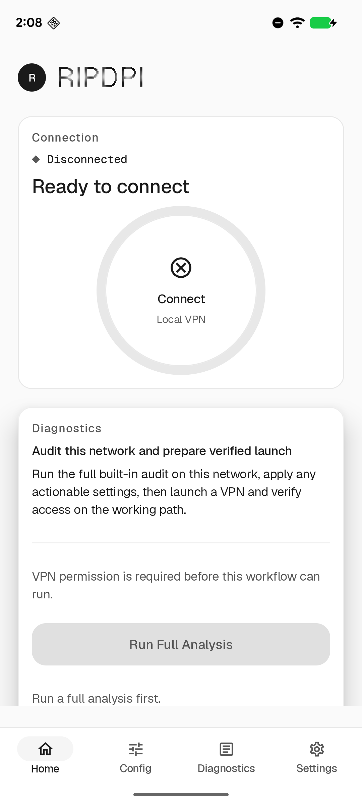
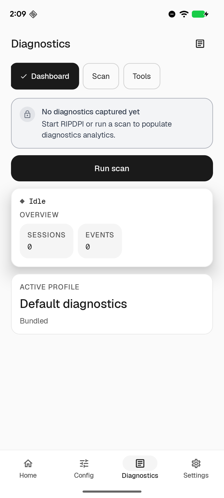
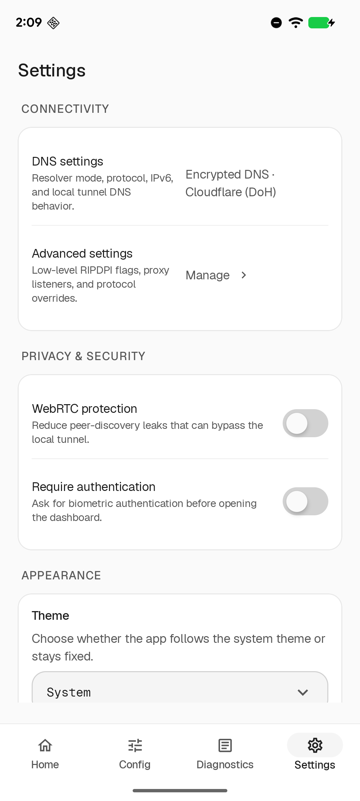
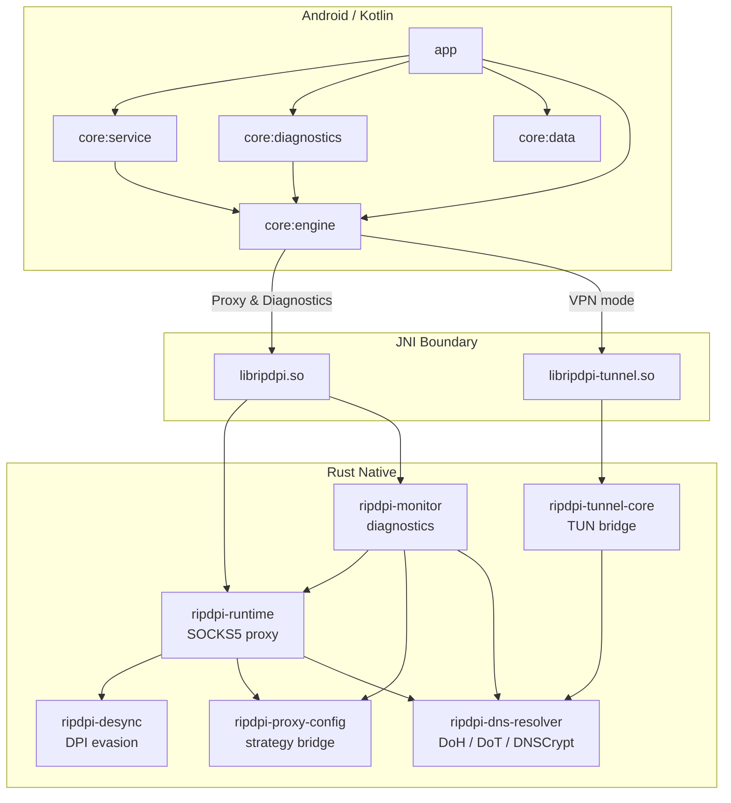

<p align="center">
  
</p>

<h1 align="center">RIPDPI</h1>
<p align="center"><b>Routing & Internet Performance Diagnostics Platform Interface</b></p>

<p align="center">
  <a href="https://github.com/po4yka/RIPDPI/actions/workflows/ci.yml"></a>
  <a href="https://github.com/po4yka/RIPDPI/releases/latest"></a>
  <a href="LICENSE"></a>
  &nbsp;
  
  
  
</p>

<p align="center"><b>English</b> | <a href="README-ru.md">Русский</a></p>

Android application for optimizing network connectivity with:

- local proxy mode
- local VPN redirection mode
- encrypted DNS in VPN mode with DoH/DoT/DNSCrypt
- advanced strategy controls with semantic markers, adaptive split placement, QUIC/TLS/DNS lane separation, per-network policy memory, and automatic probing/audit
- handover-aware live policy re-evaluation across Wi-Fi, cellular, and roaming changes
- integrated diagnostics and passive telemetry
- in-repository Rust native modules

RIPDPI runs a local SOCKS5 proxy built from in-repository Rust modules. In VPN mode it redirects Android traffic through that local proxy using a local TUN-to-SOCKS bridge.

## Screenshots

<p align="center">
  
  &nbsp;&nbsp;
  
  &nbsp;&nbsp;
  
</p>

## Architecture



## Diagnostics

RIPDPI includes an integrated diagnostics screen for active network checks and passive runtime monitoring.

Implemented diagnostic mechanisms:

- Manual scans in `RAW_PATH` and `IN_PATH` modes
- Automatic probing profiles in `RAW_PATH`, plus hidden `quick_v1` re-checks after first-seen network handovers
- Automatic audit in `RAW_PATH` with rotating curated target cohorts, full TCP/QUIC matrix evaluation, confidence/coverage scoring, and manual recommendations
- DNS integrity checks across UDP DNS and encrypted resolvers (DoH/DoT/DNSCrypt)
- Domain reachability checks with TLS and HTTP classification
- TCP 16-20 KB cutoff detection with repeated fat-header requests
- Whitelist SNI retry detection for restricted TLS paths
- Resolver recommendations with diversified DoH/DoT/DNSCrypt path candidates, bootstrap validation, temporary session overrides, and save-to-settings actions
- Strategy-probe progress with live TCP/QUIC lane, candidate index, and candidate label during automatic probing/audit
- Explicit remediation when automatic probing/audit is unavailable because `Use command line settings` blocks isolated strategy trials
- Passive native telemetry while proxy or VPN service is running
- Export bundles with `summary.txt`, `report.json`, `telemetry.csv`, and `manifest.json`

What the app records:

- Android network snapshot: transport, capabilities, DNS, MTU, local addresses, public IP/ASN, captive portal, validation state
- Native proxy runtime telemetry: listener lifecycle, accepted clients, route selection and route advances, retry pacing/diversification, host-autolearn state, and native errors
- Native tunnel runtime telemetry: tunnel lifecycle, packet and byte counters, resolver id/protocol/endpoint, DNS latency and failure counters, fallback reason, and network handover class

What the app does not record:

- Full packet captures
- Traffic payloads
- TLS secrets

## Settings

The Android UI exposes a broad typed strategy surface beyond the command-line path.

## Advanced Strategy Surface

RIPDPI's current Android and native strategy stack includes:

- semantic markers such as `host`, `endhost`, `midsld`, `sniext`, and `extlen`
- adaptive markers such as `auto(balanced)` and `auto(host)` that resolve from live `TCP_INFO` hints
- ordered TCP and UDP chain steps with per-step activation filters
- richer fake TLS mutations (`orig`, `rand`, `rndsni`, `dupsid`, `padencap`, size tuning)
- built-in fake payload profile libraries for HTTP, TLS, UDP, and QUIC Initial traffic
- host-targeted fake chunks (`hostfake`) and Linux/Android-focused `fakedsplit` / `fakeddisorder` approximations
- per-network remembered policy replay with hashed network fingerprints and optional VPN-only DNS override
- per-network host autolearn scoping, activation windows, and adaptive fake TTL for TCP fake sends
- separate TCP, QUIC, and DNS strategy families for diagnostics, telemetry, and remembered-policy scoring
- handover-aware full restarts with background `quick_v1` strategy probes for first-seen networks
- retry-stealth pacing with jitter, diversified candidate order, and adaptive tuning beyond fake TTL
- diagnostics-side automatic probing and automatic audit with candidate-aware progress, confidence-scored reports, winners-first review, and manual recommendations

Implementation details and the native call path are documented in [docs/native/proxy-engine.md](docs/native/proxy-engine.md).

## FAQ

**Does the application require root?** No.

**Is this a VPN?** No. It uses Android's VPN mode to redirect traffic locally. It does not encrypt general app traffic or hide your IP address. When encrypted DNS is enabled, only DNS lookups are sent through DoH/DoT/DNSCrypt.

**How to use with AdGuard?**

1. Run RIPDPI in proxy mode.
2. Add RIPDPI to AdGuard exceptions.
3. In AdGuard settings, set proxy: SOCKS5, host `127.0.0.1`, port `1080`.

## User Guide Generator

The repository includes a script that automates creation of annotated PDF user guides from live app screenshots.

```bash
# One-time setup
uv venv scripts/guide/.venv
uv pip install -r scripts/guide/requirements.txt --python scripts/guide/.venv/bin/python

# Generate guide (device or emulator must be connected)
scripts/guide/.venv/bin/python scripts/guide/generate_guide.py \
  --spec scripts/guide/specs/user-guide.yaml \
  --output build/guide/ripdpi-user-guide.pdf
```

The script navigates the app via the debug automation contract, captures screenshots with ADB, annotates them with red arrows/circles/brackets (Pillow), and assembles everything into an A4 PDF with explanatory text (fpdf2). Guide content is defined in YAML spec files under `scripts/guide/specs/` using relative coordinates for portability across device resolutions.

Options: `--device <serial>` to target a specific device, `--skip-capture` to re-annotate from cached screenshots, `--pages <id,id>` to filter pages.

## Documentation

**Native Libraries**
- [Native integration and modules](docs/native/README.md)
- [Proxy engine and strategy surface](docs/native/proxy-engine.md)
- [TUN-to-SOCKS bridge](docs/native/tunnel.md)
- [Debug a runtime issue](docs/native/debug-runtime-issue.md)

**Testing & CI**
- [Testing, E2E, golden contracts, and soak coverage](docs/testing.md)

**UI & Design**
- [Design system](docs/design-system.md)
- [Host-pack presets](docs/host-pack-presets.md)

**Automation**
- [External UI automation](docs/automation/README.md)
- [Selector contract](docs/automation/selector-contract.md)
- [Appium readiness](docs/automation/appium-readiness.md)

**User Manuals**
- [Diagnostics manual (Russian)](docs/user-manual-diagnostics-ru.md)

## Building

Requirements:

- JDK 17
- Android SDK
- Android NDK `29.0.14206865`
- Rust toolchain `1.94.0`
- Android Rust targets for the ABIs you want to build

Basic local build:

```bash
git clone https://github.com/po4yka/RIPDPI.git
cd RIPDPI
./gradlew assembleDebug
```

Local non-release builds default to `ripdpi.localNativeAbisDefault=arm64-v8a`.

Fast local native build for the emulator ABI:

```bash
./gradlew assembleDebug -Pripdpi.localNativeAbis=x86_64
```

APK outputs:

- debug: `app/build/outputs/apk/debug/`
- release: `app/build/outputs/apk/release/`

## Testing

The project now has layered coverage for Kotlin, Rust, JNI, services, diagnostics, local-network E2E, Linux TUN E2E, golden contracts, and native soak runs. Recent focused coverage includes per-network policy memory, handover-aware restart logic, encrypted DNS path planning, retry-stealth pacing, and telemetry contract goldens.

Common commands:

```bash
./gradlew testDebugUnitTest
bash scripts/ci/run-rust-native-checks.sh
bash scripts/ci/run-rust-network-e2e.sh
```

Details and targeted commands: [docs/testing.md](docs/testing.md)

## CI/CD

The project uses GitHub Actions for continuous integration and release automation.

**PR / push CI** (`.github/workflows/ci.yml`) currently runs:

- `build`: debug APK build, ELF verification, native size verification, JVM unit tests
- `static-analysis`: Rust formatting/clippy/tests, cargo-deny, Android static analysis
- `rust-network-e2e`: repo-owned local-network proxy E2E plus focused vendored parity smoke
- `android-network-e2e`: emulator-based instrumentation E2E against the local fixture stack

**Nightly / manual CI** adds:

- `rust-native-soak`: host-side native soak for proxy and diagnostics runtimes
- `linux-tun-e2e`: privileged Linux TUN E2E and TUN soak coverage

Golden diff artifacts, Android reports, fixture logs, and soak metrics are uploaded when produced by the workflow.

**Release** (`.github/workflows/release.yml`) runs on `v*` tag pushes or manual dispatch:

- Builds a signed release APK
- Creates a GitHub Release with the APK attached

### Required GitHub Secrets

To enable signed release builds, configure these repository secrets:

| Secret | Description |
|--------|-------------|
| `KEYSTORE_BASE64` | Base64-encoded release keystore (`base64 -i release.keystore`) |
| `KEYSTORE_PASSWORD` | Keystore password |
| `KEY_ALIAS` | Signing key alias |
| `KEY_PASSWORD` | Signing key password |

## Native Modules

- `native/rust/crates/ripdpi-android`: proxy JNI bridge and proxy runtime telemetry surface
- `native/rust/crates/ripdpi-tunnel-android`: TUN-to-SOCKS JNI bridge and tunnel telemetry surface
- `native/rust/crates/ripdpi-monitor`: active diagnostics scans and passive diagnostics events
- `native/rust/crates/ripdpi-dns-resolver`: shared encrypted DNS resolver used by diagnostics and VPN mode
- `native/rust/crates/ripdpi-runtime`: shared proxy runtime layer used by `libripdpi.so`
- `native/rust/crates/android-support`: Android logging and JNI support helpers

Native integration details: [docs/native/README.md](docs/native/README.md)
