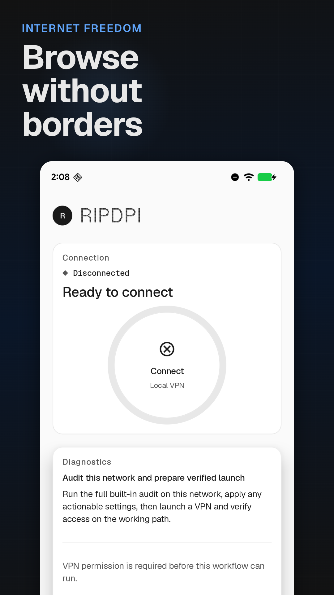
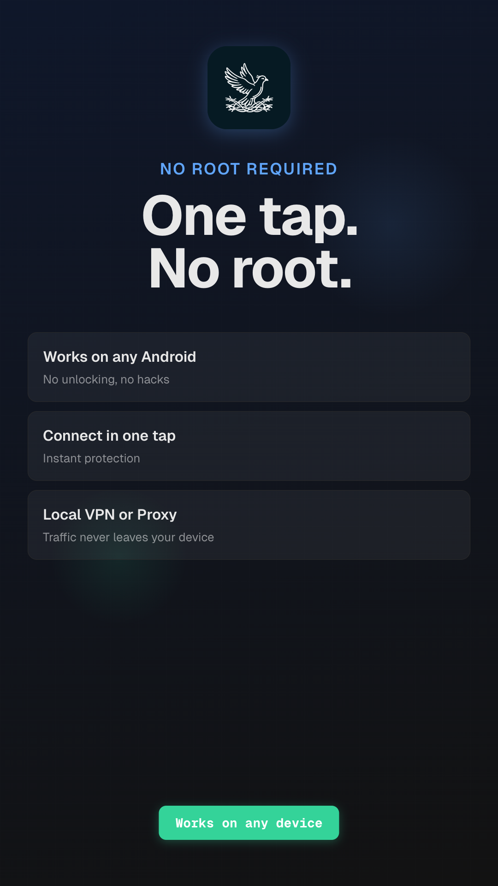
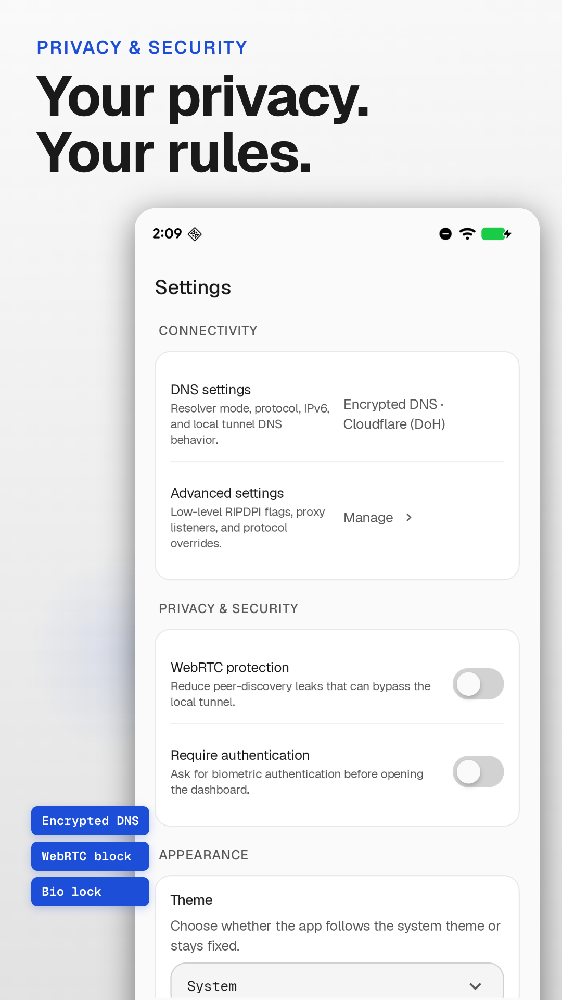
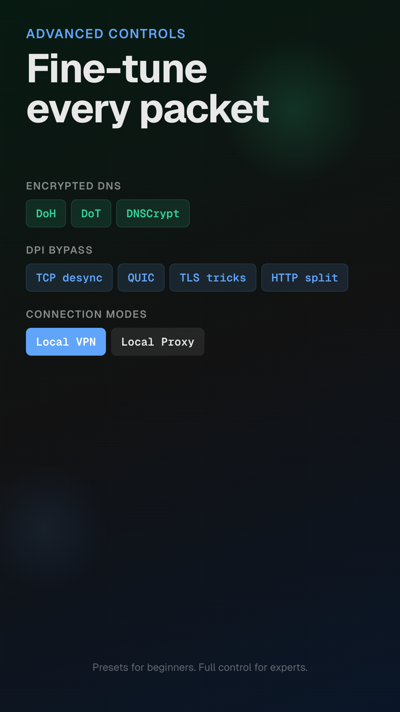
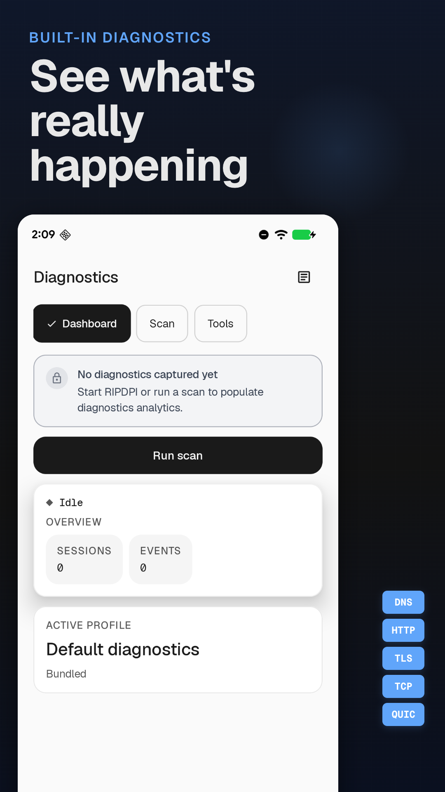
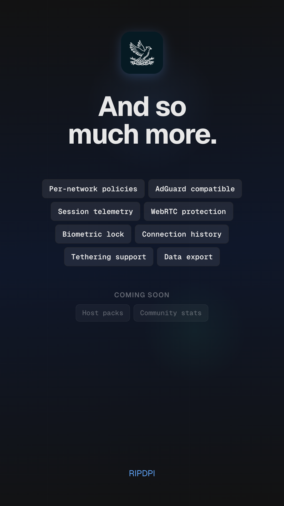
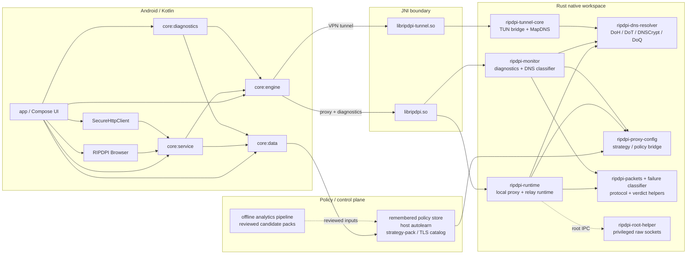

<p align="center">
  
</p>

<h1 align="center">RIPDPI</h1>
<p align="center"><b>Routing & Internet Performance Diagnostics Platform Interface</b></p>

<p align="center">
  <a href="https://github.com/po4yka/RIPDPI/actions/workflows/ci.yml"></a>
  <a href="https://github.com/po4yka/RIPDPI/releases/latest"></a>
  <a href="LICENSE"></a>
  &nbsp;
  
  
  
</p>

<p align="center"><b>English</b> | <a href="README-ru.md">Русский</a></p>

Android network-path diagnostics and performance toolkit. RIPDPI measures, classifies, and optimizes how individual flows traverse the local network and the path to the origin — useful when middleboxes, congested cellular links, mismatched MTUs, or middlebox-induced TLS handshake aborts degrade specific authorities while leaving others healthy. RIPDPI ships:

- **VLESS Reality and xHTTP** as the primary tunneled outbound for performance and privacy, implemented natively in `ripdpi-vless` / `ripdpi-relay-core` / `ripdpi-relay-mux` without a Go runtime, with `ripdpi-relay-android` providing the JNI surface and Android socket protection
- additional tunneled-outbound protocols on the same path: WARP, Cloudflare Tunnel, MASQUE, Hysteria2, TUIC v5, ShadowTLS v3, and NaiveProxy
- local proxy mode and local VPN redirection mode for app-traffic routing, with or without a tunneled outbound attached
- encrypted DNS in VPN mode with DoH/DoT/DNSCrypt/DoQ
- advanced strategy controls with semantic markers, adaptive split placement, QUIC/TLS/DNS lane separation, per-network policy memory, and automatic probing/audit
- handover-aware live policy re-evaluation across Wi-Fi, cellular, and roaming changes
- strategy-pack and TLS-catalog driven rollout control for transport defaults, feature flags, and fingerprint rotation
- direct-path DNS classification, transport verdicts, and transport-specific remediation that branches between on-device path optimization, the owned-stack browser, a browser-camouflage tunnel, a QUIC-heavy tunnel, or manual review per authority
- owned-stack RIPDPI Browser plus a shared `SecureHttpClient` path for app-originated traffic we control
- repo-local offline analytics pipeline for clustering middlebox/device fingerprints and mining reviewed signature catalogs
- xHTTP-side Finalmask support for supported tunnel profiles and Cloudflare Tunnel paths
- integrated diagnostics and passive telemetry
- in-repository Rust native modules

RIPDPI runs a local SOCKS5 proxy built from in-repository Rust modules. In manual Proxy mode it binds the configured fixed localhost port. In VPN mode it starts an internal ephemeral localhost proxy endpoint, protects it with per-session local auth, and routes Android traffic through that endpoint using a local TUN-to-SOCKS bridge. When a tunneled outbound (VLESS Reality, xHTTP, WARP, MASQUE, Hysteria2, TUIC v5, ShadowTLS v3, NaiveProxy, or Cloudflare Tunnel) is configured, the local proxy chains to that outbound inside the same Rust workspace — encrypting app traffic end-to-end to the configured endpoint. Without a tunnel, the same path applies on-device path optimization (TCP / TLS / QUIC mutation) and exits to the network directly.

## Why RIPDPI

Modern Android networks routinely apply active L7 fingerprinting (TLS JA3/JA4, QUIC, DTLS), aggressive QoS on cellular and shared Wi-Fi, MTU and ECN inconsistencies, middlebox-induced TLS handshake aborts, and uneven ECH rollout — all of which can degrade specific authorities while leaving others healthy. A single global setting cannot answer all of those at once. RIPDPI's design assumption is:

1. **Pick the right answer per network and per authority**, not a global policy. Diagnostics classify each site as healthy raw, recoverable on-device, owned-stack-only, or tunneled-only — and remember the verdict per network fingerprint.
2. **Mutate the local path when the network is solvable on-device.** Semantic markers, adaptive split placement, fake-payload chains, OOB / disorder, randomized TLS records, QUIC and DTLS handshake variation — composed from in-repo Rust crates, not an external strategy binary.
3. **Fall back to a tunneled outbound when the direct path is degraded.** The native-Rust VLESS Reality / xHTTP outbound (and WARP, MASQUE, Hysteria2, TUIC v5, ShadowTLS v3, NaiveProxy, Cloudflare Tunnel) handles authorities the local path cannot recover.
4. **Stay honest about failures.** Verdicts are typed (`TRANSPARENT_WORKS`, `OWNED_STACK_ONLY`, `NO_DIRECT_SOLUTION`, `IP_BLOCK_SUSPECT`); failure-classifier results are surfaced rather than swallowed; diagnostic exports redact secrets.

## Screenshots

<p align="center">
  
  &nbsp;
  
  &nbsp;
  
  &nbsp;
  
</p>
<p align="center">
  
  &nbsp;
  
</p>

## Architecture



## Diagnostics

RIPDPI includes an integrated diagnostics screen for active network checks and passive runtime monitoring.

Implemented diagnostic mechanisms:

- Manual scans in `RAW_PATH` and `IN_PATH` modes
- Automatic probing profiles in `RAW_PATH`, plus hidden `quick_v1` re-checks after first-seen network handovers
- Automatic audit in `RAW_PATH` with rotating curated target cohorts, full TCP/QUIC matrix evaluation, confidence/coverage scoring, and manual recommendations
- 4-stage home composite analysis: automatic audit, default connectivity, DPI full (ru-dpi-full), DPI strategy probe (ru-dpi-strategy) with per-stage timeouts
- 24 TCP + 6 QUIC strategy probe candidates covering semantic split families, TLS record families, transparent TLS first-flight families, disorder, OOB (TCP urgent pointer), disoob, fake packets, hostfake, parser-tolerant variants, and ECH techniques
- Tournament bracket qualifier: tests each candidate against 1 domain first, eliminates ~70% of failing candidates before the full-matrix round
- Within-candidate domain parallelism: 3 domains tested concurrently per candidate via `thread::scope`
- DNS integrity checks across UDP DNS and encrypted resolvers (DoH/DoT/DNSCrypt/DoQ) with fallback resolver chain (AdGuard, DNS.SB, Google IP, Mullvad)
- Authority-scoped DNS classification into clean, poisoned, divergent, ECH-capable, and no-HTTPS-RR outcomes, feeding direct-mode resolver and transport hints
- Domain reachability checks with TLS and HTTP classification
- TCP 16-20 KB cutoff detection with repeated fat-header requests
- Allowlist-SNI retry detection for constrained TLS paths
- Resolver recommendations with diversified DoH/DoT/DNSCrypt path candidates, bootstrap validation, temporary session overrides, and save-to-settings actions
- Eager DNS failover for catastrophic errors (connection reset, refused) on first query
- Direct-mode policy persistence with confirmation/revalidation, honest verdicts (`TRANSPARENT_WORKS`, `OWNED_STACK_ONLY`, `NO_DIRECT_SOLUTION`, `IP_BLOCK_SUSPECT`), and transport-family replay
- Transport-specific remediation that branches to the owned-stack browser, browser-camouflage relay, QUIC-heavy relay, or manual review instead of one generic relay hint
- Strategy-probe progress with live TCP/QUIC lane, candidate index, and candidate label during automatic probing/audit
- Partial results recovery: 3s grace period after timeout to retrieve results from the native engine
- Configurable native scan deadline (Kotlin timeout - 30s) ensures native engine finalizes before Kotlin gives up
- Explicit remediation when automatic probing/audit is unavailable because `Use command line settings` blocks isolated strategy trials
- Passive native telemetry while proxy or VPN service is running
- Structured logging across DNS failover, strategy probes, diagnostics stages, and VPN socket protection
- Logcat capture from scan start timestamp (not just buffer snapshot) to preserve logs from long-running scans
- Export bundles with `summary.txt`, `report.json`, `telemetry.csv`, `app-log.txt`, and `manifest.json`

What the app records:

- Android network snapshot: transport, capabilities, DNS, MTU, local addresses, public IP/ASN, captive portal, validation state
- Native proxy runtime telemetry: listener lifecycle, accepted clients, route selection and route advances, retry pacing/diversification, host-autolearn state, and native errors
- Native tunnel runtime telemetry: tunnel lifecycle, packet and byte counters, resolver id/protocol/endpoint, DNS latency and failure counters, fallback reason, and network handover class

What the app does not record:

- Full packet captures
- Traffic payloads
- TLS secrets

## Advanced Strategy Surface

RIPDPI's strategy stack is composable across TCP, TLS, QUIC/UDP, and DTLS layers, with policy memory and adaptive scheduling on top. The Android UI exposes the full typed surface beyond the command-line path.

**TCP**

- Semantic markers (`host`, `endhost`, `midsld`, `sniext`, `extlen`) and adaptive markers (`auto(balanced)`, `auto(host)`) that resolve from live `TCP_INFO` hints
- Ordered TCP chain steps with per-step `ActivationFilter` predicates (timestamp, ECH, window, MSS) and runtime TCP-state branching
- Circular mid-connection rotation that swaps fallback chains between outbound rounds on the same socket
- Zapret-style fake ordering (`altorder=0..3`) plus `duplicate` / `sequential` fake sequence control on `fake`, `fakedsplit`, `fakeddisorder`, and `hostfake`
- Per-step TCP flag crafting (named masks, chip editor for visually representable chains) for both fake and original payload packets
- Group-wide IPv4 ID control with exact `seqgroup` promotion so mixed fake/original flows share one real ID sequence
- Standalone disorder (TTL-based segment reordering), OOB (TCP urgent pointer injection), and disoob (disorder + OOB)
- Host-targeted fake chunks (`hostfake`) and Linux/Android-focused `fakedsplit` / `fakeddisorder` approximations

**TLS**

- Randomized record fragmentation (`tlsrandrec`) with configurable fragment count and size bounds
- Fake TLS mutations (`orig`, `rand`, `rndsni`, `dupsid`, `padencap`, size tuning)
- Built-in fake payload profile libraries for HTTP, TLS, UDP, and QUIC Initial traffic

**QUIC / UDP**

- QUIC handshake variation: SNI split, fake version field, dummy packet prepend, fake burst profiles
- DTLS handshake fingerprint normalization: WebRTC-Chrome / WebRTC-Firefox shaped ClientHello and a randomized JA4-equivalent fingerprint slot (cipher and extension multiset-preserving shuffles, GREASE-aware) for WebRTC/DTLS transports interacting with strict middlebox policies

**Policy and scheduling**

- Per-network remembered policy replay with hashed network fingerprints and optional VPN-only DNS override
- Per-network host autolearn scoping with telemetry/system host filtering, activation windows, and adaptive fake TTL
- Separate TCP, QUIC, and DNS strategy families for diagnostics, telemetry, and remembered-policy scoring
- Handover-aware full restarts with background `quick_v1` strategy probes on first-seen networks
- Retry-stealth pacing with jitter, diversified candidate order, and adaptive tuning beyond fake TTL
- Diagnostics-side automatic probing and audit with candidate-aware progress, confidence-scored reports, and winners-first review

**Runtime hardening**

- VPN-only localhost hardening with telemetry-resolved ephemeral SOCKS5 bind ports and per-session auth rotation shared by UI-config and command-line-config sessions

Implementation details and the native call path are documented in [docs/native/proxy-engine.md](docs/native/proxy-engine.md).

## Android 17 (API 37)

### Owned-stack ECH path

RIPDPI ships a separate owned-stack request path for traffic the app originates itself.

- The RIPDPI Browser and the repo-local `SecureHttpClient` surface both use the same owned-stack request service in `:core:service`.
- On Android 14+ / API 34+, the owned-stack path can use platform `HttpEngine` opportunistically and retries with QUIC disabled (H2-only) before falling back to RIPDPI's native owned TLS bridge.
- On Android 17 / API 37, RIPDPI treats the platform path as confirmed ECH-capable only for authorities with cached `ECH_CAPABLE` DNS evidence or explicit `xml-v37` domain overrides.
- On older devices, or when confirmed ECH evidence is unavailable, owned-stack mode still works through opportunistic `HttpEngine` when available and native owned TLS otherwise. That does not imply universal ECH support or hide server IPs.

### Platform readiness

Current builds target SDK 35. The checked-in `xml-v37` Network Security Config only declares platform ECH preferences for app-owned HTTPS authorities. API 37 local-network permission work is not enabled in the runtime manifest yet and must be added with the eventual `targetSdk` bump if RIPDPI starts binding non-loopback LAN listeners.

## FAQ

**Does the application require root?** No. On rooted devices an opt-in root mode unlocks additional packet-mutation primitives (FakeRst, MultiDisorder, IP fragmentation, full SeqOverlap) via a privileged helper process.

**Is this a VPN?** RIPDPI uses Android's `VpnService` API for system-level traffic routing. When a tunneled outbound is configured, traffic is encrypted end-to-end to the endpoint you configure — same as any standard tunneled-VPN setup; the choice of endpoint is yours. When no tunneled outbound is configured, the `VpnService` API is used purely as a local-traffic redirector to the on-device path-optimization engine; in that mode RIPDPI does not change the egress IP, and only DNS lookups go through encrypted DNS when configured.

**How to use with AdGuard?**

1. Run RIPDPI in proxy mode.
2. Add RIPDPI to AdGuard exceptions.
3. In AdGuard settings, set proxy: SOCKS5, host `127.0.0.1`, port `1080`.

## User Guide Generator

The repository includes a script that automates creation of annotated PDF user guides from live app screenshots.

```bash
# One-time setup
uv venv scripts/guide/.venv
uv pip install -r scripts/guide/requirements.txt --python scripts/guide/.venv/bin/python

# Generate guide (device or emulator must be connected)
scripts/guide/.venv/bin/python scripts/guide/generate_guide.py \
  --spec scripts/guide/specs/user-guide.yaml \
  --output build/guide/ripdpi-user-guide.pdf
```

The script navigates the app via the debug automation contract, captures screenshots with ADB, annotates them with red arrows/circles/brackets (Pillow), and assembles everything into an A4 PDF with explanatory text (fpdf2). Guide content is defined in YAML spec files under `scripts/guide/specs/` using relative coordinates for portability across device resolutions.

Options: `--device <serial>` to target a specific device, `--skip-capture` to re-annotate from cached screenshots, `--pages <id,id>` to filter pages.

## Documentation

**Native Libraries**
- [Native integration and modules](docs/native/README.md)
- [Proxy engine and strategy surface](docs/native/proxy-engine.md)
- [TUN-to-SOCKS bridge](docs/native/tunnel.md)
- [Debug a runtime issue](docs/native/debug-runtime-issue.md)
- [Cloudflare Tunnel operations](docs/native/cloudflare-tunnel-operations.md)
- [MASQUE runtime](docs/native/relay-masque-status.md)
- [NaiveProxy runtime](docs/native/relay-naiveproxy-runtime.md)
- [Finalmask compatibility and example configs](docs/native/finalmask-compatibility.md)

**Operations**
- [Strategy-pack and TLS catalog operations](docs/strategy-pack-operations.md)
- [Offline analytics pipeline](docs/offline-analytics-pipeline.md)
- [Server hardening for self-hosted relays](docs/server-hardening.md)

**Configuration**
- [Relay profile examples](docs/relay-profile-examples.md)

**Testing & CI**
- [Testing, E2E, golden contracts, and soak coverage](docs/testing.md)

**Architecture Hardening**
- [Architecture notes](docs/architecture/README.md)
- [Current roadmap](ROADMAP.md)
- [Unsafe audit guide](docs/native/unsafe-audit.md)
- [Service session scope](docs/service-session-scope.md)
- [TCP relay concurrency](docs/native/tcp-concurrency.md)
- [Native size monitoring](docs/native/size-monitoring.md)

**UI & Design**
- [Design system](docs/design-system.md)
- [Host-pack presets](docs/host-pack-presets.md)

**Automation**
- [External UI automation](docs/automation/README.md)
- [Selector contract](docs/automation/selector-contract.md)
- [Appium readiness](docs/automation/appium-readiness.md)

**User Manuals**
- [Diagnostics manual (Russian)](docs/user-manual-diagnostics-ru.md)

**Roadmap**
- [Roadmap index](ROADMAP.md)
- [Roadmap summary](ROADMAP.md)

## Building

Requirements:

- JDK 17
- Android SDK
- Android NDK `29.0.14206865`
- Rust toolchain `1.94.0`
- Android Rust targets for the ABIs you want to build

Basic local build:

```bash
git clone https://github.com/po4yka/RIPDPI.git
cd RIPDPI
./gradlew assembleDebug
```

Local non-release builds default to `ripdpi.localNativeAbisDefault=arm64-v8a`.

Fast local native build for the emulator ABI:

```bash
./gradlew assembleDebug -Pripdpi.localNativeAbis=x86_64
```

APK outputs:

- debug: `app/build/outputs/apk/debug/`
- release: `app/build/outputs/apk/release/`

## Testing

The project now has layered coverage for Kotlin, Rust, JNI, services, diagnostics, local-network E2E, Linux TUN E2E, golden contracts, and native soak runs. Recent focused coverage includes per-network policy memory, handover-aware restart logic, encrypted DNS path planning, retry-stealth pacing, and telemetry contract goldens.

Common commands:

```bash
./gradlew testDebugUnitTest
bash scripts/ci/run-rust-native-checks.sh
bash scripts/ci/run-rust-network-e2e.sh
python3 -m unittest scripts.tests.test_offline_analytics_pipeline
```

Details and targeted commands: [docs/testing.md](docs/testing.md)

## CI/CD

The project uses GitHub Actions for continuous integration and release automation.

**PR / push CI** (`.github/workflows/ci.yml`) currently runs:

- `build`: debug APK build, ELF verification, native size verification, JVM unit tests
- `release-verification`: release APK build verification
- `native-bloat`: cargo-bloat checks for native code size
- `cargo-deny`: dependency vulnerability scanning
- `rust-lint`: Rust formatting and Clippy checks
- `rust-cross-check`: Android ABI cross-compilation verification
- `rust-workspace-tests`: Rust workspace tests via cargo-nextest
- `gradle-static-analysis`: detekt, ktlint, Android lint
- `rust-network-e2e`: local-network proxy E2E plus vendored parity smoke
- `cli-packet-smoke`: CLI proxy behavioral verification with pcap capture
- `rust-turmoil`: deterministic fault-injection network tests
- `coverage`: JaCoCo and Rust LLVM coverage
- `rust-loom`: exhaustive concurrency verification
- offline analytics unit tests in the `build` job

**Nightly / manual CI** adds:

- `rust-criterion-bench`: Criterion micro-benchmarks
- `android-macrobenchmark`: Android macro-benchmarks
- `rust-native-soak`: host-side native endurance tests
- `rust-native-load`: high-concurrency ramp-up, burst, and saturation tests
- `nightly-rust-coverage`: coverage including ignored tests
- `android-network-e2e`: emulator-based instrumentation E2E
- `linux-tun-e2e`: privileged Linux TUN E2E
- `linux-tun-soak`: privileged Linux TUN endurance tests

Golden diff artifacts, Android reports, fixture logs, and soak metrics are uploaded when produced by the workflow.

**Additional analytics workflow**:

- `offline-analytics.yml`: sample-corpus clustering/signature-mining pipeline plus optional private-corpus run on manual dispatch

**Release** (`.github/workflows/release.yml`) runs on `v*` tag pushes or manual dispatch:

- Builds a signed release APK
- Creates a GitHub Release with the APK attached

### Required GitHub Secrets

To enable signed release builds, configure these repository secrets:

| Secret | Description |
|--------|-------------|
| `KEYSTORE_BASE64` | Base64-encoded release keystore (`base64 -i release.keystore`) |
| `KEYSTORE_PASSWORD` | Keystore password |
| `KEY_ALIAS` | Signing key alias |
| `KEY_PASSWORD` | Signing key password |

## Native Modules

- `native/rust/crates/ripdpi-android`: proxy JNI bridge, proxy runtime telemetry surface, and VPN socket protection JNI callbacks
- `native/rust/crates/ripdpi-tunnel-android`: TUN-to-SOCKS JNI bridge and tunnel telemetry surface
- `native/rust/crates/ripdpi-monitor`: active diagnostics scans, passive diagnostics events, DNS tampering detection, and response parser framework (HTTP/TLS/SSH)
- `native/rust/crates/ripdpi-dns-resolver`: shared encrypted DNS resolver used by diagnostics and VPN mode
- `native/rust/crates/ripdpi-runtime`: shared proxy runtime layer used by `libripdpi.so`, protocol classification registry, and VPN socket protection callback registry
- `native/rust/crates/ripdpi-packets`: protocol detection, packet mutation, protocol classification traits (`ProtocolClassifier`, `ProtocolField`, `FieldObserver`), DTLS ClientHello classifier with JA4-equivalent fingerprint extraction and fingerprint-randomization profiles (WebRTC-Chrome / WebRTC-Firefox / Randomized) wired into the strategy evolver as COMBO_POOL slots 33–35
- `native/rust/crates/ripdpi-failure-classifier`: response failure classification, error-page fingerprinting, field-based classification via `FieldCache`, and DTLS-fingerprint block detection
- `native/rust/crates/ripdpi-root-helper`: standalone privileged helper binary for rooted devices, enables raw socket operations (FakeRst, MultiDisorder, IpFrag2, full SeqOverlap) via Unix socket IPC with SCM_RIGHTS fd passing
- `native/rust/crates/android-support`: Android logging, JNI support helpers, and generic data structures (`BoundedHeap`, `EnumMap`)

Native integration details: [docs/native/README.md](docs/native/README.md)
