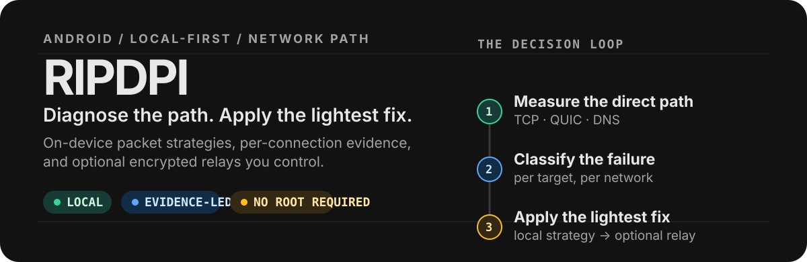

<p align="center">
  
</p>

<p align="center">
  <a href="https://github.com/po4yka/RIPDPI/actions/workflows/ci.yml"></a>
  <a href="https://github.com/po4yka/RIPDPI/releases/latest"></a>
  <a href="LICENSE"></a>
  &nbsp;
  
  
  
</p>

<p align="center"><b>English</b> | <a href="README-ru.md">Русский</a> | <a href="README-es.md">Español</a> | <a href="README-de.md">Deutsch</a> | <a href="README-fr.md">Français</a> | <a href="docs/fa/README.md">فارسی</a> | <a href="README-zh-CN.md">简体中文</a> | <a href="README-hi.md">हिन्दी</a> | <a href="README-pt-BR.md">Português (Brasil)</a></p>

> [!WARNING]
> **The project is in an active phase of development.** New features are being added and large refactorings are frequently performed to improve the quality of the code base. Coding agents are used heavily for this work, so **breaking changes, schema migrations, and partially broken functionality are currently possible on `main`**. If you hit a regression, please [open an issue](https://github.com/po4yka/RIPDPI/issues) — your feedback helps stabilise the project.

RIPDPI is an Android network-path diagnostics and optimization toolkit. It measures why a target is failing or degrading, applies configurable packet strategies on-device, and can connect through relay servers you control. Each capability works independently or in combination.

## See the path, not just a switch

<p align="center">
  
  &nbsp;
  
  &nbsp;
  
</p>

Instead of a single global policy, RIPDPI classifies each target and network separately, remembers validated outcomes, and makes its failure verdicts visible. Start locally; introduce a relay only when the direct path cannot be recovered.

## Quick start

Build the Android debug APK from source:

```bash
git clone https://github.com/po4yka/RIPDPI.git
cd RIPDPI
./gradlew assembleDebug
```

See [build requirements and output paths](#build-requirements) before preparing a device or release build.

## Three capabilities, one decision loop

### On-device packet strategies

Applies configurable packet-level transformations on-device without routing traffic to a relay server. No root is required for the core path.

Supported techniques: TCP segment splitting and disorder, fake packet injection, OOB (urgent pointer), TLS record fragmentation, fake TLS first-flight, QUIC handshake variation, UDP length-field variation, IPv6 extension-header insertion, Lua-defined raw packet sends, and adaptive semantic markers that resolve position against live `TCP_INFO`. Strategy chains are built from Rust crates in this repository with no external strategy binary.

When no relay is configured, traffic exits the device directly — on-device mutations are the only change to the path.

### Diagnostics

Scans each connection target independently and produces a typed verdict:

- `TRANSPARENT_WORKS` — raw path works, no intervention needed
- `OWNED_STACK_ONLY` — works only via the app's owned TLS stack
- `NO_DIRECT_SOLUTION` — on-device mutations cannot recover this target; relay required
- `IP_BLOCK_SUSPECT` — IP-level block detected

Verdicts are stored per network fingerprint and replayed automatically when the same network is seen again. The diagnostics screen adds TCP and QUIC strategy probing from the `ripdpi-diagnostics-candidates` quick/full-matrix suites, DNS tampering detection, DoH/DoT/DNSCrypt/DoQ resolver recommendations, and exportable diagnostic archives.

### Optional VPN relay

Chains local proxy or VPN traffic through encrypted relay protocols to a server you configure:

| Kind / protocol | Integration tier | Scope | Traffic |
| --- | --- | --- | --- |
| `vless_reality` / VLESS Reality TCP | Native relay-core backend (`ripdpi-vless`) | Client relay | TCP |
| `vless_reality` / xHTTP transport | Native relay-core backend (`ripdpi-xhttp`) | Client relay | TCP |
| `cloudflare_tunnel` | Native xHTTP relay path plus optional Cloudflare publish runtime | Client relay / local-origin publish | TCP |
| `hysteria2` | Native relay-core backend (`ripdpi-hysteria2`) | Client relay | TCP + UDP |
| `tuic_v5` | Native relay-core backend (`ripdpi-tuic`) | Client relay | TCP + UDP |
| `masque` | Native relay-core backend (`ripdpi-masque`): HTTP/2 classic CONNECT for TCP, HTTP/3 CONNECT-UDP for UDP | Client relay | TCP + UDP |
| `shadowtls_v3` | Native relay-core backend (`ripdpi-shadowtls`) with a profile-backed inner relay | Client relay | TCP |
| `trojan` | Native relay-core backend (`ripdpi-trojan`) | Client relay | TCP + UDP |
| `anytls` | Native relay-core backend (`ripdpi-anytls`) | Client relay | TCP + UDP |
| `shadowsocks` | Native relay-core backend (`ripdpi-shadowsocks`) | Client relay | TCP + UDP |
| `tor` | Native Arti-backed relay-core backend (`ripdpi-tor`) with bridge/PT bootstrap | Opt-in client anonymity relay | TCP |
| `naiveproxy` | External helper process (`ripdpi-naiveproxy`) supervised by Android service code | Client relay | TCP |
| `google_apps_script` | In-repository Rust Apps Script relay runtime (`ripdpi-apps-script-core`) selected by `libripdpi-relay.so` | Client relay path | TCP |
| `snowflake` | External Go pluggable-transport binary (`ripdpi-snowflake`) | Client PT relay | TCP |
| `webtunnel` | In-repository Rust pluggable-transport helper binary (`ripdpi-webtunnel`) | Client PT relay | TCP |
| `obfs4` | External pluggable-transport binary (`ripdpi-obfs4`) | Client PT relay | TCP |
| `chain_relay` | Native relay-core composition over referenced relay profiles | Ordered 2-4 hop client relay | TCP |
| `mieru` | Native relay-core backend (`ripdpi-mieru`); UDP relay gated off pending the custom UDP/TCP wire engine | Client relay | TCP |
| `ssh` | Native relay-core backend (`ripdpi-ssh`) | Client relay | TCP |
| `vless` | Recognized profile/settings compatibility kind; not a relay-core descriptor-backed backend | Import/config compatibility | TCP |

Snowflake intentionally remains an external Go binary; see the [Snowflake native Rust no-go decision](docs/architecture/snowflake-native-rust-decision.md). VLESS Reality does not use real ECH; see [ADR 0001](docs/adr/0001-reality-ech.md) for the GREASE-only policy.

WARP and AmneziaWG are separate VPN/tunnel profile surfaces, not `relay_kind` values in the relay-core registry.

Both local proxy mode and Android VPN redirection mode work with or without a relay configured.

## Why this approach

Modern Android networks regularly apply L7 fingerprinting (TLS JA3/JA4, QUIC), aggressive QoS on cellular and public Wi-Fi, MTU and ECN desync, and middlebox-induced TLS handshake aborts — causing some targets to fail while others on the same network work fine. A single global setting cannot address all cases.

RIPDPI's design principle: classify each target and each network separately, apply the lightest fix that works, and remember it.

1. **Per-target, per-network answer** — not one global policy. Diagnostics classify each authority and store the verdict keyed to a network fingerprint hash.
2. **Mutate the local path when the network is the problem.** Semantic markers, adaptive split placement, fake-payload chains, OOB/disorder, randomized TLS records, QUIC fingerprint variation — assembled from in-repo Rust crates.
3. **Fall back to a tunneled relay when the direct path is degraded.** The relay matrix above distinguishes native relay-core backends, helper subprocesses, external pluggable transports, and separate VPN/tunnel profile surfaces so unsupported or opt-in paths are not hidden behind one feature label.
4. **Honest reporting.** Verdicts are typed and displayed; failure classifier results are surfaced rather than suppressed; diagnostic export bundles redact secrets.

## More of the interface

<p align="center">
  
  &nbsp;
  
  &nbsp;
  
</p>

## Features

- **Proxy mode**: local SOCKS5 proxy on the configured localhost port.
- **VPN mode**: routes Android device traffic through a local TUN-to-SOCKS bridge via `VpnService`.
- **Profile import**: QR-code scan and generation, plus clipboard and share-sheet import. Clipboard/share-sheet parsing uses the proxy URI codec, which accepts `vless://`, `ss://`, `trojan://`, `hysteria2://`, `hy2://`, `anytls://`, `tuic://`, `mieru://`, and `ssh://`; QR scanning currently succeeds for `vless://`, `ss://`, `trojan://`, `hysteria2://`, `hy2://`, `tuic://`, and `mieru://`. AmneziaWG uses the separate `amneziawg://` codec. Android intent filters also expose `ssh://` to the import trampoline, and the proxy URI codec parses and round-trips it.
- **Support settings links**: `ripdpi://support-config` and verified HTTPS support links can preview and apply a support-provided patch for any persisted app setting after user confirmation.
- **Subscriptions**: base64, Clash / Clash.Meta YAML, sing-box JSON, and WireGuard-INI subscription formats with background auto-update, duplicate-profile detection, selector/urltest groups, and multi-mirror delivery.
- **Encrypted DNS**: DoH, DoT, DNSCrypt, and DoQ resolver support in VPN-related paths.
- **Strategy controls**: TCP split/disorder/fake families, TLS record fragmentation and fake profiles, QUIC handshake variation, UDP length-field variation, IPv6 extension headers, Lua `rawsend`, per-step activation filters, IPv4 ID control, and OOB injection.
- **Per-network policy memory**: validated per-authority verdicts keyed to a network fingerprint; automatically replayed on reconnect.
- **Adaptive probing**: automatic strategy probing for first-seen networks; background `quick_v1` recheck on network handover.
- **Handover-aware restart**: live policy re-evaluation on transitions between Wi-Fi, cellular, and roaming.
- **RIPDPI Browser**: app-owned browser for HTTPS targets that require the owned TLS stack; shared `SecureHttpClient` path for app-originated requests.
- **Runtime telemetry and logs**: proxy lifecycle, route decisions, DNS failover events, diagnostics progress, and native runtime events — available as in-app history and support export.
- **Optional root helper**: on rooted devices, unlocks raw-socket operations (FakeRst, MultiDisorder, IP fragmentation, full SeqOverlap, raw IPv4/IPv6 packet emission) via a privileged helper process.

## Runtime modes

### Proxy

SOCKS5 proxy on a configured localhost port. For apps that support proxy configuration. Strategy mutations and relay chaining apply to all traffic that enters through the proxy.

### VPN

Uses Android `VpnService` to redirect device traffic through RIPDPI's local engine. When no relay is configured, VPN mode applies on-device mutations without changing the egress IP. When a relay is configured, traffic is forwarded encrypted to the configured endpoint.

## Privacy

RIPDPI records operational metadata for diagnostics and troubleshooting: network snapshots, resolver status, route decisions, scan results, service state, and native runtime events.

Normal operation does not capture packets, persist traffic payloads, or record TLS secrets. Advanced packet capture is an explicit opt-in diagnostic tool: it stores raw packet bytes locally under bounded retention and includes them in an archive only when the user deliberately shares that archive.

Relay traffic privacy depends on the relay endpoint and profile you configure.

Multi-hop relay chains carry an ordered list of 2-4 TCP hops (entry, optional intermediates, exit). The stored profile model, native wire schema (`chainHops`), per-hop telemetry, and chain editor all carry the ordered hop list, with the legacy two-hop `chainEntry`/`chainExit` shape preserved as a backward-compatible mirror (hop[0]/hop[last]) so existing two-hop configs migrate cleanly. The 2-4 bound is enforced as a typed validation error, not a silent truncation. UDP through a chain is intentionally unsupported (`udpCapable=false`). A chain only improves anti-correlation when hops are in different trust domains; reusing the same operator or jurisdiction across hops can create false confidence and is surfaced as a warning condition in the UX.

## Build requirements

Requirements: JDK 17, Android SDK, Android NDK `29.0.14206865`, Rust toolchain `1.98.1`, Android Rust targets for the needed ABIs, [`just`](https://just.systems) (task runner; `justfile` recipes mirror CI), and [`lefthook`](https://github.com/evilmartians/lefthook) (run `lefthook install` once to wire the pre-commit gates).

```bash
git clone https://github.com/po4yka/RIPDPI.git
cd RIPDPI
./gradlew assembleDebug
```

Local builds default to `host` (`ripdpi.localNativeAbisDefault`), which resolves to the host architecture (e.g. `arm64-v8a` on Apple Silicon). For emulator: `./gradlew assembleDebug -Pripdpi.localNativeAbis=x86_64`.

APK output is flavor-specific, for example `app/build/outputs/apk/githubFull/debug/`; see [distribution.md](docs/distribution.md) for release tasks and paths.

## Testing

```bash
./gradlew testDebugUnitTest
bash scripts/ci/run-rust-native-checks.sh
bash scripts/ci/run-rust-network-e2e.sh
./test-lab/scripts/start-lab.sh --profile emulator
./test-lab/scripts/adb-install-debug.sh
./test-lab/scripts/adb-run-probe-emulator.sh --mode diagnostics
./test-lab/scripts/stop-lab.sh
python3 -m unittest scripts.tests.test_offline_analytics_pipeline
```

Details: [docs/testing.md](docs/testing.md)

## Documentation

**New to RIPDPI?** Recommended reading path:
[Architecture overview](docs/architecture/ARCHITECTURE.md) →
[runtime modes](docs/architecture/RUNTIME_MODES.md) →
[native Rust workspace](docs/architecture/NATIVE_RUST.md) →
[Kotlin/Rust JNI contract](docs/architecture/JNI_CONTRACT.md) →
[config contracts](docs/architecture/CONFIG_CONTRACTS.md) →
[feature extension guide](docs/architecture/FEATURE_EXTENSION_GUIDE.md).

- [Native integration and modules](docs/native/README.md)
- [Packet strategy runtime](docs/packet-strategy-runtime.md)
- [Proxy engine and strategy surface](docs/native/proxy-engine.md)
- [TUN-to-SOCKS bridge](docs/native/tunnel.md)
- [Strategy-pack and TLS catalog operations](docs/strategy-pack-operations.md)
- [Relay profile examples](docs/relay-profile-examples.md)
- [Importing a server configuration](docs/server-integration.md)
- [Local network test lab](test-lab/README.md)
- [External UI automation](docs/automation/README.md)
- [Architecture notes](docs/architecture/README.md)
- [Roadmap](ROADMAP.md)

## Translate RIPDPI

Translations are community-contributed through GitHub pull requests. See [docs/localization.md](docs/localization.md) for how to add or improve a locale and [the provenance ledger](docs/localization-provenance.md) for each locale's machine-translation and review status.
