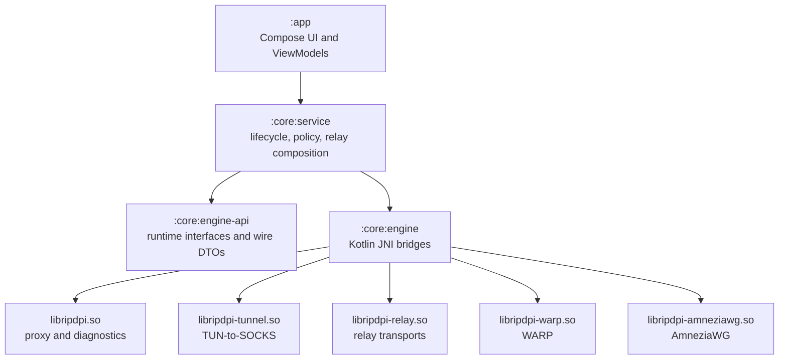

# RIPDPI Architecture — Start Here

The concise architecture map for RIPDPI. Read this first, then follow the
[deeper docs](#8-deeper-docs) for any subsystem.

This file is a navigational map, not a spec. Factual claims should be checked against the source paths linked from each subsystem section.

---

## 1. What RIPDPI does

RIPDPI is an Android network-path diagnostics and optimization toolkit. It runs
entirely on-device with **no backend server** ([AGENTS.md](../../AGENTS.md) §
Project Rules). Three capabilities work independently or combined:

1. **On-device packet strategies** — applies configurable packet-level
   transformations (TCP split/disorder, fake injection, OOB, TLS record
   fragmentation, QUIC/DTLS variation, etc.) without routing to a relay.
2. **VPN relay** — chains local proxy or VPN traffic through encrypted relay protocols (VLESS Reality/xHTTP, Hysteria2, TUIC v5, MASQUE, ShadowTLS, Trojan, AnyTLS, Shadowsocks, Mieru, SSH, Tor, NaiveProxy, Google Apps Script, Cloudflare Tunnel, in-repository WebTunnel, and external Snowflake/obfs4 PT paths) to a server or bridge path the user controls. Mieru currently exposes TCP relay only; UDP remains capability-gated. WARP and AmneziaWG are separate VPN/tunnel
   profile surfaces, not `relay_kind` values.
   Owner-operated relay promotion is governed by the deployment-plane controls in
   [`Relay Deployment Operations`](../relay-deployment-operations.md).
3. **Diagnostics** — scans each connection target, produces a typed verdict,
   and stores it per network fingerprint for automatic replay.

See [README.md](../../README.md) for the user-facing feature list.

---

## 2. Runtime modes

| Mode | Entry service | What runs | Native path |
|------|---------------|-----------|-------------|
| **Proxy** | `RipDpiProxyService.kt` | Local SOCKS5 proxy on a localhost port | `RipDpiProxy.kt` → `libripdpi.so` |
| **VPN / TUN** | `RipDpiVpnService.kt` (extends `LifecycleVpnService.kt`) | `VpnService` TUN device → TUN-to-SOCKS bridge → local proxy | `Tun2SocksTunnel.kt` → `libripdpi-tunnel.so`, then `libripdpi.so` |
| **Diagnostics** | Driven from `:core:diagnostics` UI | Active scans + DNS/TLS/strategy probes; stops the VPN service for RAW_PATH scans | `NetworkDiagnostics.kt` → `ripdpi-monitor-engine` (linked into `libripdpi.so`) |
| **Relay** | Composed into proxy/VPN mode | Encrypted relay transport; JNI relays via `RipDpiRelay.kt` / `RipDpiWarp.kt`; subprocess helpers (NaiveProxy, `cloudflared`) via `Subprocess*` services | `libripdpi-relay.so` / `libripdpi-warp.so`; subprocess helper binaries |
| **Root helper** (optional, opt-in) | `RootHelperManager.kt` | Privileged raw-socket ops (FakeRst, MultiDisorder, IP fragmentation, raw IPv4/IPv6 emit) behind `root_mode_enabled` | `ripdpi-root-helper` ELF binary, Unix-socket IPC with SCM_RIGHTS fd passing |

Both proxy and VPN modes work **with or without** a relay configured. The app
must fully function on **non-rooted devices**; root features degrade gracefully.

---

## 3. Android module ownership map

Modules from [`settings.gradle.kts`](../../settings.gradle.kts). This table is an ownership map, not a dependency order; the exact dependency edges are captured by the
auto-generated Mermaid graph at
[`MODULE_GRAPH.md`](MODULE_GRAPH.md) — regenerate with `just module-graph`.

| Module | Owns |
|--------|------|
| `:app` | Jetpack Compose UI (Material 3), navigation, ViewModels |
| `:core:service` | Android VPN + proxy foreground services; relay orchestration, DNS failover, connection-policy resolution, root-helper lifecycle, subprocess relay supervision |
| `:core:engine` | Rust native libraries + JNI bridge; Kotlin↔native config codecs |
| `:core:engine-api` | Kotlin interfaces, native runtime DTOs, and schema-versioned wire contracts shared without exposing the JNI implementation |
| `:core:pcap-export` | Explicit opt-in PCAP capture controller, reader, and export support |
| `:core:diagnostics` | Active diagnostics, passive telemetry collection, diagnostics UI logic |
| `:core:diagnostics-data` | Room database, entities, DAOs, migrations, and persistence contracts for diagnostics, telemetry, snapshots, and policies |
| `:core:detection` | VPN/DPI detection and checkers (consensus, privacy, `vpn`, `dpi`, `export`, `community`, `probe` subpackages); depends on `:xray-protos` |
| `:core:data` | Aggregator — `api`-exports the four sub-modules below; Room DB (KSP), backup, rules |
| `:core:data:model` | App-settings + geosite protobuf schemas (see [§6](#6-config-flow)) |
| `:core:data:settings` | Settings persistence (DataStore-backed), support settings deep-link package parsing, preview, and apply |
| `:core:data:runtime-state` | Runtime/session state |
| `:core:data:catalog` | Diagnostics / strategy-pack catalog data |
| `:xray-protos` | Java-library: Xray/V2Ray protobuf schemas (VLESS, Reality, transport) + gRPC; consumed by `:core:detection` |
| `:quality:detekt-rules` | Custom detekt rules (DI guardrails, Hilt ViewModel checks) |
| `:baselineprofile` | Baseline profile generation for runtime performance |
| `:testing:socket-bind-probe` | Instrumentation-test helper: unprivileged `SO_BINDTODEVICE` bind-to-device probe library consumed by `:app` androidTest |

> **Note:** This table reflects the current `settings.gradle.kts`. The split
> between `:core:data:model` and `:core:data:settings` is **schema vs.
> persistence**:
> - `:core:data:model` owns the protobuf schemas (`app_settings.proto`,
>   `geosite.proto`) and immutable domain/wire types (`AppStatus`,
>   `NativeError`, `RuntimeTelemetry`, `StrategyChainModel`, …).
> - `:core:data:settings` owns the DataStore-backed `AppSettingsRepository`,
>   `AppSettingsJson*` mappers/snapshots, and runtime override stores
>   (`ResolverOverrideStore`, …).

**Boundary enforcement.** `:app` must not depend directly on `:core:engine` —
it reaches the native layer only through `:core:service`
([§5](#5-kotlin--rust-control-flow)). The `:app:verifyEngineBoundaryClasspath`
Gradle task fails the build if `:core:engine` leaks onto an `:app` compile
classpath. Native-crate dependency direction is enforced separately by
`scripts/ci/check_native_architecture_contracts.py` — see
[`NATIVE_RUST.md`](NATIVE_RUST.md) §3.

---

## 4. Native Rust artifact map

The Rust workspace is at [`native/rust/`](../../native/rust/Cargo.toml) — a
Cargo workspace of 114 crates. [`:core:engine`](../../core/engine/build.gradle.kts)
builds it via the `ripdpi.android.rust-native` convention plugin: **five** JNI
`.so` libraries, three managed Rust helper binaries, and pluggable-transport
assets are packaged into the APK. See
[`NATIVE_RUST.md`](NATIVE_RUST.md) for the full crate taxonomy and dependency map.

| Artifact | Kind | Source crate | Kotlin bridge | Role |
|----------|------|--------------|---------------|------|
| `libripdpi.so` | JNI shared library | `crates/ripdpi-android` | `RipDpiProxy.kt`, `NetworkDiagnostics.kt` | Proxy, VPN, diagnostics, strategy engine |
| `libripdpi-tunnel.so` | JNI shared library | `crates/ripdpi-tunnel-android` | `Tun2SocksTunnel.kt` | VPN-mode TUN-to-SOCKS bridge |
| `libripdpi-relay.so` | JNI shared library | `crates/ripdpi-relay-android` | `RipDpiRelay.kt` | Encrypted relay transports |
| `libripdpi-warp.so` | JNI shared library | `crates/ripdpi-warp-android` | `RipDpiWarp.kt` | WARP runtime |
| `libripdpi-amneziawg.so` | JNI shared library | `crates/ripdpi-amneziawg-android` | `RipDpiAmneziaWg.kt` | Standalone and VPN-composed AmneziaWG runtime |
| `ripdpi-root-helper` | Standalone ELF binary | `crates/ripdpi-root-helper` | `RootHelperManager.kt`, `RootDetector.kt` | Privileged raw-socket ops, rooted devices only |
| `ripdpi-naiveproxy` | Standalone helper binary | `crates/ripdpi-naiveproxy` | `Subprocess*` services | NaiveProxy relay helper process |
| `ripdpi-cloudflare-origin` | Standalone helper binary | `crates/ripdpi-cloudflare-origin` | `Cloudflare*` services | Local xHTTP origin helper for Cloudflare Tunnel publish mode |
| `ripdpi-webtunnel` | Pluggable-transport helper binary | `crates/ripdpi-webtunnel` | Tor PT bootstrap path | WebTunnel managed-client helper |

- `libripdpi.so` is loaded by `RipDpiNativeLoader.kt` via
  `System.loadLibrary("ripdpi")`. The relay, WARP, and AmneziaWG runtimes ship as
  **separate** `.so` files (`crates/ripdpi-relay-android`,
  `crates/ripdpi-warp-android`, `crates/ripdpi-amneziawg-android`) — they are not linked into `libripdpi.so`.
  The relay transport crates (`ripdpi-relay-core`, `ripdpi-vless`,
  `ripdpi-xhttp`, `ripdpi-tuic`, `ripdpi-shadowtls`, …) link into
  `libripdpi-relay.so`.
- **Subprocess and PT helper binaries** — `ripdpi-naiveproxy`,
  `ripdpi-cloudflare-origin`, and `ripdpi-webtunnel` are workspace `bin` crates
  packaged into APK assets and run as separate processes (not JNI-embedded).
  `native/pluggable-transports/sources.json` also describes external PT assets:
  `ripdpi-snowflake` / `ripdpi-obfs4` from Lyrebird and `ripdpi-cloudflared`
  from Cloudflare's `cloudflared`.
- `ripdpi` (desktop CLI, `crates/ripdpi-cli`) is a development binary for
  macOS/Linux and is **not** packaged in the APK.
- Full crate taxonomy, layering, and dependency-direction policy live in
  [`NATIVE_RUST.md`](NATIVE_RUST.md); module narrative in
  [`docs/native/README.md`](../native/README.md).

Supported ABIs: `armeabi-v7a`, `arm64-v8a`, `x86`, `x86_64`. Never edit `.so`
files — they are compiled from source.

---

## 5. Kotlin ↔ Rust control flow



- **VPN socket protection invariant** — every non-loopback outbound socket the
  Rust core opens must be passed to `VpnService.protect(fd)` before
  `connect`/`bind`, or it loops back into the TUN device. Dual mechanism: JNI
  callback (`vpn_protect.rs` / `VpnNativeProtectRegistration.kt`) preferred,
  Unix-socket fallback (`VpnProtectSocketServer.kt`). See
  [`.claude/rules/vpnservice-protect-invariant.md`](../../.claude/rules/vpnservice-protect-invariant.md).
- **Split-DNS direct underlay** — a service-owned lease accepts only the
  validated, non-VPN, non-captive default network whose callback-delivered
  LinkProperties DNS set matches the immutable policy. A singleton callback
  authority issues an ephemeral generation only after capabilities and link
  properties are complete; the fingerprint carries that non-persisted token
  into the runtime policy. Direct UDP/53 sockets are protected and bound to
  that exact `Network`; truncated replies retry over TCP/53. A stale token
  suppresses late responses before MapDNS rewrite/cache insertion, while a
  missing token falls back to the encrypted proxy resolver. The runtime-only
  DNS signature includes the token so the periodic policy refresh closes the
  cold-start callback race without changing the canonical policy digest. Relay
  hostname bootstrap uses the same eligible callback snapshot independently of
  the split-DNS policy lease and rejects results if its generation changes
  during resolution.
  Android underlay publication is tri-state: encrypted-only policies use
  `null` (system default), an exact direct lease publishes one `Network`, and
  an explicit direct policy with a missing or stale lease publishes an empty
  blocking array until authority is restored.
- **Telemetry is pull-model** — `:core:service` polls native snapshots once per
  second and stores only metadata (counters, lifecycle changes, route
  decisions). No packet payloads are persisted.
- **Diagnosis classification is Rust-authoritative** — the native monitor
  collects packet/TLS/DNS/timing evidence and emits the final verdict; Kotlin
  maps it to UI and persistence without re-classifying
  ([architecture/README.md](README.md) § Ownership Boundaries).

---

## 6. Config flow

User settings become a Rust `RuntimeConfig` through a one-way translation
pipeline. Kotlin is **authoritative** for strategy models, defaults,
validation, and JSON serialization; Rust **consumes** the JSON
([architecture/README.md](README.md) § Ownership Boundaries).

```
app_settings.proto  (core/data/model/src/main/proto/app_settings.proto)
   │  Protobuf + Jetpack DataStore
   ▼
Kotlin settings & strategy models  (:core:data:settings, StrategyChains.kt)
   │  user-facing models, defaults, validation
   ▼
JSON codecs in :core:engine
   │  RipDpiProxyJsonCodec.kt + core/codec/*Codec.kt
   │  (ChainsCodec, FakePacketCodec, RelaySectionCodec, NetworkSectionCodec,
   │   AdaptiveSectionCodec, WarpTunnelSectionCodec, RuntimeContextCodec)
   ▼
native config JSON  ── passed over JNI ──▶  Rust
   │
   ▼
ripdpi-proxy-config / ripdpi-config  ──▶  RuntimeConfig  ──▶  ripdpi-proxy-runtime
```

- `ripdpi-proxy-config` is the shared translation crate that aligns
  UI-configured JSON, diagnostics recommendation drafts, probing candidate
  overlays, and CLI config around one `RuntimeConfig` shape
  ([docs/native/README.md](../native/README.md) § Shared Strategy Bridge).
- Validated per-network winners are persisted as exact `proxyConfigJson` in
  `remembered_network_policies` and replayed on reconnect.
- The settings schema lives at
  `core/data/model/src/main/proto/app_settings.proto` (confirmed by
  [`CONFIG_CONTRACTS.md`](CONFIG_CONTRACTS.md) §1, the canonical config-contract
  doc).

---

## 7. Control plane vs data plane

| | Control plane | Data plane |
|---|---|---|
| **Responsibility** | Config translation, JNI lifecycle calls (start/stop/restart), 1 Hz telemetry polling, connection-policy resolution, diagnostics orchestration | Packet processing — SOCKS5 sessions, TUN packet pump, desync mutation, relay transport, DNS forwarding |
| **Where it runs** | Kotlin (`:core:service`, `:core:engine`) + native control entry points | Entirely native Rust inside `libripdpi.so` / `libripdpi-tunnel.so` |
| **Crosses JNI?** | Yes — but only at lifecycle and polling boundaries | **No** — no JNI call on the per-packet hot path |
| **Logging channel** | `android_logger` (logcat) | `tracing` (kept off per-packet paths for cost reasons) |

The boundary is deliberate: JNI overhead (~3 µs/event) makes per-packet calls
across the boundary a measurable bottleneck at 1 Gbps, so the data plane stays
fully native and the control plane communicates over coarse-grained config JSON
and pulled telemetry snapshots. The one exception is `VpnService.protect(fd)`,
a per-socket (not per-packet) control-plane call required by the
[protect invariant](#5-kotlin--rust-control-flow).

---

## 8. Deeper docs

| Topic | Document |
|-------|----------|
| Domain term definitions | [`architecture/GLOSSARY.md`](GLOSSARY.md) |
| Runtime modes — proxy, VPN/TUN, diagnostics, relay, root helper | [`architecture/RUNTIME_MODES.md`](RUNTIME_MODES.md) |
| Compact architecture notes (ownership, runtime behavior, follow-ups) | [`architecture/README.md`](README.md) |
| Auto-generated inter-module dependency graph (Mermaid) | [`architecture/MODULE_GRAPH.md`](MODULE_GRAPH.md) |
| Native Rust workspace taxonomy + dependency direction | [`architecture/NATIVE_RUST.md`](NATIVE_RUST.md) |
| Adding a feature safely (strategy, relay, probe, setting, …) | [`architecture/FEATURE_EXTENSION_GUIDE.md`](FEATURE_EXTENSION_GUIDE.md) |
| Kotlin ↔ Rust JNI boundary contract | [`architecture/JNI_CONTRACT.md`](JNI_CONTRACT.md) |
| Settings / protobuf / native-JSON / Rust config compatibility | [`architecture/CONFIG_CONTRACTS.md`](CONFIG_CONTRACTS.md) |
| Native modules, crate dependency graph, runtime topology | [`docs/native/README.md`](../native/README.md) |
| Proxy engine and strategy surface | [`docs/native/proxy-engine.md`](../native/proxy-engine.md) |
| TUN-to-SOCKS bridge | [`docs/native/tunnel.md`](../native/tunnel.md) |
| Packet strategy runtime (TUN-egress + root-helper raw packets) | [`docs/packet-strategy-runtime.md`](../packet-strategy-runtime.md) |
| Diagnostics scan pipeline | [`docs/native/README.md`](../native/README.md) § Diagnostics and Telemetry |
| Relay profile examples | [`docs/relay-profile-examples.md`](../relay-profile-examples.md) |
| Architecture quality gates | [`architecture/quality-gates.md`](quality-gates.md) |
| Testing, E2E, golden contracts | [`docs/testing.md`](../testing.md) |
| Full project reference (build, CI, rules, skills) | [`AGENTS.md`](../../AGENTS.md) |
| Forward roadmap | [`ROADMAP.md`](../../ROADMAP.md) |
| Cross-tool engineering rules | [`.claude/rules/`](../../.claude/rules/) |
