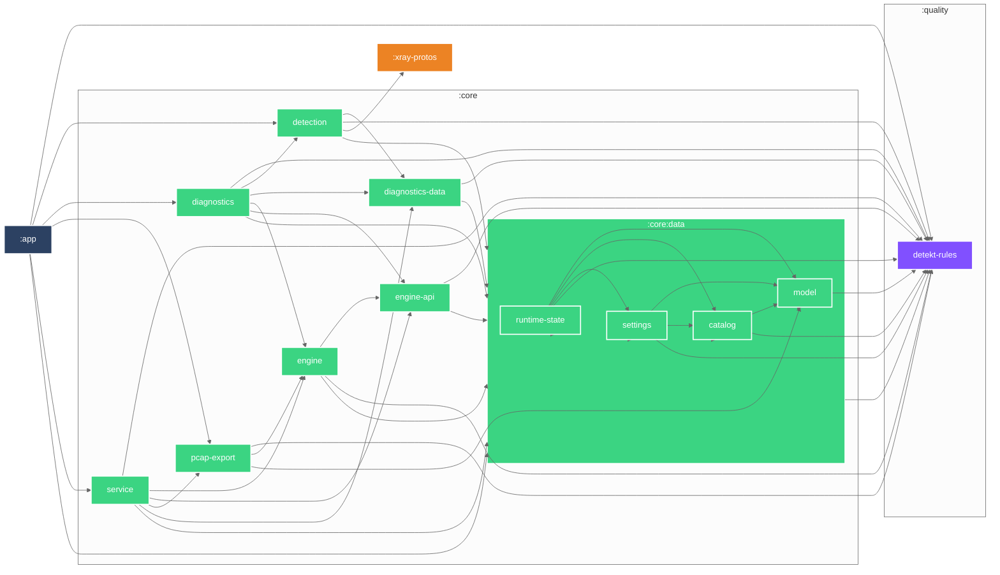

# Module Dependency Graph

Auto-generated by `./gradlew createModuleGraph` (or `just module-graph`) via the
[`dev.iurysouza.modulegraph`](https://github.com/iurysza/module-graph) Gradle plugin.

Do not edit the graph below by hand. Regenerate it with `./gradlew createModuleGraph`
(or `just module-graph`) and commit after changing any inter-module dependency.
No CI job currently enforces freshness — keep this manual regeneration step in
every dependency-changing PR.

## Module Graph

