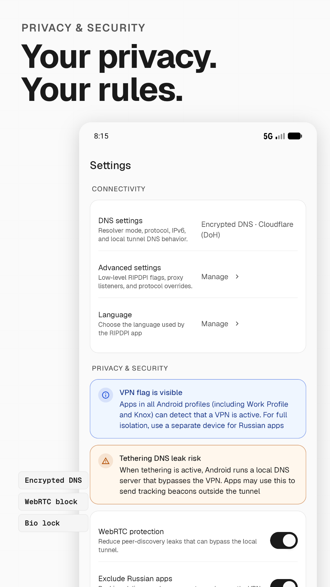

<div dir="rtl">

<p align="center">
  
</p>

<h1 align="center">RIPDPI</h1>
<p align="center"><b>پلتفرم تشخیص و بهینه‌سازی مسیر شبکه</b></p>

<p align="center">
  <a href="https://github.com/po4yka/RIPDPI/actions/workflows/ci.yml"></a>
  <a href="https://github.com/po4yka/RIPDPI/releases/latest"></a>
  <a href="../../LICENSE"></a>
  &nbsp;
  
  
  
</p>

<p align="center"><a href="../../README.md">English</a> | <a href="../../README-ru.md">Русский</a> | <a href="../../README-es.md">Español</a> | <a href="../../README-de.md">Deutsch</a> | <a href="../../README-fr.md">Français</a> | <b>فارسی</b> | <a href="../../README-zh-CN.md">简体中文</a></p>

## دربارهٔ RIPDPI

RIPDPI یک ابزار رایگان و متن‌باز برای دستگاه‌های اندرویدی است که هدف آن دور زدن مداخلهٔ شبکه‌ای در سطح بسته است — همان نوع مداخله‌ای که در ایران تحت عنوان فیلترینگ مبتنی بر بازرسی عمیق بسته (DPI) رایج است. این برنامه سه قابلیت مستقل دارد که می‌توانند جداگانه یا با یکدیگر کار کنند: تغییر شکل بسته‌ها روی همان دستگاه، اتصال به سرورهای رلهٔ تحت کنترل شما، و تشخیص خودکار نوع اختلال هر اتصال.

> ⚠️ **یادداشت دربارهٔ ایمنی کاربر.** هیچ ابزار دور زدنی نمی‌تواند ضامن ناشناس بودن یا حفاظت کامل باشد. RIPDPI شما را در برابر تحلیل ترافیک، بدافزار دستگاه، یا شناسایی مبتنی بر رفتار محافظت نمی‌کند. در صورت لزوم، RIPDPI را به‌عنوان یک لایهٔ مکمل در کنار Tor، Snowflake، یا یک VPN مورد اعتماد به کار ببرید، نه به‌جای آن‌ها.

## سه قابلیت اصلی

### ۱. راهبردهای بسته در سطح دستگاه

تغییرات قابل پیکربندی روی بسته‌های شبکه را روی خود دستگاه اعمال می‌کند، بدون نیاز به ارسال ترافیک به یک سرور رله. مسیر اصلی به دسترسی روت نیاز ندارد.

روش‌های پشتیبانی‌شده شامل: قطعه‌بندی و نامرتب‌سازی بخش‌های TCP، تزریق بسته‌های ساختگی، فشار OOB (اشاره‌گر فوری)، قطعه‌بندی رکورد TLS، اولین پرواز TLS ساختگی، تغییر دست‌دهی QUIC، عادی‌سازی اثر انگشت DTLS، تغییر فیلد طول UDP، درج هدر افزونهٔ IPv6، ارسال بسته‌های خام تعریف‌شده با Lua، و نشانگرهای معنایی تطبیقی که موقعیت خود را در برابر `TCP_INFO` زنده حل می‌کنند. زنجیره‌های راهبرد از کرت‌های Rust درون این مخزن ساخته می‌شوند و به هیچ اجرایی خارجی وابسته نیستند.

وقتی هیچ رلهٔ خارجی پیکربندی نشده باشد، ترافیک مستقیماً از دستگاه خارج می‌شود — تغییرات روی همان دستگاه تنها چیزی هستند که در مسیر اعمال می‌گردد.

### ۲. تونل از طریق رله

ترافیک پراکسی یا VPN محلی را از طریق پروتکل‌های رمزنگاری‌شده به یک سرور تحت کنترل شما زنجیر می‌کند:

- **VLESS Reality و xHTTP** — پیاده‌سازی بومی به زبان Rust، بدون نیاز به محیط اجرای Go
- **WARP، Cloudflare Tunnel، MASQUE**
- **Hysteria2، TUIC v5، ShadowTLS v3، NaiveProxy**
- **WebTunnel، obfs4، Snowflake، مسیر Google Apps Script**

هر دو حالت پراکسی محلی و تغییر مسیر VPN اندرویدی با یا بدون رلهٔ پیکربندی‌شده کار می‌کنند.

### ۳. تشخیص خودکار

هر مقصد اتصال را به‌صورت جداگانه پویش می‌کند و یک نتیجهٔ نوع‌دار تولید می‌کند:

- `TRANSPARENT_WORKS` — مسیر خام کار می‌کند، نیازی به مداخله نیست
- `OWNED_STACK_ONLY` — فقط از طریق پشتهٔ TLS متعلق به برنامه کار می‌کند
- `NO_DIRECT_SOLUTION` — تغییرات روی دستگاه نمی‌توانند این مقصد را احیا کنند؛ رله لازم است
- `IP_BLOCK_SUSPECT` — مسدودسازی در سطح آدرس IP شناسایی شد

نتایج به ازای اثر انگشت هر شبکه ذخیره می‌شوند و وقتی همان شبکه دوباره دیده شود، به‌صورت خودکار بازپخش می‌گردند. صفحهٔ تشخیص شامل کاوش راهبرد TCP و QUIC در میان ۲۴ نامزد TCP و ۶ نامزد QUIC، شناسایی دستکاری DNS، توصیه‌های تحلیل‌گر DoH/DoT/DNSCrypt/DoQ، و بایگانی‌های تشخیص قابل‌صادرات است.

## چرا RIPDPI؟

شبکه‌های مدرن اندرویدی — به‌ویژه در ایران — معمولاً ترکیبی از این مداخلات را اعمال می‌کنند: اثر انگشت‌گیری L7 (JA3/JA4 برای TLS، QUIC)، اعمال QoS تهاجمی روی شبکهٔ همراه و وای‌فای عمومی، ناسازگاری MTU و ECN، و قطع دست‌دهی TLS توسط جعبهٔ میانی. این مداخلات باعث می‌شوند برخی اهداف شکست بخورند در حالی که اهداف دیگر روی همان شبکه به‌خوبی کار می‌کنند. یک تنظیم سراسری واحد نمی‌تواند به همهٔ موارد پاسخ دهد.

اصل طراحی RIPDPI ساده است: هر مقصد و هر شبکه را جداگانه طبقه‌بندی کن، سبک‌ترین راه‌حلی را که جواب می‌دهد اعمال کن، و آن را به یاد بسپار.

۱. **پاسخ به ازای هر مقصد و هر شبکه** — نه یک سیاست سراسری. تشخیص هر مرجع را دسته‌بندی می‌کند و نتیجه را با کلید هش اثر انگشت شبکه ذخیره می‌کند.

۲. **وقتی شبکه مشکل دارد، مسیر محلی را تغییر بده.** نشانگرهای معنایی، قرارگیری تقسیم تطبیقی، زنجیره‌های بار ساختگی، OOB/disorder، رکوردهای TLS تصادفی‌شده، تنوع اثر انگشت QUIC و DTLS — همگی از کرت‌های Rust درون مخزن مونتاژ می‌شوند.

۳. **اگر مسیر مستقیم تنزل یافت، به رلهٔ تونل‌شده برگرد.** VLESS Reality/xHTTP بومی Rust، به‌علاوهٔ WARP، MASQUE، Hysteria2، TUIC v5، ShadowTLS v3، NaiveProxy و Cloudflare Tunnel، اهدافی را که روی دستگاه قابل احیا نیستند مدیریت می‌کنند.

۴. **گزارش‌دهی صادقانه.** نتایج نوع‌دار و قابل‌نمایش‌اند؛ نتایج طبقه‌بند شکست سرکوب نمی‌شوند، بلکه به‌وضوح نشان داده می‌شوند؛ بسته‌های صادرات تشخیصی اطلاعات حساس را ویرایش می‌کنند.

## ویژگی‌ها

- **حالت پراکسی**: پراکسی SOCKS5 محلی روی پورت localhost پیکربندی‌شده.
- **حالت VPN**: ترافیک دستگاه اندرویدی را از طریق یک پل TUN-به-SOCKS محلی با استفاده از `VpnService` مسیریابی می‌کند.
- **DNS رمزنگاری‌شده**: پشتیبانی از تحلیل‌گرهای DoH، DoT، DNSCrypt و DoQ در مسیرهای مرتبط با VPN.
- **کنترل‌های راهبرد**: خانوادهٔ split/disorder/fake برای TCP، قطعه‌بندی رکورد TLS و پروفایل‌های ساختگی، تنوع دست‌دهی QUIC و DTLS، تنوع فیلد طول UDP، هدرهای افزونهٔ IPv6، `rawsend` در Lua، فیلترهای فعال‌سازی به ازای هر مرحله، کنترل شناسهٔ IPv4 و تزریق OOB.
- **حافظهٔ سیاست به ازای هر شبکه**: نتایج اعتبارسنجی‌شده به ازای هر مرجع که با کلید اثر انگشت شبکه ذخیره می‌شوند؛ هنگام اتصال مجدد به‌صورت خودکار بازپخش می‌گردند.
- **کاوش تطبیقی**: کاوش خودکار راهبرد برای شبکه‌هایی که اولین بار دیده می‌شوند؛ بررسی مجدد `quick_v1` پس‌زمینه هنگام تحویل شبکه.
- **راه‌اندازی مجدد آگاه به تحویل**: ارزیابی مجدد سیاست زنده در گذار میان وای‌فای، همراه و رومینگ.
- **مرورگر RIPDPI**: مرورگر متعلق به برنامه برای اهداف HTTPS که به پشتهٔ TLS متعلق نیاز دارند؛ مسیر مشترک `SecureHttpClient` برای درخواست‌های ایجاد‌شده توسط برنامه.
- **سنجش و گزارش‌های زمان اجرا**: چرخهٔ حیات پراکسی، تصمیمات مسیر، رویدادهای بازگشت DNS، پیشرفت تشخیص و رویدادهای زمان اجرای بومی — به‌صورت تاریخچهٔ درون‌برنامه و صادرات پشتیبانی در دسترس‌اند.
- **کمک‌رسان روت اختیاری**: روی دستگاه‌های روت‌شده، با یک فرایند کمکی ممتاز، عملیات سوکت خام را باز می‌کند (FakeRst، MultiDisorder، قطعه‌بندی IP، SeqOverlap کامل، انتشار بستهٔ خام IPv4/IPv6).

## حالت‌های زمان اجرا

### پراکسی

پراکسی SOCKS5 روی پورت localhost پیکربندی‌شده. مناسب برای برنامه‌هایی که از پیکربندی پراکسی پشتیبانی می‌کنند. تغییرات راهبرد و زنجیر شدن از طریق رله روی همهٔ ترافیکی که از طریق پراکسی وارد می‌شود اعمال می‌گردد.

### VPN

از `VpnService` اندروید برای تغییر مسیر ترافیک دستگاه از طریق موتور محلی RIPDPI استفاده می‌کند. وقتی هیچ رله‌ای پیکربندی نشده باشد، حالت VPN تغییرات روی دستگاه را بدون تغییر IP خروجی اعمال می‌کند. وقتی رله پیکربندی شده باشد، ترافیک به‌صورت رمزنگاری‌شده به نقطهٔ پایانی پیکربندی‌شده ارسال می‌شود.

## حریم خصوصی

RIPDPI فراداده‌های عملیاتی را برای تشخیص و عیب‌یابی ذخیره می‌کند: تصاویر لحظه‌ای شبکه، وضعیت تحلیل‌گر، تصمیمات مسیر، نتایج پویش، وضعیت سرویس و رویدادهای زمان اجرای بومی.

RIPDPI این موارد را ذخیره **نمی‌کند**:
- ضبط کامل بسته‌ها
- محتوای ترافیک
- اسرار TLS

حریم خصوصی ترافیک رله به نقطهٔ پایانی رله و پروفایلی که شما پیکربندی می‌کنید بستگی دارد.

## یادداشت‌های ویژهٔ کاربران ایرانی

این بخش راهنمایی‌هایی برای کسانی است که در شرایط فیلترینگ شدید زندگی می‌کنند:

- **اعتماد به رله را احراز کنید.** اگر از یک رلهٔ شخص ثالث استفاده می‌کنید، کسی که آن رله را اداره می‌کند می‌تواند حداقل بفهمد چه دامنه‌هایی را باز کرده‌اید. ترجیحاً از سروری استفاده کنید که خودتان آن را پیکربندی و راه‌اندازی کرده‌اید.

- **برای موارد حساس از Tor یا Snowflake استفاده کنید.** RIPDPI ابزار دور زدن DPI است، نه ابزار ناشناس‌سازی. اگر امنیت هویتی برای شما حیاتی است، Tor یا Snowflake را ترجیح دهید و RIPDPI را به‌عنوان لایهٔ ضدّ DPI روی آن قرار دهید.

- **نتایج RIPDPI را حدس نزنید.** اگر صفحهٔ تشخیص می‌گوید مسیر مستقیم کار می‌کند، این بدان معناست که در آن لحظه و در آن شبکه کار می‌کرد. شبکه‌ها در ایران به‌صورت تطبیقی واکنش نشان می‌دهند؛ پویش را روی هر شبکه‌ای که اولین بار به آن وصل می‌شوید دوباره اجرا کنید.

- **پشتیبان‌گیری از پیکربندی.** اگر یک پروفایل کار می‌کند، آن را با ابزار اشتراک‌گذاری RIPDPI صادر کنید و در جای امنی نگه دارید. در شرایط افزایش فیلترینگ، دسترسی به مستندات و راهنماها ممکن است مسدود شود.

- **به‌روزرسانی‌ها را از منبع رسمی دریافت کنید.** RIPDPI از طریق GitHub منتشر می‌شود. اگر GitHub در دسترس نیست، از یک آینهٔ مورد اعتماد یا از Tor برای دریافت آخرین نسخه استفاده کنید. بسته‌های APK دریافت‌شده از منابع نامعتبر ممکن است دستکاری شده باشند.

## تصاویر صفحه

<p align="center">
  
  &nbsp;
  
  &nbsp;
  
  &nbsp;
  
</p>
<p align="center">
  
  &nbsp;
  
</p>

## ساخت از روی کد منبع

پیش‌نیازها: JDK 17، Android SDK، Android NDK `29.0.14206865`، زنجیرهٔ ابزار Rust `1.94.0`، و اهداف Rust اندروید برای ABIهای مورد نیاز.

```bash
git clone https://github.com/po4yka/RIPDPI.git
cd RIPDPI
./gradlew assembleDebug
```

ساخت‌های محلی به‌صورت پیش‌فرض از `arm64-v8a` استفاده می‌کنند (`ripdpi.localNativeAbisDefault`). برای شبیه‌ساز: `./gradlew assembleDebug -Pripdpi.localNativeAbis=x86_64`.

خروجی APK: `app/build/outputs/apk/debug/` و `app/build/outputs/apk/release/`.

## آزمایش

```bash
./gradlew testDebugUnitTest
bash scripts/ci/run-rust-native-checks.sh
bash scripts/ci/run-rust-network-e2e.sh
python3 -m unittest scripts.tests.test_offline_analytics_pipeline
```

جزئیات: [docs/testing.md](../../docs/testing.md)

## مستندات

- [یکپارچه‌سازی بومی و ماژول‌ها](../../docs/native/README.md)
- [زمان اجرای راهبرد بسته](../../docs/packet-strategy-runtime.md)
- [موتور پراکسی و سطح راهبرد](../../docs/native/proxy-engine.md)
- [پل TUN-به-SOCKS](../../docs/native/tunnel.md)
- [عملیات بستهٔ راهبرد و فهرست TLS](../../docs/strategy-pack-operations.md)
- [نمونه‌های پروفایل رله](../../docs/relay-profile-examples.md)
- [یادداشت‌های معماری](../../docs/architecture/README.md)
- [نقشهٔ راه](../../ROADMAP.md)

## مشارکت و گزارش اشکال

اگر در ایران هستید و می‌خواهید اشکالی را گزارش دهید، توجه داشته باشید که محتوای issueها در GitHub عمومی است. در گزارش‌های خود اطلاعات هویتی شخصی، نام شبکهٔ خانگی، یا اطلاعات حساس محل خود را وارد نکنید.

</div>
