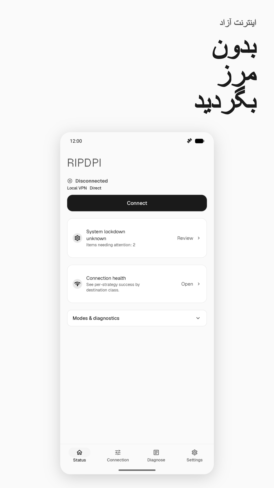
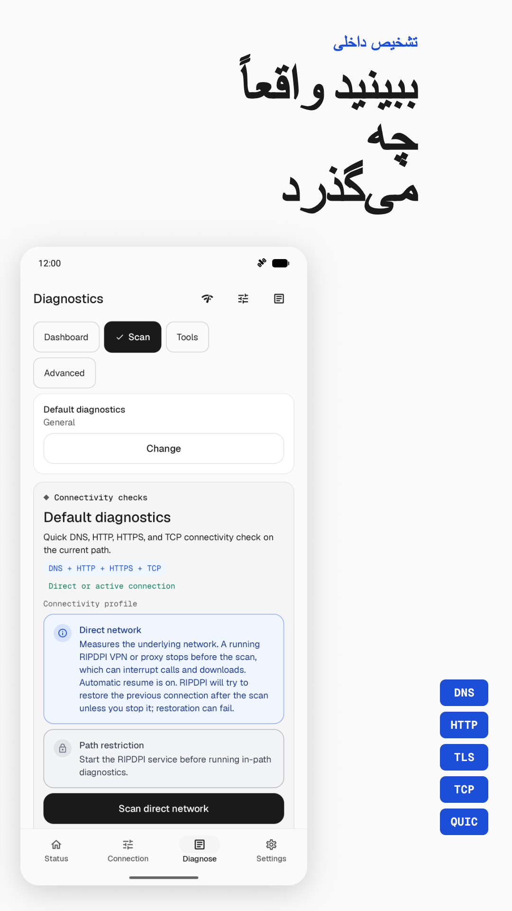
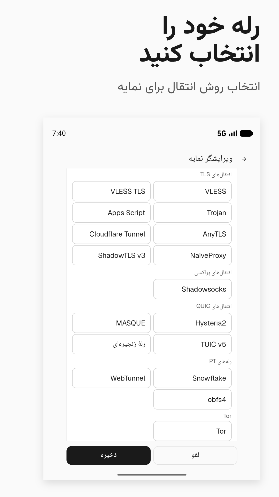

<div dir="rtl">

<p align="center">
  
</p>

<h1 align="center">RIPDPI</h1>
<p align="center"><b>Routing & Internet Performance Diagnostics Platform Interface</b></p>

<p align="center">
  <a href="https://github.com/po4yka/RIPDPI/actions/workflows/ci.yml"></a>
  <a href="https://github.com/po4yka/RIPDPI/releases/latest"></a>
  <a href="../../LICENSE"></a>
  &nbsp;
  
  
  
</p>

<p align="center"><a href="../../README.md">English</a> | <a href="../../README-ru.md">Русский</a> | <a href="../../README-es.md">Español</a> | <a href="../../README-de.md">Deutsch</a> | <a href="../../README-fr.md">Français</a> | <b>فارسی</b> | <a href="../../README-zh-CN.md">简体中文</a> | <a href="../../README-hi.md">हिन्दी</a> | <a href="../../README-pt-BR.md">Português (Brasil)</a></p>

> [!WARNING]
> **این پروژه در فاز فعال توسعه قرار دارد.** ویژگی‌های جدید در حال افزوده شدن هستند و بازآرایی‌های (refactoring) گسترده‌ای به‌طور مکرر برای بهبود کیفیت کدبیس انجام می‌شود. در این کار از عامل‌های کدنویسی (coding agents) به‌طور گسترده استفاده می‌شود، بنابراین در شاخهٔ `main` در حال حاضر **breaking changes، مهاجرت‌های اسکیما و عملکرد بخشی ناقص ممکن است رخ دهد**. اگر با یک رگرسیون مواجه شدید، لطفاً [یک issue باز کنید](https://github.com/po4yka/RIPDPI/issues) — بازخورد شما به پایدارسازی پروژه کمک می‌کند.

RIPDPI یک جعبه‌ابزار اندرویدی برای تشخیص و بهینه‌سازی مسیر شبکه است. راهبردهای بسته‌ای قابل پیکربندی را روی دستگاه اعمال می‌کند، می‌تواند به سرورهای رلهٔ تحت کنترل شما متصل شود و تشخیص هر اتصال را اجرا می‌کند تا مشخص شود چرا هر مقصدی شکست می‌خورد یا کیفیتش افت می‌کند. سه قابلیت به‌صورت مستقل یا ترکیبی کار می‌کنند.

## سه ستون

### راهبردهای بستهٔ روی دستگاه

تبدیلات قابل پیکربندی در سطح بسته را روی دستگاه اعمال می‌کند بدون اینکه ترافیک را به یک سرور رله هدایت کند. مسیر اصلی به دسترسی روت نیاز ندارد.

تکنیک‌های پشتیبانی‌شده: قطعه‌بندی و نامرتب‌سازی بخش‌های TCP، تزریق بسته‌های ساختگی، OOB (اشاره‌گر فوری)، قطعه‌بندی رکورد TLS، اولین پرواز TLS ساختگی، تغییر دست‌دهی QUIC، تغییر فیلد طول UDP، درج هدر افزونهٔ IPv6، ارسال بسته‌های خام تعریف‌شده با Lua، و نشانگرهای معنایی تطبیقی که موقعیت خود را در برابر `TCP_INFO` زنده حل می‌کنند. زنجیره‌های راهبرد از کرت‌های Rust درون این مخزن ساخته می‌شوند و به هیچ اجرایی خارجی وابسته نیستند.

وقتی رله‌ای پیکربندی نشده باشد، ترافیک مستقیماً از دستگاه خارج می‌شود — تغییرات روی دستگاه تنها چیزی هستند که در مسیر اعمال می‌گردد.

### رلهٔ VPN

ترافیک پراکسی یا VPN محلی را از طریق پروتکل‌های رمزنگاری‌شده به سروری که شما پیکربندی می‌کنید زنجیر می‌کند:

> [!NOTE]
> ماتریس پروتکل‌ها با رجیستری‌های فعلی کد منبع مطابقت دارد. متن ترجمه‌شدهٔ پیرامون ممکن است تا بازبینی انسانی از `README.md` عقب باشد.

| Kind / protocol | Integration tier | Scope | Traffic |
| --- | --- | --- | --- |
| `vless_reality` / VLESS Reality TCP | Native relay-core backend (`ripdpi-vless`) | Client relay | TCP + UDP (XUDP) |
| `vless_reality` / xHTTP transport | Native relay-core backend (`ripdpi-xhttp`) | Client relay | TCP |
| `cloudflare_tunnel` | Native xHTTP relay path plus optional Cloudflare publish runtime | Client relay / local-origin publish | TCP |
| `hysteria2` | Native relay-core backend (`ripdpi-hysteria2`) | Client relay | TCP + UDP |
| `tuic_v5` | Native relay-core backend (`ripdpi-tuic`) | Client relay | TCP + UDP |
| `masque` | Native relay-core backend (`ripdpi-masque`): HTTP/2 classic CONNECT for TCP, HTTP/3 CONNECT-UDP for UDP | Client relay | TCP + UDP |
| `shadowtls_v3` | Native relay-core backend (`ripdpi-shadowtls`) with a profile-backed inner relay | Client relay | TCP |
| `trojan` | Native relay-core backend (`ripdpi-trojan`) | Client relay | TCP + UDP |
| `anytls` | Native relay-core backend (`ripdpi-anytls`) | Client relay | TCP + UDP |
| `shadowsocks` | Native relay-core backend (`ripdpi-shadowsocks`) | Client relay | TCP + UDP |
| `tor` | Native Arti-backed relay-core backend (`ripdpi-tor`) with bridge/PT bootstrap | Opt-in client anonymity relay | TCP |
| `naiveproxy` | External helper process (`ripdpi-naiveproxy`) supervised by Android service code | Client relay | TCP |
| `google_apps_script` | In-repository Rust Apps Script relay runtime (`ripdpi-apps-script-core`) selected by `libripdpi-relay.so` | Client relay path | TCP |
| `snowflake` | External Go pluggable-transport binary (`ripdpi-snowflake`) | Client PT relay | TCP |
| `webtunnel` | In-repository Rust pluggable-transport helper binary (`ripdpi-webtunnel`) | Client PT relay | TCP |
| `obfs4` | External pluggable-transport binary (`ripdpi-obfs4`) | Client PT relay | TCP |
| `chain_relay` | Native relay-core composition over referenced relay profiles | Ordered 2-4 hop client relay | TCP |
| `mieru` | Native relay-core backend (`ripdpi-mieru`); UDP relay gated off pending the custom UDP/TCP wire engine | Client relay | TCP |
| `ssh` | Native relay-core backend (`ripdpi-ssh`) | Client relay | TCP |
| `vless` / xHTTP transport | Native relay-core backend (`ripdpi-xhttp`), xHTTP/TLS | Client relay | TCP |

برای `vless` ساده یک backend بومی xHTTP/TLS وجود دارد؛ این backend از دیگر ترانسپورت‌های VLESS ساده پشتیبانی نمی‌کند. UDP در VLESS Reality فقط وقتی از XUDP استفاده می‌کند که UDP فعال باشد، ترانسپورت `reality_tcp` و flow برابر `xtls-rprx-vision` یا `xtls-rprx-vision-udp443` باشد. xHTTP فقط TCP را پشتیبانی می‌کند.

Snowflake intentionally remains an external Go binary; see the [Snowflake native Rust no-go decision](../architecture/snowflake-native-rust-decision.md). VLESS Reality does not use real ECH; see [ADR 0001](../adr/0001-reality-ech.md) for the GREASE-only policy.

WARP and AmneziaWG are separate VPN/tunnel profile surfaces, not `relay_kind` values in the relay-core registry.

هم حالت پراکسی محلی و هم حالت تغییر مسیر VPN اندرویدی با یا بدون رلهٔ پیکربندی‌شده کار می‌کنند.

### تشخیص

هر مقصد اتصال را جداگانه پویش می‌کند و یکی از سه نتیجهٔ نوع‌دار را تولید می‌کند:

- `TRANSPARENT_WORKS` — یک مسیر شفاف آزموده‌شده کار می‌کند، با یا بدون راهبردهای روی دستگاه
- `OWNED_STACK_ONLY` — فقط از طریق پشتهٔ TLS متعلق به برنامه کار می‌کند
- `NO_DIRECT_SOLUTION` — هیچ راه‌حل مستقیم آزموده‌شده‌ای در بودجهٔ این اجرا موفق نشد؛ رله یا آزمون دیگری را در نظر بگیرید

ظن به مسدودسازی جداگانه در `transportClass` ثبت می‌شود، برای نمونه `IP_BLOCK_SUSPECT`، `SNI_TLS_SUSPECT` یا `QUIC_BLOCK_SUSPECT`. این کلاس‌ها نشانه‌های یک علت احتمالی را توصیف می‌کنند؛ نه گونه‌های اضافی نتیجه هستند و نه اثبات مسدودسازی.

نتایج به ازای اثر انگشت هر شبکه ذخیره می‌شوند و وقتی همان شبکه دوباره دیده شود، به‌صورت خودکار بازپخش می‌گردند. صفحهٔ تشخیص شامل کاوش راهبرد TCP و QUIC از مجموعه‌های `ripdpi-diagnostics-candidates` (quick/full-matrix)، شناسایی دستکاری DNS، توصیه‌های تحلیل‌گر DoH/DoT/DNSCrypt/DoQ، و بایگانی‌های تشخیص قابل صادرات است.

## چرا RIPDPI

شبکه‌های مدرن اندرویدی معمولاً اثر انگشت‌گیری L7 (TLS JA3/JA4، QUIC)، QoS تهاجمی روی شبکه‌های همراه و وای‌فای عمومی، ناسازگاری MTU و ECN، و قطع دست‌دهی TLS توسط جعبهٔ میانی را اعمال می‌کنند — این مداخلات باعث می‌شوند برخی اهداف شکست بخورند در حالی که اهداف دیگر روی همان شبکه به‌خوبی کار می‌کنند. یک تنظیم سراسری واحد نمی‌تواند به همهٔ موارد پاسخ دهد.

اصل طراحی RIPDPI: هر مقصد و هر شبکه را جداگانه طبقه‌بندی کن، سبک‌ترین راه‌حلی را که جواب می‌دهد اعمال کن، و آن را به یاد بسپار.

۱. **پاسخ به ازای هر مقصد و هر شبکه** — نه یک سیاست سراسری. تشخیص هر مرجع را دسته‌بندی می‌کند و نتیجه را با کلید هش اثر انگشت شبکه ذخیره می‌کند.
۲. **وقتی شبکه مشکل دارد، مسیر محلی را تغییر بده.** نشانگرهای معنایی، قرارگیری تقسیم تطبیقی، زنجیره‌های بار ساختگی، OOB/disorder، رکوردهای TLS تصادفی‌شده، تنوع اثر انگشت QUIC — همگی از کرت‌های Rust درون مخزن مونتاژ می‌شوند.
۳. **اگر مسیر مستقیم تنزل یافت، به رلهٔ تونل‌شده برگرد.** ماتریس رله در بالا پشتیبان‌های بومی relay-core، فرایندهای کمکی، ترانسپورت‌های قابل اتصال خارجی و سطوح پروفایل VPN/تونل جداگانه را از هم متمایز می‌کند.
۴. **گزارش‌دهی صادقانه.** نتایج نوع‌دار و قابل‌نمایش‌اند؛ نتایج طبقه‌بند شکست سرکوب نمی‌شوند، بلکه به‌وضوح نشان داده می‌شوند؛ بسته‌های صادرات تشخیصی اطلاعات حساس را ویرایش می‌کنند.

## تصاویر صفحه

<p align="center">
  
  &nbsp;
  
  &nbsp;
  
</p>

پنل تشخیص تنظیم پویش را نشان می‌دهد و پنل رله پیکربندی را. دیگر [تصاویر تبلیغاتی](../../play-store-screenshots/README.md) جدا نگه داشته شده‌اند.


## ویژگی‌ها

- **حالت پراکسی**: پراکسی SOCKS5 محلی روی پورت localhost پیکربندی‌شده.
- **حالت VPN**: ترافیک دستگاه اندرویدی را از طریق یک پل TUN-به-SOCKS محلی با استفاده از `VpnService` مسیریابی می‌کند.
- **وارد کردن پروفایل**: اسکن و تولید QR، به‌علاوهٔ وارد کردن از کلیپ‌بورد و اشتراک‌گذاری. تجزیهٔ کلیپ‌بورد/اشتراک‌گذاری از کدک URI پراکسی استفاده می‌کند که `vless://`، `ss://`، `trojan://`، `hysteria2://`، `hy2://`، `anytls://`، `tuic://`، `mieru://` و `ssh://` را می‌پذیرد؛ اسکن QR در حال حاضر برای `vless://`، `ss://`، `trojan://`، `hysteria2://`، `hy2://`، `tuic://` و `mieru://` موفق است. AmneziaWG از کدک جداگانهٔ `amneziawg://` استفاده می‌کند. فیلترهای intent اندروید همچنین `ssh://` را به trampoline وارد کردن نمایان می‌کنند، و کدک URI پراکسی آن را تجزیه و در هر دو جهت کدگذاری می‌کند.
- **اشتراک‌ها**: فرمت‌های اشتراک base64، Clash / Clash.Meta YAML، sing-box JSON و WireGuard-INI با به‌روزرسانی خودکار پس‌زمینه، شناسایی پروفایل‌های تکراری، گروه‌های selector/urltest و تحویل چند‌آینه‌ای.
- **DNS رمزنگاری‌شده**: پشتیبانی از تحلیل‌گرهای DoH، DoT، DNSCrypt و DoQ در مسیرهای مرتبط با VPN.
- **کنترل‌های راهبرد**: خانوادهٔ split/disorder/fake برای TCP، قطعه‌بندی رکورد TLS و پروفایل‌های ساختگی، تنوع دست‌دهی QUIC، تنوع فیلد طول UDP، هدرهای افزونهٔ IPv6، `rawsend` در Lua، فیلترهای فعال‌سازی به ازای هر مرحله، کنترل شناسهٔ IPv4 و تزریق OOB.
- **حافظهٔ سیاست به ازای هر شبکه**: نتایج اعتبارسنجی‌شده به ازای هر مرجع که با کلید اثر انگشت شبکه ذخیره می‌شوند؛ هنگام اتصال مجدد به‌صورت خودکار بازپخش می‌گردند.
- **کاوش تطبیقی**: کاوش خودکار راهبرد برای شبکه‌هایی که اولین بار دیده می‌شوند؛ بررسی مجدد `quick_v1` پس‌زمینه هنگام تحویل شبکه.
- **راه‌اندازی مجدد آگاه به تحویل**: ارزیابی مجدد سیاست زنده در گذار میان وای‌فای، همراه و رومینگ.
- **مرورگر RIPDPI**: مرورگر متعلق به برنامه برای اهداف HTTPS که به پشتهٔ TLS متعلق نیاز دارند؛ مسیر مشترک `SecureHttpClient` برای درخواست‌های ایجاد‌شده توسط برنامه.
- **سنجش و گزارش‌های زمان اجرا**: چرخهٔ حیات پراکسی، تصمیمات مسیر، رویدادهای بازگشت DNS، پیشرفت تشخیص و رویدادهای زمان اجرای بومی — به‌صورت تاریخچهٔ درون‌برنامه و صادرات پشتیبانی در دسترس‌اند.
- **کمک‌رسان روت اختیاری**: روی دستگاه‌های روت‌شده، با یک فرایند کمکی ممتاز، عملیات سوکت خام را باز می‌کند (FakeRst، MultiDisorder، قطعه‌بندی IP، SeqOverlap کامل، انتشار بستهٔ خام IPv4/IPv6).

## حالت‌های زمان اجرا

### پراکسی

پراکسی SOCKS5 روی پورت localhost پیکربندی‌شده. برای برنامه‌هایی که از پیکربندی پراکسی پشتیبانی می‌کنند. تغییرات راهبرد و زنجیر شدن از طریق رله روی همهٔ ترافیکی که از طریق پراکسی وارد می‌شود اعمال می‌گردد.

### VPN

از `VpnService` اندروید برای تغییر مسیر ترافیک دستگاه از طریق موتور محلی RIPDPI استفاده می‌کند. وقتی هیچ رله‌ای پیکربندی نشده باشد، حالت VPN تغییرات روی دستگاه را بدون تغییر IP خروجی اعمال می‌کند. وقتی رله پیکربندی شده باشد، ترافیک به‌صورت رمزنگاری‌شده به نقطهٔ پایانی پیکربندی‌شده ارسال می‌شود.

## حریم خصوصی

RIPDPI فراداده‌های عملیاتی را برای تشخیص و عیب‌یابی ذخیره می‌کند: تصاویر لحظه‌ای شبکه، وضعیت تحلیل‌گر، تصمیمات مسیر، نتایج پویش، وضعیت سرویس و رویدادهای زمان اجرای بومی.

در حالت عادی RIPDPI بسته‌ها را ضبط نمی‌کند، محتوای ترافیک را نگه نمی‌دارد و اسرار TLS را ثبت نمی‌کند. ضبط پیشرفتهٔ بسته یک ابزار تشخیصی با فعال‌سازی صریح است: بایت‌های خام بسته فقط به‌صورت محلی و با نگه‌داری محدود ذخیره می‌شوند و تنها وقتی در بایگانی قرار می‌گیرند که کاربر آگاهانه آن بایگانی را به اشتراک بگذارد.

حریم خصوصی ترافیک رله به نقطهٔ پایانی رله و پروفایلی که شما پیکربندی می‌کنید بستگی دارد.

## ساخت

پیش‌نیازها: JDK 17، Android SDK (platform `37`, CMake `3.31.6`)، Android NDK `29.0.14206865`، زنجیرهٔ ابزار Rust `1.98.1`، و اهداف Rust اندروید برای ABIهای مورد نیاز.

یک checkout تازه پیش از بسته‌بندی APK به AAR واقعی libXray با وصله‌های پروژه نیز نیاز دارد. Go با معماری amd64، نسخه‌های تثبیت‌شدهٔ `gomobile` و `gobind` و `ANDROID_NDK_HOME` را طبق [راهنمای libXray](../native/libxray-packaging.md#build) آماده کنید. تولیدکننده به پوشهٔ جدید یا خالی `native/xray/artifacts/` و دسترسی به منابع تثبیت‌شده نیاز دارد. برای استفادهٔ دوباره از پوشهٔ تأییدشده و سازگار با نسخه‌های فعلی، `-Pripdpi.prebuiltXrayAarDir=/absolute/path/to/artifacts` را به Gradle بدهید؛ بررسی بسته‌بندی همچنان اجرا می‌شود.

بسته‌های لازم SDK را با Android CLI 1.0+ نصب کنید:

```bash
android sdk install platforms/android-37 ndk/29.0.14206865 cmake/3.31.6
```

```bash
git clone https://github.com/po4yka/RIPDPI.git
cd RIPDPI
bash scripts/native/build-libxray.sh
bash scripts/native/verify-libxray-artifacts.sh
./gradlew assembleDebug
```

ساخت‌های محلی به‌صورت پیش‌فرض از `host` استفاده می‌کنند (`ripdpi.localNativeAbisDefault`) — ABI از معماری میزبان استخراج می‌شود (مثلاً `arm64-v8a` روی Apple Silicon). برای شبیه‌ساز: `./gradlew assembleDebug -Pripdpi.localNativeAbis=x86_64`.

خروجی APK در پوشه‌های مخصوص هر variant ساخته می‌شود، برای نمونه `app/build/outputs/apk/githubFull/debug/`؛ برای taskها و مسیرهای release به [distribution.md](../distribution.md) مراجعه کنید.

ساخت debug محلی برای Snowflake، obfs4، WebTunnel و ابزار انتشار Cloudflare از اجراکننده‌های stub استفاده می‌کند. این ابزارها در APK debug پیش‌فرض ترافیک منتقل نمی‌کنند. برای ساخت ابزارهای واقعی، افزون بر Rust/NDK بالا به Go و Git و دسترسی به مخزن‌های تثبیت‌شده و ماژول‌های Go نیاز است. نسخه‌های Go در [مانیفست منبع](../../native/pluggable-transports/sources.json) آمده‌اند. خطاهای سخت‌گیرانه را فعال کنید تا شکست ساخت ابزار، ساخت را متوقف کند:

```bash
./gradlew assembleDebug \
  -Pripdpi.pluggableTransportAssetsMode=source \
  -Pripdpi.pluggableTransportAssetsStrictFailures=true
```

## آزمایش

```bash
./gradlew testDebugUnitTest
bash scripts/ci/run-rust-native-checks.sh
bash scripts/ci/run-rust-network-e2e.sh
python3 -m unittest scripts.tests.test_offline_analytics_pipeline
```

جزئیات: [docs/testing.md](../../docs/testing.md)

## مستندات

- [یکپارچه‌سازی بومی و ماژول‌ها](../../docs/native/README.md)
- [زمان اجرای راهبرد بسته](../../docs/packet-strategy-runtime.md)
- [موتور پراکسی و سطح راهبرد](../../docs/native/proxy-engine.md)
- [پل TUN-به-SOCKS](../../docs/native/tunnel.md)
- [عملیات بستهٔ راهبرد و فهرست TLS](../../docs/strategy-pack-operations.md)
- [نمونه‌های پروفایل رله](../../docs/relay-profile-examples.md)
- [یادداشت‌های معماری](../../docs/architecture/README.md)
- [نقشهٔ راه](../../ROADMAP.md)

## ترجمهٔ RIPDPI

ترجمه‌ها از سوی جامعه و از طریق pull request در GitHub ارائه می‌شوند. برای افزودن یا بهبود زبان، [docs/localization.md](../../docs/localization.md) و برای وضعیت و تاریخ بازبینی، [دفتر منشأ ترجمه‌ها](../localization-provenance.md) را ببینید. بررسی ساختاری دقت زبانی را اثبات نمی‌کند؛ عربی، هندی و پرتغالی برزیلی هنوز در انتظار بازبینی گویشور بومی هستند.

</div>
