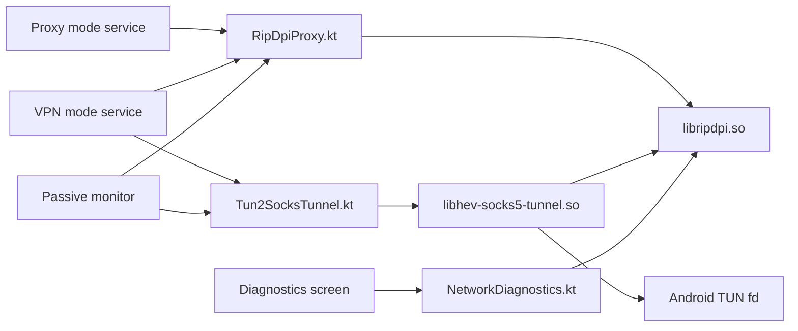

# Native Libraries

This directory documents the in-repository Rust native modules used by RIPDPI and the Android integration layer that wraps them.

## Overview

| Native module | Built artifact | Used in app | Main Kotlin bridge | Methods actually reached from app |
| --- | --- | --- | --- | --- |
| `native/rust/crates/ripdpi-android` | `libripdpi.so` | Proxy mode, VPN mode, diagnostics | `core/engine/src/main/java/com/poyka/ripdpi/core/RipDpiProxy.kt`, `core/engine/src/main/java/com/poyka/ripdpi/core/NetworkDiagnostics.kt` | `ciadpi_config::parse_cli`, `ciadpi_config::parse_hosts_spec`, `runtime::create_listener`, `runtime::run_proxy_with_embedded_control`, `EmbeddedProxyControl::request_shutdown`, `platform::detect_default_ttl`, `MonitorSession::*`, proxy telemetry polling |
| `native/rust/crates/hs5t-android` | `libhev-socks5-tunnel.so` | VPN mode only | `core/engine/src/main/java/com/poyka/ripdpi/core/Tun2SocksTunnel.kt` | `hs5t_core::run_tunnel`, `CancellationToken::cancel`, `Stats::snapshot`, tunnel telemetry polling |
| `native/rust/crates/ripdpi-monitor` | linked into `libripdpi.so` | Diagnostics scans | `core/engine/src/main/java/com/poyka/ripdpi/core/NetworkDiagnostics.kt` | DNS integrity probes across UDP and encrypted resolvers, TLS/HTTP reachability probes, TCP fat-header probes, whitelist-SNI retries, diagnostics session state |
| `native/rust/crates/ripdpi-dns-resolver` | linked into existing native libraries | Diagnostics scans, VPN-mode encrypted DNS | none directly | `EncryptedDnsResolver::*` through `ripdpi-monitor` and `hs5t-core` for DoH/DoT/DNSCrypt exchange, metadata collection, and IP answer extraction |

## Shared Strategy Bridge

The Android UI mode, diagnostics recommendation flow, and native monitor candidate overlays now share one config-translation path through `native/rust/crates/ripdpi-proxy-config`.

That crate is not built as a standalone `.so`, but it is a first-class part of the native surface because it keeps:

- UI-configured strategy JSON
- diagnostics recommendation drafts
- automatic-probing candidate overlays
- vendored CLI-compatible runtime config

aligned around the same `RuntimeConfig` shape.

The same bridge also carries the runtime context used by the service layer:

- `networkScopeKey` for per-network host-autolearn segmentation
- exact `proxyConfigJson` replay for validated remembered policies
- VPN-only DNS override replay when a remembered VPN policy is applied

## Runtime Topology

## Diagnostics and Telemetry

Diagnostics in the Android app are split across three native paths:

- `ripdpi-monitor` performs active scans and produces structured scan reports and scan-time passive events
- `ripdpi-runtime` emits passive proxy runtime telemetry for the long-running local SOCKS5 proxy
- `hs5t-android` exposes tunnel runtime telemetry for the long-running TUN-to-SOCKS bridge

The service layer polls those native snapshots once per second while the service is running and stores only metadata:
- listener and tunnel lifecycle changes
- active and total session counters
- route selection and route advances between desync groups
- retry pacing counts, last retry reason/backoff, and candidate diversification counts
- host-autolearn enabled state plus learned/penalized host counters
- packet and byte counters
- resolver id, protocol, endpoint, query latency, and failure counters
- resolver fallback state and reason
- network handover classification
- last native error plus a bounded event ring

No packet payloads or packet captures are persisted.

## Connection Policy and Network Memory

Service startup and live restarts now resolve connection policy through one Kotlin path in `ConnectionPolicyResolver`.

- `NetworkFingerprintProvider` captures a privacy-preserving network fingerprint from transport, validation state, private DNS mode, DNS servers, and either Wi-Fi or cellular identity tuples.
- Only the SHA-256 `fingerprintHash` plus a non-sensitive summary are persisted; raw SSID/BSSID/operator strings are not stored in diagnostics history.
- `remembered_network_policies` stores exact normalized `proxyConfigJson`, optional VPN DNS override, and separate TCP/QUIC/DNS strategy families for validated per-network winners.
- Host autolearn is segmented by `networkScopeKey` in `host-autolearn-v2.json`, so one network does not poison another network's preferred groups.
- Actionable handovers from `NetworkHandoverMonitor` trigger full proxy or proxy+tunnel restarts under the service mutex, then publish a success event used by diagnostics to schedule a hidden `quick_v1` probe for first-seen networks.

## Current Proxy Strategy Surface

The in-repo Rust stack currently exposes:

- semantic marker offsets such as `host`, `endhost`, `midsld`, `method`, `extlen`, and `sniext`
- adaptive `auto(...)` split markers backed by `TCP_INFO` hints (`snd_mss`, `advmss`, `pmtu`)
- ordered TCP and UDP strategy chains with per-step activation filters
- richer fake TLS mutation controls and built-in fake payload profile libraries for HTTP, TLS, UDP, and QUIC Initial traffic
- host-oriented fake steps such as `hostfake` plus partial `fakedsplit` / `fakeddisorder` approximations on Linux/Android
- host autolearn segmented per network scope, remembered policy replay, and automatic diagnostics probing with manual recommendations
- separate TCP, QUIC, and DNS strategy-family labels used by diagnostics, telemetry, and remembered-policy ranking
- adaptive tuning beyond fake TTL, including split placement, TLS record sizing, UDP burst behavior, and QUIC fake-profile selection
- retry-stealth pacing with jitter and cooldown-aware candidate diversification for both the live runtime and the diagnostics probe runner

See [byedpi.md](byedpi.md) for the proxy-specific details.

## Build Integration

- `core/engine/build.gradle.kts` applies `ripdpi.android.rust-native`, which registers `:core:engine:buildRustNativeLibs`.
- `build-logic/convention/src/main/kotlin/ripdpi.android.rust-native.gradle.kts` cross-compiles the `native/rust` workspace with Cargo plus the Android NDK linker toolchain.
- `native/rust/.cargo/config.toml` holds the 16 KiB page-size linker flags per Android target.
- The Android build targets these ABIs: `armeabi-v7a`, `arm64-v8a`, `x86`, `x86_64`.
- Local non-release builds default to `ripdpi.localNativeAbisDefault=arm64-v8a`.
- `ripdpi.localNativeAbis=x86_64` is the fast path for emulator-oriented local builds.
- `ripdpi.localNativeAbis` can still override the ABI set explicitly for local debug builds.

## Test Coverage

Native integration is covered at several layers:

- Rust crate tests for config parsing, lifecycle, state machines, fault injection, retry-stealth behavior, and telemetry/logging goldens
- JVM tests for Kotlin wrappers, diagnostics orchestration, service state aggregation, handover-aware policy resolution, and structured golden contracts
- Android instrumentation tests for JNI/service integration and local-network E2E against the real packaged `.so` files
- Linux-only privileged tests for real TUN E2E and TUN soak
- nightly/manual soak suites for proxy runtime, diagnostics runtime, and TUN runtime longevity

Testing commands and CI mapping are documented in [../testing.md](../testing.md).

## Golden Contracts

Structured telemetry and diagnostics-event payloads are treated as compatibility contracts.

- Rust goldens live under each crate `tests/golden/` directory.
- JVM goldens live under each module `src/test/resources/golden/` directory.
- The default test mode is read-only and fails on unexpected payload changes.
- Set `RIPDPI_BLESS_GOLDENS=1` to rewrite fixtures intentionally.
- Use `scripts/tests/bless-telemetry-goldens.sh` to refresh the Rust and JVM telemetry/logging goldens together and then sync the Android instrumentation assets.
- Volatile fields are scrubbed before comparison: timestamps, generated ids, dynamic archive file names, and ephemeral loopback ports. Semantic fields such as `state`, `health`, counters, retry pacing/diversification metadata, handover classification, event order, levels, and messages remain strict.

## Direct Native Modules

- `native/rust/crates/ripdpi-android`
- `native/rust/crates/hs5t-android`
- `native/rust/crates/ripdpi-monitor`
- `native/rust/crates/ripdpi-dns-resolver`
- `native/rust/crates/ripdpi-proxy-config`
- `native/rust/crates/ripdpi-runtime`
- `native/rust/crates/android-support`

## Native Test Support Crates

- `native/rust/crates/golden-test-support`
- `native/rust/crates/local-network-fixture`
- `native/rust/crates/native-soak-support`

## Runtime ELF Dependencies

- `libripdpi.so` links against `libc.so`, `libdl.so`, and `liblog.so`.
- `libhev-socks5-tunnel.so` links against `libc.so`, `libdl.so`, `liblog.so`, and `libm.so`.

## Documents

- [byedpi usage](byedpi.md)
- [hev-socks5-tunnel usage](hev-socks5-tunnel.md)
- [testing coverage](../testing.md)
