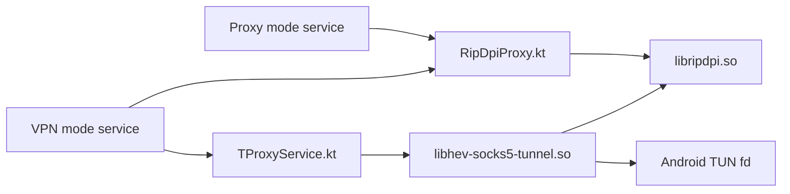

# Native Libraries

This directory documents the native code integrated into RIPDPI, how it is built, and which dependency methods the app actually calls.

## Overview

| Dependency | Built artifact | Used in app | Main Kotlin bridge | Methods actually reached from app |
| --- | --- | --- | --- | --- |
| `byedpi` | `libripdpi.so` | Proxy mode and VPN mode | `core/engine/src/main/java/com/poyka/ripdpi/core/RipDpiProxy.kt` | `listen_socket`, `event_loop`, `get_addr`, `get_default_ttl`, `add`, `data_from_str`, `parse_hosts`, `change_tls_sni`, `mem_pool`, `clear_params`; command-line mode also reaches `ftob` and `parse_offset` |
| `hev-socks5-tunnel` | `libhev-socks5-tunnel.so` | VPN mode only | `core/engine/src/main/java/com/poyka/ripdpi/core/TProxyService.kt` | `hev_socks5_tunnel_main`, `hev_socks5_tunnel_quit`; `hev_socks5_tunnel_stats` is exposed but currently unused |

## Runtime Topology

## Build Integration

- `core/engine/build.gradle.kts` builds all native code in the `core:engine` module.
- `src/main/cpp/CMakeLists.txt` builds `libripdpi.so` from bundled `byedpi` sources plus JNI wrapper files.
- `runNdkBuild` runs `ndk-build` with `src/main/jni/Android.mk` and writes `libhev-socks5-tunnel.so` into `src/main/jniLibs`.
- The Android build targets these ABIs: `armeabi-v7a`, `arm64-v8a`, `x86`, `x86_64`.

## Direct and Transitive Native Pieces

- Direct native dependencies:
  - `byedpi`
  - `hev-socks5-tunnel`
- Transitive native pieces inside `hev-socks5-tunnel`:
  - `yaml`
  - `lwip`
  - `hev-task-system`
- Vendored but not used by the Android build:
  - `wintun`

## Documents

- [byedpi usage](byedpi.md)
- [hev-socks5-tunnel usage](hev-socks5-tunnel.md)
