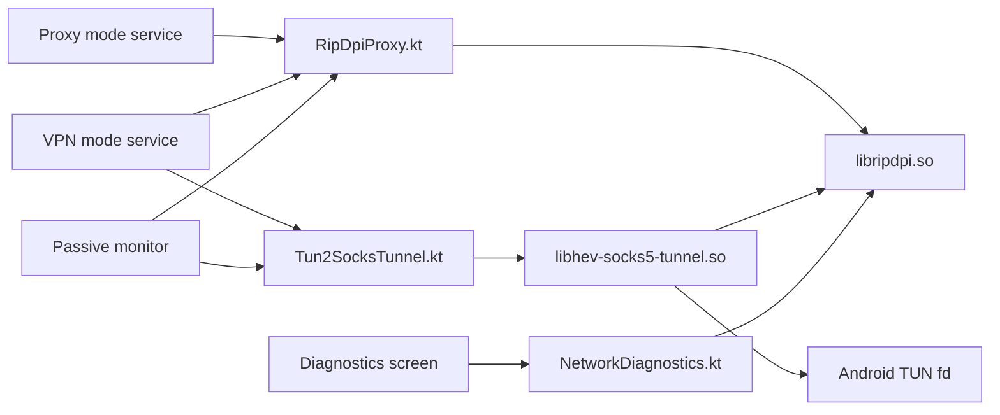

# Native Libraries

This directory documents the in-repository Rust native modules used by RIPDPI and the Android integration layer that wraps them.

## Overview

| Native module | Built artifact | Used in app | Main Kotlin bridge | Methods actually reached from app |
| --- | --- | --- | --- | --- |
| `native/rust/crates/ripdpi-android` | `libripdpi.so` | Proxy mode, VPN mode, diagnostics | `core/engine/src/main/java/com/poyka/ripdpi/core/RipDpiProxy.kt`, `core/engine/src/main/java/com/poyka/ripdpi/core/NetworkDiagnostics.kt` | `ciadpi_config::parse_cli`, `ciadpi_config::parse_hosts_spec`, `runtime::create_listener`, `runtime::run_proxy_with_listener`, `process::prepare_embedded`, `process::request_shutdown`, `platform::detect_default_ttl`, `MonitorSession::*`, proxy telemetry polling |
| `native/rust/crates/hs5t-android` | `libhev-socks5-tunnel.so` | VPN mode only | `core/engine/src/main/java/com/poyka/ripdpi/core/Tun2SocksTunnel.kt` | `hs5t_core::run_tunnel`, `CancellationToken::cancel`, `Stats::snapshot`, tunnel telemetry polling |
| `native/rust/crates/ripdpi-monitor` | linked into `libripdpi.so` | Diagnostics scans | `core/engine/src/main/java/com/poyka/ripdpi/core/NetworkDiagnostics.kt` | DNS integrity probes, DoH comparison, TLS/HTTP reachability probes, TCP fat-header probes, whitelist-SNI retries, diagnostics session state |

## Runtime Topology

## Diagnostics and Telemetry

Diagnostics in the Android app are split across three native paths:

- `ripdpi-monitor` performs active scans and produces structured scan reports and scan-time passive events
- `ripdpi-runtime` emits passive proxy runtime telemetry for the long-running local SOCKS5 proxy
- `hs5t-android` exposes tunnel runtime telemetry for the long-running TUN-to-SOCKS bridge

The service layer polls those native snapshots once per second while the service is running and stores only metadata:
- listener and tunnel lifecycle changes
- active and total session counters
- route selection and route advances between desync groups
- packet and byte counters
- last native error plus a bounded event ring

No packet payloads or packet captures are persisted.

## Build Integration

- `core/engine/build.gradle.kts` applies `ripdpi.android.rust-native`, which registers `:core:engine:buildRustNativeLibs`.
- `build-logic/convention/src/main/kotlin/ripdpi.android.rust-native.gradle.kts` cross-compiles the `native/rust` workspace with Cargo plus the Android NDK linker toolchain.
- `native/rust/.cargo/config.toml` holds the 16 KiB page-size linker flags per Android target.
- The Android build targets these ABIs: `armeabi-v7a`, `arm64-v8a`, `x86`, `x86_64`.
- `ripdpi.localNativeAbis` can narrow the ABI set for local debug builds only.

## Test Coverage

Native integration is covered at several layers:

- Rust crate tests for config parsing, lifecycle, state machines, fault injection, and telemetry/logging goldens
- JVM tests for Kotlin wrappers, diagnostics orchestration, service state aggregation, and structured golden contracts
- Android instrumentation tests for JNI/service integration and local-network E2E against the real packaged `.so` files
- Linux-only privileged tests for real TUN E2E and TUN soak
- nightly/manual soak suites for proxy runtime, diagnostics runtime, and TUN runtime longevity

Testing commands and CI mapping are documented in [../testing.md](../testing.md).

## Golden Contracts

Structured telemetry and diagnostics-event payloads are treated as compatibility contracts.

- Rust goldens live under each crate `tests/golden/` directory.
- JVM goldens live under each module `src/test/resources/golden/` directory.
- The default test mode is read-only and fails on unexpected payload changes.
- Set `RIPDPI_BLESS_GOLDENS=1` to rewrite fixtures intentionally.
- Use `scripts/tests/bless-telemetry-goldens.sh` to refresh the Rust and JVM telemetry/logging goldens together and then sync the Android instrumentation assets.
- Volatile fields are scrubbed before comparison: timestamps, generated ids, dynamic archive file names, and ephemeral loopback ports. Semantic fields such as `state`, `health`, counters, event order, levels, and messages remain strict.

## Direct Native Modules

- `native/rust/crates/ripdpi-android`
- `native/rust/crates/hs5t-android`
- `native/rust/crates/ripdpi-monitor`
- `native/rust/crates/ripdpi-runtime`
- `native/rust/crates/android-support`

## Native Test Support Crates

- `native/rust/crates/golden-test-support`
- `native/rust/crates/local-network-fixture`
- `native/rust/crates/native-soak-support`

## Runtime ELF Dependencies

- `libripdpi.so` links against `libc.so`, `libdl.so`, and `liblog.so`.
- `libhev-socks5-tunnel.so` links against `libc.so`, `libdl.so`, `liblog.so`, and `libm.so`.

## Documents

- [byedpi usage](byedpi.md)
- [hev-socks5-tunnel usage](hev-socks5-tunnel.md)
- [testing coverage](../testing.md)
