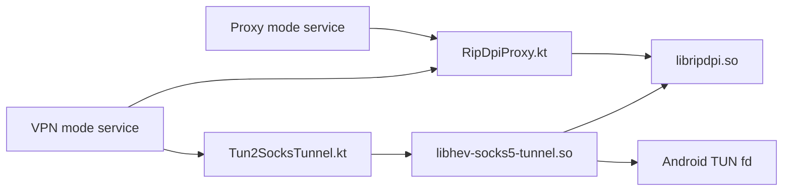

# Native Libraries

This directory documents the in-repository Rust native modules used by RIPDPI and the Android integration layer that wraps them.

## Overview

| Native module | Built artifact | Used in app | Main Kotlin bridge | Methods actually reached from app |
| --- | --- | --- | --- | --- |
| `native/rust/crates/ripdpi-android` | `libripdpi.so` | Proxy mode and VPN mode | `core/engine/src/main/java/com/poyka/ripdpi/core/RipDpiProxy.kt` | `ciadpi_config::parse_cli`, `ciadpi_config::parse_hosts_spec`, `runtime::create_listener`, `runtime::run_proxy_with_listener`, `process::prepare_embedded`, `process::request_shutdown`, `platform::detect_default_ttl` |
| `native/rust/crates/hs5t-android` | `libhev-socks5-tunnel.so` | VPN mode only | `core/engine/src/main/java/com/poyka/ripdpi/core/Tun2SocksTunnel.kt` | `hs5t_core::run_tunnel`, `CancellationToken::cancel`, `Stats::snapshot` |

## Runtime Topology

## Build Integration

- `core/engine/build.gradle.kts` applies `ripdpi.android.rust-native`, which registers `:core:engine:buildRustNativeLibs`.
- `build-logic/convention/src/main/kotlin/ripdpi.android.rust-native.gradle.kts` cross-compiles the `native/rust` workspace with Cargo plus the Android NDK linker toolchain.
- `native/rust/.cargo/config.toml` holds the 16 KiB page-size linker flags per Android target.
- The Android build targets these ABIs: `armeabi-v7a`, `arm64-v8a`, `x86`, `x86_64`.
- `ripdpi.localNativeAbis` can narrow the ABI set for local debug builds only.

## Direct Native Modules

- `native/rust/crates/ripdpi-android`
- `native/rust/crates/hs5t-android`
- `native/rust/crates/ripdpi-runtime`
- `native/rust/crates/android-support`

## Runtime ELF Dependencies

- `libripdpi.so` links against `libc.so`, `libdl.so`, and `liblog.so`.
- `libhev-socks5-tunnel.so` links against `libc.so`, `libdl.so`, `liblog.so`, and `libm.so`.

## Documents

- [byedpi usage](byedpi.md)
- [hev-socks5-tunnel usage](hev-socks5-tunnel.md)
