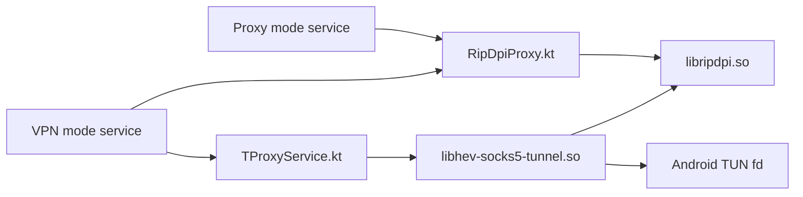

# Native Libraries

This directory documents the in-repository Rust native modules used by RIPDPI.

## Overview

| Native module | Built artifact | Used in app | Main Kotlin bridge | Methods actually reached from app |
| --- | --- | --- | --- | --- |
| `native/rust/third_party/byedpi/crates/ciadpi-jni` | `libripdpi.so` | Proxy mode and VPN mode | `core/engine/src/main/java/com/poyka/ripdpi/core/RipDpiProxy.kt` | `ciadpi_config::parse_cli`, `ciadpi_config::parse_hosts_spec`, `runtime::create_listener`, `runtime::run_proxy_with_listener`, `process::prepare_embedded`, `process::request_shutdown`, `platform::detect_default_ttl` |
| `native/rust/third_party/hev-socks5-tunnel/crates/hs5t-jni` | `libhev-socks5-tunnel.so` | VPN mode only | `core/engine/src/main/java/com/poyka/ripdpi/core/TProxyService.kt` | `hs5t_config::Config::from_file`, `hs5t_core::run_tunnel`, `CancellationToken::cancel`, `Stats::snapshot` |

## Runtime Topology

## Build Integration

- `core/engine/build.gradle.kts` builds all native code in the `core:engine` module.
- `scripts/native/build-rust-android.sh` cross-compiles the Rust native modules with Cargo plus the Android NDK linker toolchain.
- The Android build targets these ABIs: `armeabi-v7a`, `arm64-v8a`, `x86`, `x86_64`.
- The repo no longer depends on `CMake`, `ndk-build`, or Git submodules for native code.

## Direct Native Modules

- `native/rust/third_party/byedpi`
- `native/rust/third_party/hev-socks5-tunnel`

## Runtime ELF Dependencies

- `libripdpi.so` links against `libc.so` and `libdl.so`.
- `libhev-socks5-tunnel.so` links against `libc.so`, `libdl.so`, and `libm.so`.

## Removed From Android Build

- Vendored C sources under `core/engine/src/main/cpp`
- `ndk-build` integration under `core/engine/src/main/jni`
- The `hev-socks5-tunnel` Git submodule
- Legacy transitive C deps such as `yaml`, `lwip`, `hev-task-system`, and `wintun`

## Documents

- [byedpi usage](byedpi.md)
- [hev-socks5-tunnel usage](hev-socks5-tunnel.md)
