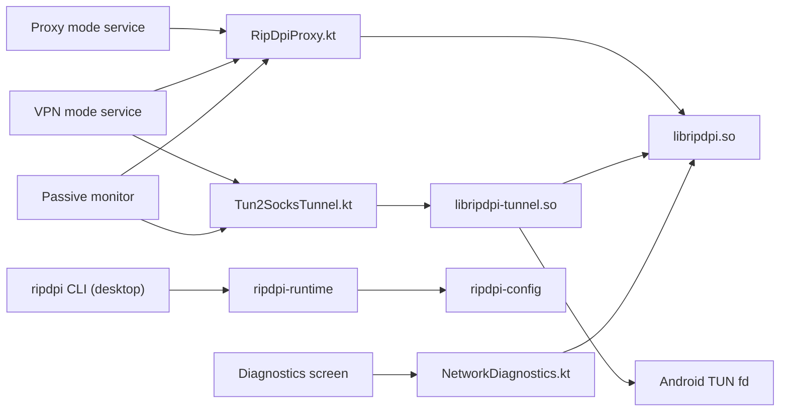
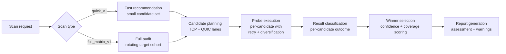
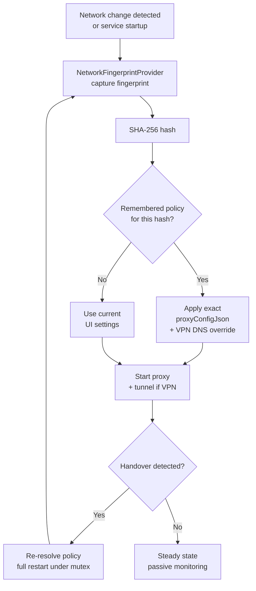
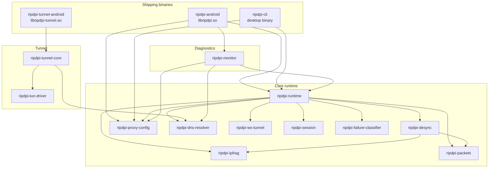

# Native Libraries

This directory documents the in-repository Rust native modules used by RIPDPI and the Android integration layer that wraps them.

## Overview

| Native module | Built artifact | Used in app | Main Kotlin bridge | Methods actually reached from app |
| --- | --- | --- | --- | --- |
| `native/rust/crates/ripdpi-cli` | `ripdpi` binary | Desktop development (macOS/Linux) | N/A -- standalone CLI | `ripdpi_config::parse_cli`, `runtime::run_proxy`, `ProcessGuard::prepare`, `install_runtime_telemetry` |
| `native/rust/crates/ripdpi-android` | `libripdpi.so` | Proxy mode, VPN mode, diagnostics | `core/engine/src/main/kotlin/com/poyka/ripdpi/core/RipDpiProxy.kt`, `core/engine/src/main/kotlin/com/poyka/ripdpi/core/NetworkDiagnostics.kt` | `ripdpi_config::parse_cli`, `ripdpi_config::parse_hosts_spec`, `runtime::create_listener`, `runtime::run_proxy_with_embedded_control`, `EmbeddedProxyControl::request_shutdown`, `platform::detect_default_ttl`, `MonitorSession::*`, proxy telemetry polling |
| `native/rust/crates/ripdpi-tunnel-android` | `libripdpi-tunnel.so` | VPN mode only | `core/engine/src/main/kotlin/com/poyka/ripdpi/core/Tun2SocksTunnel.kt` | `ripdpi_tunnel_core::run_tunnel`, `CancellationToken::cancel`, `Stats::snapshot`, tunnel telemetry polling |
| `native/rust/crates/ripdpi-monitor` | linked into `libripdpi.so` | Diagnostics scans | `core/engine/src/main/kotlin/com/poyka/ripdpi/core/NetworkDiagnostics.kt` | DNS integrity probes across UDP and encrypted resolvers, TLS/HTTP reachability probes, TCP fat-header probes, whitelist-SNI retries, strategy-probe progress/report state |
| `native/rust/crates/ripdpi-dns-resolver` | linked into existing native libraries | Diagnostics scans, VPN-mode encrypted DNS | none directly | `EncryptedDnsResolver::*` through `ripdpi-monitor` and `ripdpi-tunnel-core` for DoH/DoT/DNSCrypt/DoQ exchange, metadata collection, and IP answer extraction |

## Shared Strategy Bridge

The Android UI mode, diagnostics recommendation flow, and native monitor candidate overlays now share one config-translation path through `native/rust/crates/ripdpi-proxy-config`.

That crate is not built as a standalone `.so`, but it is a first-class part of the native surface because it keeps:

- UI-configured strategy JSON
- diagnostics recommendation drafts
- automatic-probing candidate overlays
- automatic-audit target cohort selections and report provenance
- CLI-compatible runtime config

aligned around the same `RuntimeConfig` shape.

The same bridge also carries the runtime context used by the service layer:

- `networkScopeKey` for per-network host-autolearn segmentation
- exact `proxyConfigJson` replay for validated remembered policies
- VPN-only DNS override replay when a remembered VPN policy is applied

## Runtime Topology

## Diagnostics and Telemetry

Diagnostics in the Android app are split across three native paths:

- `ripdpi-monitor` performs active scans and produces structured scan reports and scan-time passive events
- `ripdpi-runtime` emits passive proxy runtime telemetry for the long-running local SOCKS5 proxy
- `ripdpi-tunnel-android` exposes tunnel runtime telemetry for the long-running TUN-to-SOCKS bridge

The service layer polls those native snapshots once per second while the service is running and stores only metadata:
- listener and tunnel lifecycle changes
- active and total session counters
- route selection and route advances between desync groups
- retry pacing counts, last retry reason/backoff, and candidate diversification counts
- host-autolearn enabled state plus learned/penalized host counters
- packet and byte counters
- resolver id, protocol, endpoint, query latency, and failure counters
- resolver fallback state and reason
- network handover classification
- last native error plus a bounded event ring

No packet payloads or packet captures are persisted.

For strategy-probe runs, the native diagnostics path also exposes richer structured state:

- `ScanProgress.strategyProbeProgress` carries the active TCP/QUIC lane, candidate index/total, candidate id, and candidate label while a candidate is running
- `StrategyProbeReport.auditAssessment` carries confidence, matrix coverage, winner coverage, rationale, and warnings for `full_matrix_v1`
- `StrategyProbeReport.targetSelection` records which rotating audit cohort was selected, plus the concrete domain and QUIC hosts that were probed

## Connection Policy and Network Memory

Service startup and live restarts now resolve connection policy through one Kotlin path in `ConnectionPolicyResolver`.

- `NetworkFingerprintProvider` captures a privacy-preserving network fingerprint from transport, validation state, private DNS mode, DNS servers, and either Wi-Fi or cellular identity tuples.
- Only the SHA-256 `fingerprintHash` plus a non-sensitive summary are persisted; raw SSID/BSSID/operator strings are not stored in diagnostics history.
- `remembered_network_policies` stores exact normalized `proxyConfigJson`, optional VPN DNS override, and separate TCP/QUIC/DNS strategy families for validated per-network winners.
- Host autolearn is segmented by `networkScopeKey` in `host-autolearn-v2.json`, so one network does not poison another network's preferred groups.
- Actionable handovers from `NetworkHandoverMonitor` trigger full proxy or proxy+tunnel restarts under the service mutex, then publish a success event used by diagnostics to schedule a hidden `quick_v1` probe for first-seen networks.

## Current Proxy Strategy Surface

The in-repo Rust stack currently exposes:

- 13 TCP chain step kinds: `split`, `seqovl`, `disorder`, `multidisorder`, `fake`, `fakesplit`, `fakedisorder`, `hostfake`, `oob`, `disoob`, `tlsrec`, `tlsrandrec`, `ipfrag2`
- semantic marker offsets: `host`, `endhost`, `midsld`, `endsld`, `method`, `extlen`, `sniext`, `echext` (ECH extension, 0xFE0D), `payloadend`, `payloadmid`, `payloadrand`, `hostrand`
- adaptive `auto(...)` split markers backed by `TCP_INFO` hints (`snd_mss`, `advmss`, `pmtu`)
- ordered TCP and UDP strategy chains with per-step activation filters
- `seqovl` -- TCP sequence overlap with fake prefix via TCP_REPAIR and raw socket injection (configurable `overlap_size` 1-32 and `fake_mode`)
- `multidisorder` with configurable `inter_segment_delay_ms` (0-100ms) to prevent router burst-reordering
- `ipfrag2` -- IP-level packet fragmentation (DF cleared, MF set, 8-byte aligned) for both TCP and UDP/QUIC, with IPv4 and IPv6 Fragment Extension Header support
- `echext` marker for ECH fragmentation -- graceful no-op when ECH extension absent
- `md5sig` -- TCP MD5 Signature option (Kind=19) injection in both socket-level fake sends and per-packet raw packet construction
- MTProto WebSocket tunnel (`ripdpi-ws-tunnel`) for Telegram traffic through official `kws{dc}.web.telegram.org` gateways with Always/Fallback modes, obfuscated2 validation, and DC normalization
- richer fake TLS mutation controls and built-in fake payload profile libraries for HTTP, TLS, UDP, and QUIC Initial traffic
- host-oriented fake steps such as `hostfake` plus partial `fakedsplit` / `fakeddisorder` approximations on Linux/Android
- automatic block signal detection (8 signal types: HttpBlockpage, HttpRedirect, TlsAlert, SilentDrop, TcpReset, ConnectionFreeze, QuicBreakage, TcpRetransmissions) with 2-confirmation state machine and per-network persistence
- host autolearn segmented per network scope, remembered policy replay, and automatic diagnostics probing/audit with rotating cohorts, confidence scoring, and manual recommendations
- separate TCP, QUIC, and DNS strategy-family labels used by diagnostics, telemetry, and remembered-policy ranking
- adaptive tuning beyond fake TTL, including split placement, TLS record sizing, UDP burst behavior, and QUIC fake-profile selection
- Geneva-style strategy evolution with epsilon-greedy + UCB1 combo exploration across adaptive dimensions
- TCP window clamping (`TCP_WINDOW_CLAMP`) to force small server segments that DPI cannot reassemble
- QUIC-level DPI evasion: SNI splitting across CRYPTO frames, source port manipulation, dummy UDP prepend, version negotiation trick, and post-handshake connection migration
- DNS-over-QUIC (DoQ, RFC 9250) support alongside DoH, DoT, and DNSCrypt
- 10-second TCP connect timeout to prevent thread exhaustion on unreachable upstream hosts
- retry-stealth pacing with family cooldowns, exponential backoff (300-3000ms), 35% jitter, and cooldown-aware candidate diversification
- entropy padding (popcount/Shannon/combined modes) to counter GFW and TSPU entropy-based detection
- auto TTL with adaptive delta, min/max bounds, derived from server SYN-ACK TTL
- connection freeze detection (`freeze_window_ms`, `freeze_min_bytes`, `freeze_max_stalls`)
- TCP option manipulation: `drop_sack`, `strip_timestamps`, `oob_data` (urgent byte), `tlsminor` (TLS version override), `mod_http` (HTTP header bitflags)
- QUIC fake profiles (`compat_default`, `realistic_initial`), fake host, fake version, low port binding, post-handshake migration
- per-step activation filters on round, payload size, and stream byte ranges
- proxy protocol support: SOCKS5, SOCKS4/4a, HTTP CONNECT, Shadowsocks
- external SOCKS upstream chaining (`ext_socks`)
- delayed upstream connection (`delay_conn`), TCP Fast Open (`tfo`), bounded retries (`max_route_retries`)
- blockpage fingerprint database with ISP/government pattern matching and provider identification
- VPN tunnel DNS interception with real-to-synthetic IP mapping, LRU cache, and encrypted DNS forwarding
- adaptive profiles: UDP burst (balanced/conservative/aggressive), TLS random record (balanced/tight/wide)
- cache prefix scoping and optional file-backed policy cache persistence

`multidisorder` is DSL/manual-chain only in v1. Express it as a contiguous terminal run such as `tlsrec extlen`, `multidisorder sniext`, `multidisorder host`. It relies on raw IPv4/IPv6 sockets plus TCP repair, similar to `ipfrag2`.

See [proxy-engine.md](proxy-engine.md) for the proxy-specific details.

## Build Integration

- `core/engine/build.gradle.kts` applies `ripdpi.android.rust-native`, which registers `:core:engine:buildRustNativeLibs`.
- `build-logic/convention/src/main/kotlin/ripdpi.android.rust-native.gradle.kts` cross-compiles the `native/rust` workspace with Cargo plus the Android NDK linker toolchain.
- `native/rust/.cargo/config.toml` holds the 16 KiB page-size linker flags per Android target.
- The Android build targets these ABIs: `armeabi-v7a`, `arm64-v8a`, `x86`, `x86_64`.
- Local non-release builds default to `ripdpi.localNativeAbisDefault=arm64-v8a`.
- `ripdpi.localNativeAbis=x86_64` is the fast path for emulator-oriented local builds.
- `ripdpi.localNativeAbis` can still override the ABI set explicitly for local debug builds.

## Test Coverage

Native integration is covered at several layers:

- Rust crate tests for config parsing, lifecycle, state machines, fault injection, retry-stealth behavior, and telemetry/logging goldens
- JVM tests for Kotlin wrappers, diagnostics orchestration, service state aggregation, handover-aware policy resolution, and structured golden contracts
- Android instrumentation tests for JNI/service integration and local-network E2E against the real packaged `.so` files
- Linux-only privileged tests for real TUN E2E and TUN soak
- nightly/manual soak suites for proxy runtime, diagnostics runtime, and TUN runtime longevity

Testing commands and CI mapping are documented in [../testing.md](../testing.md).

## Golden Contracts

Structured telemetry, diagnostics-event payloads, and strategy-probe progress/report payloads are treated as compatibility contracts.

- Rust goldens live under each crate `tests/golden/` directory.
- JVM goldens live under each module `src/test/resources/golden/` directory.
- The default test mode is read-only and fails on unexpected payload changes.
- Set `RIPDPI_BLESS_GOLDENS=1` to rewrite fixtures intentionally.
- Use `scripts/tests/bless-telemetry-goldens.sh` to refresh the Rust and JVM telemetry/logging goldens together and then sync the Android instrumentation assets.
- Volatile fields are scrubbed before comparison: timestamps, generated ids, dynamic archive file names, and ephemeral loopback ports. Semantic fields such as `state`, `health`, counters, retry pacing/diversification metadata, handover classification, event order, levels, and messages remain strict.

## Direct Native Modules

- `native/rust/crates/ripdpi-cli` (desktop CLI binary -- macOS/Linux)
- `native/rust/crates/ripdpi-android`
- `native/rust/crates/ripdpi-tunnel-android`
- `native/rust/crates/ripdpi-monitor`
- `native/rust/crates/ripdpi-dns-resolver`
- `native/rust/crates/ripdpi-proxy-config`
- `native/rust/crates/ripdpi-runtime`
- `native/rust/crates/ripdpi-ws-tunnel` -- MTProto WebSocket tunnel for Telegram traffic through official web gateways
- `native/rust/crates/ripdpi-ipfrag` -- IP-level packet fragmentation for DPI bypass (TCP and UDP/QUIC)
- `native/rust/crates/ripdpi-desync` -- DPI evasion packet crafting and strategy planning
- `native/rust/crates/ripdpi-failure-classifier` -- connection failure classification and block signal detection
- `native/rust/crates/ripdpi-session` -- session state machine and policy store
- `native/rust/crates/ripdpi-packets` -- packet parsing utilities (TLS, HTTP, QUIC markers)
- `native/rust/crates/ripdpi-tun-driver` -- raw TUN socket handling
- `native/rust/crates/android-support`

### Crate dependency graph

## Native Test Support Crates

- `native/rust/crates/golden-test-support`
- `native/rust/crates/local-network-fixture`
- `native/rust/crates/native-soak-support`

## Runtime ELF Dependencies

- `libripdpi.so` links against `libc.so`, `libdl.so`, and `liblog.so`.
- `libripdpi-tunnel.so` links against `libc.so`, `libdl.so`, `liblog.so`, and `libm.so`.

## Documents

- [Proxy engine](proxy-engine.md)
- [TUN-to-SOCKS tunnel](tunnel.md)
- [Debug a runtime issue](debug-runtime-issue.md)
- [testing coverage](../testing.md)
