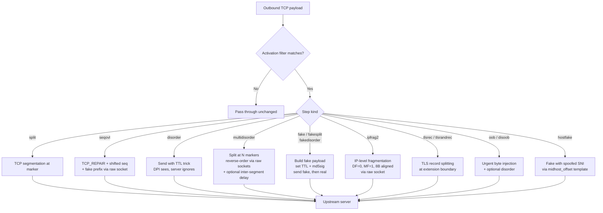
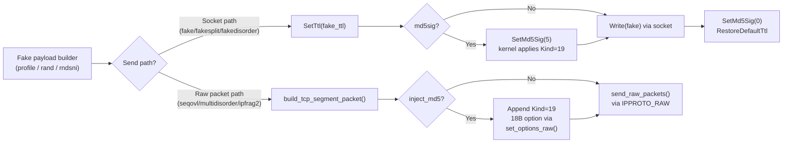
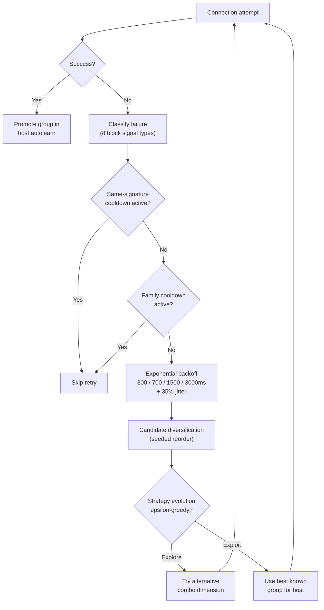
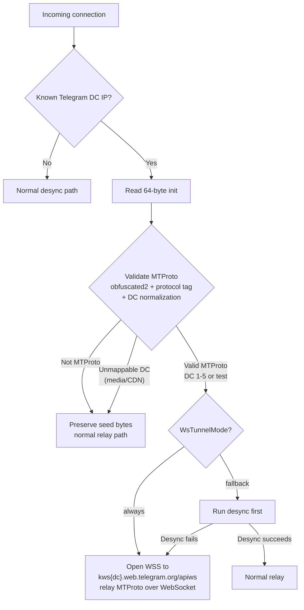
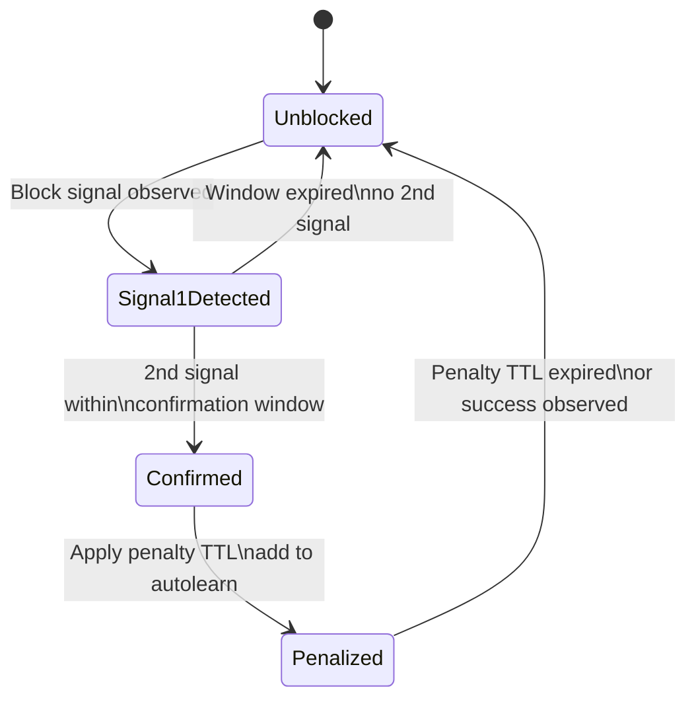

# Proxy Engine

## Role in RIPDPI

The local SOCKS5 proxy is implemented by the in-repo Rust native module.

- Proxy mode: the app exposes the local SOCKS5 proxy directly.
- VPN mode: the app starts the same local SOCKS5 proxy first, then routes TUN traffic through the TUN-to-SOCKS tunnel.

The built shared library is `libripdpi.so`.

## Diagnostics and Telemetry Role

The same shared library now also carries two additional responsibilities:

- Active diagnostics scans through the linked `ripdpi-monitor` crate
- Passive proxy runtime telemetry for the long-running SOCKS5 listener

The diagnostics path also links the shared `ripdpi-dns-resolver` crate, so encrypted DNS probing and resolver recommendation logic stay in native code rather than Kotlin.

That means `libripdpi.so` is no longer only the proxy engine. It is also the diagnostics entry point used by the Diagnostics screen.

## Owned-Stack Boundary

Not every RIPDPI-managed request now goes through the local SOCKS5 proxy.

- App-originated traffic from the RIPDPI Browser and the repo-local `SecureHttpClient` uses `OwnedStackBrowserService` in `:core:service`.
- On Android 17 / API 37, that path prefers platform `HttpEngine` only for authorities with fresh `ECH_CAPABLE` DNS evidence or explicit `xml-v37` overrides, then retries H2-only before falling back to the native owned TLS path.
- This document covers the local proxy runtime used for proxy mode, VPN mode, diagnostics probes, relay transports, and localhost policy replay. The owned-stack path is adjacent to it, not a replacement for it.

## Call Chains

### Desktop CLI (macOS/Linux)

`main()` -> `ripdpi_config::parse_cli(args)` -> `ProcessGuard::prepare()` -> `runtime::run_proxy(config)`

The CLI binary (`ripdpi`) wraps the same `ripdpi-runtime` and `ripdpi-config` used by Android, with no JNI. Signal handling (SIGINT/SIGTERM/SIGHUP) uses the existing `ProcessGuard`. Telemetry is emitted via `tracing` to stderr.

```bash
cargo run -p ripdpi-cli -- -p 1080 -x 1      # info logging
RUST_LOG=debug cargo run -p ripdpi-cli       # override via env
```

Relevant sources:

- `native/rust/crates/ripdpi-cli/src/main.rs`
- `native/rust/crates/ripdpi-cli/src/telemetry.rs`

### Android Proxy mode

`RipDpiProxyService.startProxy()` -> `ConnectionPolicyResolver.resolve()` -> `RipDpiProxy.startProxy()` -> `jniCreate(configJson)` -> `jniStart(handle)` -> `runtime::create_listener()` -> `runtime::run_proxy_with_embedded_control()`

### Android VPN mode

`RipDpiVpnService.startProxy()` -> `ConnectionPolicyResolver.resolve()` -> `RipDpiProxy.startProxy()` -> `jniCreate(configJson)` -> `jniStart(handle)` -> `runtime::create_listener()` -> `runtime::run_proxy_with_embedded_control()`

### App-owned request path (owned-stack)

`OwnedStackBrowserViewModel` / `SecureHttpClient` -> `OwnedStackBrowserService.execute(...)` -> platform `HttpEngine` (Android 17 with confirmed ECH evidence) -> H2-only retry -> native owned TLS fallback

### VPN localhost hardening

VPN mode now treats the local proxy endpoint as a session-local runtime detail
instead of reusing the persisted manual proxy port.

- Proxy mode still binds the configured `proxyPort` and exposes it directly to
  the user.
- VPN mode applies runtime-only `sessionOverrides` after payload parsing:
  `listenPortOverride=0` for an ephemeral localhost bind and `authToken=<fresh
  token>` for mandatory local auth.
- The same override layer is applied to both UI-config and command-line-config
  VPN sessions. No AppSettings schema change and no new CLI flag were added.
- `ProxyRuntimeSupervisor.start()` waits for readiness, polls proxy telemetry,
  and resolves the actual `listenerAddress` into a concrete localhost endpoint
  before tun2socks starts.
- If the proxy becomes ready but never publishes a listener address, VPN
  startup fails closed instead of falling back to `1080`.
- Initial VPN start and handover restart rotate both the auth token and the
  ephemeral listener port. DNS-only tunnel rebuilds reuse the current endpoint
  because the proxy is not restarted.

Resolved endpoint shape handed from proxy startup to the TUN bridge:

```text
host=127.0.0.1
port=<telemetry-reported ephemeral port>
username=ripdpi
password=<session auth token>
```

That same token is enforced on all localhost proxy protocols already guarded by
the native `auth_token` path:

- SOCKS5 requires RFC 1929 username/password auth
- HTTP CONNECT requires valid `Proxy-Authorization`

Relevant sources:

- `core/service/src/main/kotlin/com/poyka/ripdpi/services/RipDpiProxyService.kt`
- `core/service/src/main/kotlin/com/poyka/ripdpi/services/RipDpiVpnService.kt`
- `core/engine/src/main/kotlin/com/poyka/ripdpi/core/RipDpiProxy.kt`
- `core/engine/src/main/kotlin/com/poyka/ripdpi/core/NetworkDiagnostics.kt`
- `native/rust/crates/ripdpi-android/src/lib.rs`
- `native/rust/crates/ripdpi-runtime/src/runtime.rs`
- `native/rust/crates/ripdpi-monitor/src/lib.rs`

## Methods Actually Used

| Method | Defined in | Reached from | When it is used | Purpose |
| --- | --- | --- | --- | --- |
| `ripdpi_config::parse_cli` | `native/rust/crates/ripdpi-config/src/lib.rs` | `jniCreate(configJson)` | Command-line mode only | Parses user-supplied CLI arguments into a `RuntimeConfig`. |
| `ripdpi_config::parse_hosts_spec` | `native/rust/crates/ripdpi-config/src/lib.rs` | `jniCreate(configJson)` | UI mode host list setup | Parses the app host list string into normalized host rules. |
| `runtime::create_listener` | `native/rust/crates/ripdpi-runtime/src/runtime.rs` | `jniStart(handle)` | Start only | Opens the local listening socket for the proxy runtime. |
| `runtime::run_proxy_with_embedded_control` | `native/rust/crates/ripdpi-runtime/src/runtime.rs` | `jniStart(handle)` | Always after session start | Runs the Rust proxy loop on the listener owned by the native session, with session-local shutdown state, telemetry sink, and runtime context. |
| `EmbeddedProxyControl::request_shutdown` | `native/rust/crates/ripdpi-runtime/src/lib.rs` | `jniStop(handle)` | Stop path | Signals the active embedded proxy session to exit without relying on standalone daemon/process control. |
| `platform::detect_default_ttl` | `native/rust/crates/ripdpi-runtime/src/platform/mod.rs` | `runtime::run_proxy_with_embedded_control` | When custom TTL is not supplied | Detects the system default TTL before the proxy loop starts. |
| `MonitorSession::start_scan` | `native/rust/crates/ripdpi-monitor/src/lib.rs` | `NetworkDiagnostics.jniStartScan()` | Diagnostics screen | Starts an active diagnostics session with structured phase progress, live strategy-candidate progress, and reports. |
| `MonitorSession::poll_progress_json` / `take_report_json` / `poll_passive_events_json` | `native/rust/crates/ripdpi-monitor/src/lib.rs` | `NetworkDiagnostics` JNI methods | Diagnostics screen | Returns scan progress, scan report, and scan-time native events. |

## UI Mode Compatibility

The Android bridge now uses a handle-based session contract instead of exposing raw listener fds to Kotlin.

- `jniCreate(configJson)` validates and stores a native proxy session, then returns an opaque handle.
- `jniStart(handle)` is still blocking.
- `jniStop(handle)` still uses `shutdown(listener_fd, SHUT_RDWR)` to wake the listener and then requests runtime shutdown.
- `jniDestroy(handle)` frees the native session after the blocking start call unwinds.

The wrapper also keeps the previous host-group arrangement used by the Android UI bridge:

- `HostsMode.Whitelist` inserts a host-filter-only group before the main action group.
- `HostsMode.Blacklist` puts the host filter on the main action group.

That behavior matches the old JNI C wrapper, even though the naming comes from the Android settings model.

## Current RIPDPI-native Strategy Surface

The proxy engine exposes a broad typed strategy surface.

### Config translation

Android UI mode, diagnostics recommendation drafts, and automatic-probing candidate overlays all pass through the shared `ripdpi-proxy-config` crate before the runtime starts. That keeps the Kotlin UI model, diagnostics monitor, and native runtime aligned around one config shape instead of three loosely matching serializers.

The same JSON path is also used to replay validated remembered network policies. `RipDpiProxyJsonPreferences` can apply an exact normalized `proxyConfigJson` with a fresh `networkScopeKey` and runtime context, instead of rebuilding the policy from today's UI settings.

### Circular TCP rotation

The native strategy bridge now supports optional per-connection TCP chain
rotation through `chains.tcpRotation`.

- Rotation is JSON/config driven only in this slice. There is no new AppSettings
  field or Compose surface.
- Only TCP chains rotate. The base group's fake-packet settings, QUIC config,
  parser evasions, activation filters, and route/group selection remain
  inherited.
- Rotation boundaries are per outbound round on the same socket. RIPDPI does
  not rewrite an in-flight payload mid-send.
- The relay activates rotation only after the connection has already completed
  its first successful outbound and first-response exchange. Initial connect and
  first-response failures still use the existing cross-connection route/group
  retry path.
- Failure signals come from the existing first-response classifier
  (redirect/TLS alert/reset-class style failures), connection close/reset during
  the first-response window for that round, and `TCP_INFO` retransmission
  deltas.
- When a threshold trips, the current round finishes unchanged and the next
  outbound round swaps `actions.tcp_chain` to the next candidate in the ordered
  rotation list, wrapping modulo the candidate count.

`chains.tcpRotation` shape:

```json
{
  "chains": {
    "tcpSteps": [
      { "kind": "tlsrec", "marker": "extlen" },
      { "kind": "split", "marker": "host+2" }
    ],
    "tcpRotation": {
      "fails": 3,
      "retrans": 3,
      "seq": 65536,
      "rst": 1,
      "timeSecs": 60,
      "candidates": [
        { "tcpSteps": [ /* replacement tcp chain */ ] }
      ]
    }
  }
}
```

Each candidate supplies only a replacement `tcpSteps` chain. Everything else is
inherited from the base group for that connection.

### Conditional TCP step execution

TCP chain steps now support runtime branching through the existing
`activationFilter` path rather than a separate condition AST.

- The predicates are available only on TCP step activation filters. Group
  activation windows and UDP steps reject them during Kotlin validation and
  native config conversion.
- Predicate evaluation happens per outbound TCP write during planning. If a step
  does not match, that step is skipped and later steps still run normally.
- TCP-state predicates are ANDed with the existing `when_round`,
  `when_size_*`, and `when_stream_*` filters.
- Unknown TCP state fails closed for that predicate. RIPDPI skips the step
  instead of guessing.
- `tcp_has_ech` is derived from the current outbound TLS payload's markers, not
  from persistent socket state.
- `tcp_window_lt` and `tcp_mss_lt` prefer TCP repair snapshot data and fall back
  to the existing segment hints only when a repair snapshot does not provide the
  value.

Supported TCP predicates:

- `tcp_has_ts=true|false` -- whether the negotiated TCP connection has
  timestamps
- `tcp_has_ech=true|false` -- whether the current outbound TLS payload contains
  an ECH extension
- `tcp_window_lt=<u16>` -- current advertised receive window is below the
  threshold
- `tcp_mss_lt=<u16>` -- negotiated MSS is below the threshold

Example chain DSL:

```text
fake(tcp_has_ts=true)
fake(tcp_has_ts=false,when_round=1)
tlsrec(extlen,tcp_has_ech=true)
split(host+1,tcp_window_lt=4096,tcp_mss_lt=1300)
```

Equivalent JSON fragment:

```json
{
  "chains": {
    "tcpSteps": [
      {
        "kind": "fake",
        "activationFilter": {
          "tcpHasTimestamp": true
        }
      },
      {
        "kind": "tlsrec",
        "marker": "extlen",
        "activationFilter": {
          "tcpHasEch": true
        }
      }
    ]
  }
}
```

### TCP flag manipulation

TCP chain steps now support explicit TCP flag overrides on both fake packets
and original payload packets.

- Shared fields across proto, Kotlin, JSON, and Rust config:
  - `tcp_flags_set`
  - `tcp_flags_unset`
  - `tcp_flags_orig_set`
  - `tcp_flags_orig_unset`
- Supported flag names: `fin`, `syn`, `rst`, `psh`, `ack`, `urg`, `ece`,
  `cwr`, `ae`, `r1`, `r2`, `r3`
- Import accepts decimal or hex numeric masks as well as named masks, but the
  stored representation is always normalized to lower-case pipe-separated names
  in canonical bit order.

Validation rules:

- Fake masks are allowed only on steps that emit synthetic TCP packets:
  `fake`, `fakesplit`, `fakedisorder`, `hostfake`, `seqovl`, and `fakerst`
- Original masks are allowed only on steps that emit original payload bytes:
  `split`, `syndata`, `disorder`, `multidisorder`, `fake`, `fakesplit`,
  `fakedisorder`, `hostfake`, and `ipfrag2`
- `fakerst` is fake-only
- `oob` and `disoob` reject all four mask fields in v1
- Set and unset masks for the same target must not overlap

Runtime semantics:

- Fake packet flag overrides are applied by the shared raw TCP segment builder
  used by fake sends, fake RST, seq-overlap helpers, multi-disorder, and TCP
  IP fragmentation.
- Original-payload flag overrides do not use normal stream writes. The runtime
  sends the payload through the raw TCP / TCP_REPAIR path and swaps to a
  replacement socket exactly like other raw original-payload techniques.
- If the required raw capability is unavailable, RIPDPI fails closed instead of
  silently sending the original payload with the kernel's default flags.

Example DSL:

```text
[tcp]
fake host+1 tcp_flags=fin|syn tcp_flags_unset=ack
split host+1 tcp_flags_orig=psh|urg tcp_flags_orig_unset=ece
```

Equivalent JSON fragment:

```json
{
  "chains": {
    "tcpSteps": [
      {
        "kind": "fake",
        "marker": "host+1",
        "tcpFlagsSet": "fin|syn",
        "tcpFlagsUnset": "ack"
      },
      {
        "kind": "split",
        "marker": "host+1",
        "tcpFlagsOrigSet": "psh|urg",
        "tcpFlagsOrigUnset": "ece"
      }
    ]
  }
}
```

### Fake ordering variants

Fake-family TCP steps also support zapret-style ordering control for how fake
and genuine spans are emitted on a single outbound write.

- Shared fields across proto, Kotlin, JSON, and Rust config:
  - `fake_order`
  - `fake_seq_mode`
- DSL tokens:
  - `altorder=<0|1|2|3>`
  - `seqmode=<duplicate|sequential>`
- Supported step kinds:
  - `fake`
  - `fakedsplit`
  - `fakeddisorder`
  - `hostfake`

Ordering semantics:

- `altorder=0`: fake before each genuine span
- `altorder=1`: all fake spans first, then all genuine spans
- `altorder=2`: genuine span first, then its corresponding fake span
- `altorder=3`: all genuine spans first, then all fake spans

Step-specific behavior:

- `fake` is treated as a one-region case:
  - `0` and `1` both collapse to fake(s) before the original payload
  - `2` and `3` both collapse to the original payload before fake(s)
- `fakedsplit` and `fakeddisorder` use the full two-region ordering model
- `hostfake` uses the full two-region ordering model only when `midhost=` is
  present. Prefix bytes before the host and suffix bytes after the host stay in
  their normal positions, while the host-region block is reordered internally.

Sequence behavior:

- `duplicate` preserves current behavior: every fake packet reuses the original
  stream sequence for its target region
- `sequential` advances later fake packet sequence numbers in emission order by
  the byte lengths of earlier fake packets
- genuine/original packets keep the normal real stream sequence

Runtime policy:

- Non-default `altorder` can still use the normal fake/original execution path
  when exact raw sequence control is not required.
- `seqmode=sequential` and any combination with other raw-only features
  (original TCP flag overrides, exact `seqgroup`, and similar settings) are
  executed through the generalized raw TCP batch sender.
- If exact sequential fake sequencing would require raw/TCP_REPAIR support and
  that capability is unavailable, RIPDPI fails closed instead of silently
  degrading to duplicate mode.
- `hostfake` rejects non-default `altorder` without `midhost=` in both Kotlin
  and native validation.

Example DSL:

```text
[tcp]
tlsrec extlen
fakedsplit host+1 altorder=1
```

```text
[tcp]
hostfake endhost+8 midhost=midsld host=googlevideo.com altorder=2 seqmode=sequential
```

Equivalent JSON fragment:

```json
{
  "chains": {
    "tcpSteps": [
      {
        "kind": "tlsrec",
        "marker": "extlen"
      },
      {
        "kind": "fakedsplit",
        "marker": "host+1",
        "fakeOrder": "1",
        "fakeSeqMode": "duplicate"
      }
    ]
  }
}
```

### IPv4 ID control

RIPDPI also exposes a group-wide IPv4 Identification mode on the fake-packet
surface. This is intentionally not a per-step DSL field because the policy
belongs to the shared raw IPv4 packet builders.

- Supported values: empty/default, `seq`, `seqgroup`, `rnd`, `zero`
- Kotlin / JSON field: `ipIdMode`
- Proto field: `ip_id_mode`
- UI surface: Advanced Settings fake-packet selector

Allocator semantics:

- The main runtime owns a per-flow IPv4 ID allocator.
- One unfragmented IPv4 datagram consumes one ID.
- One IPv4 fragment pair consumes one shared ID.
- Multi-packet fake batches consume contiguous IDs in transmit order.
- IPv6 ignores this setting because there is no IPv6 IP ID field.

Mode behavior:

- `seq`: monotonic per-flow IDs for raw-built IPv4 datagrams
- `seqgroup`: same monotonic sequence, but mixed fake+original TCP paths
  promote the original payload onto the raw/TCP_REPAIR replacement-socket path
  so fake and original packets participate in the exact same ID stream
- `rnd`: randomized non-zero IDs
- `zero`: always write ID `0`

Fail-closed behavior:

- `seqgroup` correctness is prioritized over partial compatibility.
- If a mixed fake+original TCP technique would need raw promotion to keep exact
  sequencing and the required raw/TCP_REPAIR path is unavailable, RIPDPI fails
  that send closed instead of silently emitting a kernel-stream original with a
  mismatched ID.
- Root-helper IPC takes explicit IPv4 identification values from the main
  runtime so rooted and non-rooted paths consume the same reserved sequence.

Example JSON:

```json
{
  "fakePackets": {
    "ipIdMode": "seqgroup"
  }
}
```

### Markers and chains

The runtime now supports:

- semantic marker offsets such as `host`, `endhost`, `midsld`, `method`, `extlen`, and `sniext`
- adaptive markers such as `auto(balanced)` and `auto(host)` that resolve per payload from live `TCP_INFO`
- ordered TCP and UDP chain steps with per-step activation filters, runtime TCP-state predicates on TCP steps, and group activation windows
- fake-family ordering control through `altorder` and `seqmode`, including raw sequential fake sequencing when requested
- general TCP flag crafting for both fake packets and original payload packets through per-step set/unset masks
- group-wide IPv4 ID control for raw IPv4 TCP and fragmentation paths, including exact `seqgroup` promotion for mixed fake/original flows
- grouped `multidisorder` TCP runs where each contiguous terminal step contributes one marker and the runtime sends the resulting regions in reverse order

#### TCP chain step kinds (complete reference)

| Kind | Description | Key parameters | Platform |
| --- | --- | --- | --- |
| `split` | TCP segmentation at marker offset | offset | All |
| `seqovl` | Sequence overlap -- fake prefix sent with seq shifted back via TCP_REPAIR, server discards overlap, DPI caches fake | offset, `overlap_size` (1-32, default 12), `fake_mode` (`profile` or `rand`) | Linux/Android |
| `disorder` | Send segment with TTL trick (DPI sees, server ignores expired packet) | offset | All |
| `multidisorder` | Split at 2+ markers, send resulting 3+ segments in reverse order via raw sockets | 2+ marker offsets, `inter_segment_delay_ms` (0-100, default 0) | Linux/Android |
| `fake` | Fake packet (TTL/checksum-invalidated) before real payload | TTL, `md5sig` | All |
| `fakesplit` | Fake packet + split at marker | TTL, `md5sig`, offset | All |
| `fakedisorder` | Fake packet + disorder | TTL, `md5sig`, offset | All |
| `hostfake` | Fake packet with spoofed hostname | `midhost_offset`, `fake_host_template` | All |
| `oob` | Out-of-band urgent data byte injection | `oob_data` byte | All |
| `disoob` | Disorder + OOB combination | `oob_data` byte | All |
| `tlsrec` | TLS record splitting at extension boundary | offset (e.g. `extlen`, `sniext`, `echext`) | All |
| `tlsrandrec` | Random TLS record fragmentation | `fragment_count`, `min_fragment_size`, `max_fragment_size` | All |
| `ipfrag2` | IP-level packet fragmentation (DF cleared, MF set, 8-byte aligned offset) | offset | Linux/Android |

Steps requiring raw sockets (`seqovl`, `multidisorder`, `ipfrag2`) probe TCP_REPAIR and raw socket capabilities at startup and gracefully degrade to `split` when unavailable.

#### TCP desync pipeline



#### Offset markers (complete reference)

| Marker | Description |
| --- | --- |
| `host` | Start of HTTP Host or TLS SNI hostname |
| `endhost` | End of hostname |
| `midsld` | Middle of second-level domain (e.g. `yout\|ube` in youtube.com) |
| `endsld` | End of second-level domain |
| `method` | Start of HTTP method |
| `extlen` | TLS extensions length field |
| `sniext` | Start of TLS SNI extension |
| `echext` | Start of TLS ECH extension (type 0xFE0D) -- graceful no-op when ECH absent |
| `payloadend` | End of payload |
| `payloadmid` | Midpoint of payload |
| `payloadrand` | Random offset within payload |
| `hostrand` | Random offset within hostname |
| `auto(balanced)` | Adaptive offset from TCP_INFO (balanced heuristic) |
| `auto(host)` | Adaptive offset from TCP_INFO (host-aware heuristic) |
| `auto(sniext)` | Adaptive SNI extension offset |
| `auto(midsld)` | Adaptive mid-SLD offset |
| `auto(endhost)` | Adaptive end-of-host offset |
| N (integer) | Absolute byte offset |

All markers support delta arithmetic: `sniext+1`, `echext+4`, `host-2`.

#### UDP chain step kinds for QUIC DPI evasion

- `DummyPrepend` (aliases: `dummy_prepend`) -- random UDP datagram before QUIC Initial to reset GFW flow state
- `QuicSniSplit` (aliases: `quic_sni_split`) -- re-encrypt Initial with ClientHello split across CRYPTO frames
- `QuicFakeVersion` (aliases: `quic_fake_version`) -- replace QUIC version field to prevent DPI decryption
- `IpFrag2Udp` (aliases: `ip_frag2_udp`) -- IP-level fragmentation of QUIC Initial packet (8-byte aligned)

Config parser accepts both PascalCase and snake_case for all UDP chain step kinds, so `quic_sni_split` and `QuicSniSplit` are equivalent.

### Packet-owned TCP techniques

#### Sequence overlap (seqovl)

Sends a fake prefix with TCP sequence number shifted backward by `overlap_size` bytes via TCP_REPAIR. The server's TCP stack accepts only bytes at `seq >= original`, discarding the fake prefix. DPI typically processes "first received" and caches the fake data.

Controlled by `overlap_size` (1-32, default 12) and `seqovl_fake_mode` (`profile` reuses the fake payload builder, `rand` fills with random bytes). Requires TCP_REPAIR capability (probed at startup via `seqovl_supported()`). Falls back to `split` when unavailable.

#### IP fragmentation (ipfrag2)

Fragments IP packets so DPI-relevant payload (SNI in TLS, hostname in HTTP) falls into the second fragment. TSPU has limited reassembly timeout (~1-3s).

- TCP variant: fragments ClientHello at 8-byte aligned offset, clears DF bit, sets MF flag on first fragment
- UDP variant (`IpFrag2Udp`): fragments QUIC Initial similarly
- Supports both IPv4 (fragment offset in IP header) and IPv6 (Fragment Extension Header)
- Round 1 only restriction prevents cascading fragmentation

#### Multi-disorder inter-segment delay

`inter_segment_delay_ms` (0-100, default 0) inserts a `thread::sleep` between reversed-order segment sends. Without delay, routers may coalesce the burst and reorder packets back to original order.

#### ECH fragmentation

The `echext` marker targets the Encrypted Client Hello extension (type `0xFE0D`) in TLS ClientHello. TSPU blocks ECH+Cloudflare combinations; splitting at the ECH boundary prevents detection without full TCP reassembly.

When ECH is absent, `echext`-based steps are silently skipped (graceful no-op). Combine with `tlsrec` for TLS record-level splitting at the ECH boundary.

#### TCP MD5 signature option (md5sig)

When `md5sig` is enabled, fake packets include a TCP MD5 Signature option (Kind=19, RFC 2385) with 16 random bytes. Some DPI implementations drop packets with unrecognized TCP options from connection tracking.

- Socket-level path (`Write` action): kernel applies MD5 via `setsockopt(TCP_MD5SIG)` during fake send window
- Raw packet paths (`seqovl`, `multidisorder`, `ipfrag2`): Kind=19 option injected directly into TCP header via `set_options_raw()` in `build_tcp_segment_packet()`
- 18-byte option (kind + length + 16-byte deterministic signature from sequence number)

#### Fake packet dual path



### TCP option manipulation

#### Drop SACK (`drop_sack`)

When enabled, attaches a kernel-level filter that strips TCP SACK options from outbound segments. Some DPI implementations use SACK negotiation to fingerprint OS and track connections. Toggled per-step via `AttachDropSack` / `DetachDropSack` actions.

#### Timestamp stripping (`strip_timestamps`)

Removes TCP timestamp option from outbound packets. Prevents DPI from using timestamp-based RTT estimation and OS fingerprinting.

#### OOB data (`oob_data`)

Configures the urgent byte value used by `oob` and `disoob` chain steps. The urgent pointer mechanism sends one byte out-of-band, which can desynchronize DPI reassembly state. Default: `'a'` (0x61).

#### TLS minor version override (`tlsminor`)

Forces the TLS record layer minor version byte. Value is the minor version: `0x01` = TLS 1.0, `0x02` = TLS 1.1, `0x03` = TLS 1.2, `0x04` = TLS 1.3. Some DPI filters target specific TLS versions.

#### HTTP modifications (`mod_http`)

Bitflag field enabling HTTP header-level tampering for plaintext HTTP traffic. Applied during the fake payload construction phase.

### Auto TTL (`auto_ttl`)

Adaptive fake TTL derived from the server's response TTL. Configuration:

| Field | Type | Description |
| --- | --- | --- |
| `delta` | `i8` | TTL adjustment from detected server hop distance (negative = reduce) |
| `min_ttl` | `u8` | Floor value (default 3) |
| `max_ttl` | `u8` | Ceiling value (default 20) |

The runtime infers hop distance from the SYN-ACK TTL (common initial TTLs: 64, 128, 255), then applies `detected_hops + delta` clamped to `[min_ttl, max_ttl]`. This ensures fake packets reach the DPI box but expire before the server.

### Entropy padding

Counters entropy-based DPI detection models used by GFW (popcount) and TSPU (Shannon entropy).

| Mode | Detection model | Technique |
| --- | --- | --- |
| `popcount` | GFW bitwise popcount | Pads payload with printable ASCII to reach target popcount ratio |
| `shannon` | TSPU Shannon entropy analysis | Adjusts byte distribution to target Shannon entropy |
| `combined` | Both models simultaneously | Applies both padding strategies |
| `disabled` | None | No entropy manipulation (default) |

Configuration:

| Field | Type | Default | Description |
| --- | --- | --- | --- |
| `entropy_mode` | `EntropyMode` | `disabled` | Padding mode |
| `entropy_padding_target_permil` | `u32` | - | Target popcount in permil (e.g. 3400 = 3.4%) |
| `entropy_padding_max` | `u32` | 256 | Maximum padding bytes |
| `shannon_entropy_target_permil` | `u32` | - | Target Shannon entropy in permil (e.g. 7920 = 7.92 bits/byte) |

### Fake payload and fake transport surface

The fake-transport path now includes:

- built-in fake payload profile libraries for HTTP, TLS, UDP, and QUIC Initial traffic
- richer fake TLS mutations (`orig`, `rand`, `rndsni`, `dupsid`, `padencap`, size tuning)
- fixed or adaptive fake TTL for TCP fake sends (see Auto TTL above)
- optional IPv4 ID control (`seq`, `seqgroup`, `rnd`, `zero`) for raw IPv4 fake and fragmentation paths
- `md5sig`, fake offset markers, and QUIC fake Initial profile selection
- `fake_host_template` for custom SNI in hostfake steps
- `midhost_offset` for precise host-field split positioning in hostfake
- TCP window clamping (`TCP_WINDOW_CLAMP`) to force small server response segments
- QUIC source port binding to evade port-based GFW filtering

`hostfake`, `fakedsplit`, and `fakeddisorder` reuse that same fake-payload and fake-transport pipeline instead of shipping separate blob knobs. `multidisorder` is different: it uses packet-owned TCP repair plus raw IPv4/IPv6 injection to emit the real payload segments in reverse order, then hands the live stream off to a repaired replacement socket.

### QUIC DPI evasion surface

Beyond UDP chain steps, the QUIC subsystem exposes:

| Field | Type | Default | Description |
| --- | --- | --- | --- |
| `quic_fake_profile` | `QuicFakeProfile` | disabled | Fake Initial profile: `compat_default` or `realistic_initial` |
| `quic_fake_host` | `String` | - | Custom SNI for fake QUIC Initial packets |
| `quic_fake_version` | `u32` | `0x1a2a3a4a` | QUIC version field in fake packets |
| `quic_bind_low_port` | `bool` | false | Bind to ports < 1024 for realism |
| `quic_migrate_after_handshake` | `bool` | false | Trigger connection migration after handshake |
| `quic_initial_mode` | enum | `route_and_cache` | `route` / `route_and_cache` / `disabled` -- how QUIC Initial packets are processed |
| `support_v1` | `bool` | true | Enable QUIC v1 |
| `support_v2` | `bool` | false | Enable QUIC v2 |

### Activation filters

Each TCP/UDP chain step can carry an `activation_filter` that restricts when the step fires:

| Dimension | Type | Description |
| --- | --- | --- |
| `round` | `NumericRange` | Outbound pass number (e.g. `1-1` = first pass only) |
| `payload_size` | `NumericRange` | Payload byte length range |
| `stream_bytes` | `NumericRange` | Cumulative stream byte range (e.g. `0-1500` = first MSS window) |

When a filter does not match, the step is silently skipped. This enables different strategies for initial vs. subsequent packets, small vs. large payloads, and early vs. late stream positions.

### Proxy protocol support

| Protocol | Field | Description |
| --- | --- | --- |
| SOCKS5 | default | Local SOCKS5 proxy (RFC 1928) with optional auth |
| SOCKS4/4a | built-in | SOCKS4 protocol family support |
| HTTP CONNECT | `http_connect` | HTTPS CONNECT method proxy |
| Shadowsocks | `shadowsocks` | Shadowsocks protocol support |

### External SOCKS upstream (`ext_socks`)

Chains traffic through an external SOCKS proxy before applying desync. Configuration:

- `ext_socks.addr` -- upstream SOCKS server address
- `ext_socks.auth` -- optional username/password

This enables proxy chaining: client -> RIPDPI (desync) -> upstream SOCKS -> internet.

### Connection behavior

| Field | Type | Default | Description |
| --- | --- | --- | --- |
| `delay_conn` | `bool` | false | Delay upstream connection until first client data received |
| `tfo` | `bool` | false | Enable TCP Fast Open for faster handshakes |
| `max_route_retries` | `usize` | 8 | Maximum retry attempts across desync groups before giving up |

### Runtime adaptation

The shared runtime layer now also adds:

- Geneva-style strategy evolution (`StrategyEvolver`) with epsilon-greedy + UCB1 selection across combo dimensions, configurable via `strategy_evolution` (bool) and `evolution_epsilon_permil` (default 100 = 10% exploration rate)
- host autolearn and per-host preferred group promotion scoped by `networkScopeKey`, with configurable `penalty_ttl_secs` (default 600), `max_hosts` (default 1024), and optional `store_path` for persistence
- `cache_prefix` (u8) for isolated policy caches when multiple profiles share storage, with `cache_ttl` and optional `cache_file`
- validated remembered-network policy replay with hashed network fingerprints and optional VPN DNS override
- automatic diagnostics probing plus `full_matrix_v1` audit runs with rotating curated target cohorts, hidden handover-triggered `quick_v1` probes, and manual recommendation output
- separate TCP, QUIC, and DNS strategy-family labels for scoring and diagnostics
- activation windows keyed by outbound round, payload size, and stream-byte ranges (see Activation Filters above)
- retry-stealth pacing with family cooldowns (same-signature 15s, exponential backoff 300-3000ms, 35% jitter) and seeded candidate diversification in both live runtime retries and diagnostics probes
- adaptive UDP burst profiles: `balanced` (default), `conservative`, `aggressive`
- adaptive TLS random record profiles: `balanced` (default), `tight`, `wide`



### Network-aware policy resolution

Before the native runtime starts, the Android service layer now resolves policy against the current network:

- `NetworkFingerprintProvider` captures a hashable network identity from transport, validation/captive state, private DNS mode, DNS servers, and Wi-Fi or cellular identity tuples.
- `ConnectionPolicyResolver` can auto-apply a validated remembered policy for the current `fingerprintHash`, including exact `proxyConfigJson` and VPN-only DNS override replay.
- `ActiveConnectionPolicyStore` tracks the active policy, its `policySignature`, `fingerprintHash`, and whether it was applied from remembered policy memory.
- `NetworkHandoverMonitor` re-runs the same resolver on actionable handovers and forces a full runtime restart even when the signature stays the same, so sockets and resolver state are rebound to the new path.

The packet-level pieces live in the native runtime and diagnostics monitor, while Kotlin owns policy resolution, remembered-policy replay, and handover-triggered restart orchestration.

## MTProto WebSocket Tunnel

The proxy runtime can tunnel Telegram MTProto traffic through Telegram's official WebSocket gateways (`kws{dc}.web.telegram.org/apiws`), making it indistinguishable from Telegram Web client traffic.

### Modes

| Mode | Behavior |
| --- | --- |
| `off` | No WS tunneling (default) |
| `always` | Detect known Telegram DC IPs, validate MTProto init, tunnel via WSS |
| `fallback` | Run normal desync first; escalate to WS tunnel on failure |

### Detection pipeline

1. **DC IP prefilter** -- only known Telegram IP ranges trigger detection
2. **Read 64-byte init** -- MTProto obfuscated2 transport header
3. **Blocked prefix rejection** -- rejects TLS, HTTP, and reserved signatures
4. **Obfuscated2 decryption** -- AES-256-CTR with key/IV from init bytes
5. **Protocol tag validation** -- must match Telegram allowed MTProto tags
6. **DC normalization** -- production (1-5), test (10001-10005), media/CDN (-1 to -5, recognized but not tunnelable)



### Gateway mapping

- Production: `wss://kws{dc}.web.telegram.org/apiws`
- Test: `wss://kws{dc}-test.web.telegram.org/apiws`

### Seed preservation

When validation fails (not MTProto, unmappable DC, short init), the already-consumed 64 bytes are preserved and reused as the desync `seed_request` for the normal relay path.

### DNS bootstrap

Resolves Telegram WebSocket hostnames through the active encrypted DNS context when available; falls back to standard resolution otherwise. Shares the same DC host mapping as the transport crate.

Relevant sources:

- `native/rust/crates/ripdpi-ws-tunnel/src/dc.rs`
- `native/rust/crates/ripdpi-ws-tunnel/src/mtproto.rs`
- `native/rust/crates/ripdpi-ws-tunnel/src/connect.rs`
- `native/rust/crates/ripdpi-ws-tunnel/src/relay.rs`
- `native/rust/crates/ripdpi-runtime/src/runtime/handshake/ws_tunnel.rs`

## Failure Classification and Block Detection

The `ripdpi-failure-classifier` crate classifies connection failures into actionable categories.

### Failure classes

Each classified failure carries a recommended action:

| Action | Description |
| --- | --- |
| `None` | No action needed |
| `RetryWithMatchingGroup` | Try alternative desync group |
| `ResolverOverrideRecommended` | Suggest DNS resolver change |
| `DiagnosticsOnly` | Informational, log only |
| `SurfaceOnly` | Display to user |

### Block signal detection

Eight distinct signal types identify how blocking manifests:

| Signal | Detection method |
| --- | --- |
| `HttpBlockpage` | Response body matches built-in blockpage fingerprint database (ISP, government, CDN patterns) |
| `HttpRedirect` | 3xx redirect to known block/error page |
| `TlsAlert` | TLS handshake failure or access_denied alert |
| `SilentDrop` | Connection drops with no response |
| `TcpReset` | RST received during handshake |
| `ConnectionFreeze` | Mid-stream stall detected via `freeze_window_ms` (default 5000ms), `freeze_min_bytes` (512), `freeze_max_stalls` |
| `QuicBreakage` | QUIC protocol-level failure |
| `TcpRetransmissions` | >= 3 TCP retransmissions within 60s window (via `TCP_INFO` socket option) |

Block signals feed into the host autolearn 2-confirmation state machine:



### Blockpage fingerprint database

Built-in CSV database of known blockpage patterns with:
- Multi-location matching (body, headers)
- Pattern types: exact, prefix, contains
- Provider identification (ISP name, government agency)
- Rate-limit exclusion (HTTP 429 is NOT a blockpage)

## VPN Tunnel DNS Interception

In VPN mode, `ripdpi-tunnel-core` intercepts DNS queries at the TUN interface:

- Maps external IPs to synthetic local-network IPs (198.18.0.0/15 range)
- LRU DNS response cache with real-to-synthetic and reverse mappings
- Encrypted DNS forwarding through the active resolver (DoH/DoT/DNSCrypt/DoQ)
- Per-network-scope cache isolation
- Transparent to applications -- no DNS configuration changes needed

## Implemented Diagnostic Mechanisms

The diagnostics path linked into `libripdpi.so` currently implements:

- `RAW_PATH` and `IN_PATH` scan transports
- Strategy-probe suites for fast `quick_v1` recommendations and `full_matrix_v1` automatic audit runs
- Candidate-aware progress for strategy-probe runs, including active TCP/QUIC lane plus candidate index/total and label
- UDP DNS integrity checks against encrypted resolvers (DoH/DoT/DNSCrypt/DoQ)
- HTTPS reachability checks with TLS 1.3 and TLS 1.2 split probing
- HTTP block-page classification
- TCP 16-20 KB cutoff detection with repeated fat-header `HEAD` requests
- Whitelist SNI retry search
- Built-in encrypted resolver sweep and ranking for connectivity scans with diversified DoH/DoT/DNSCrypt path candidates and bootstrap validation
- Rotating curated target cohorts for `automatic-audit`, with selected cohort provenance persisted into the request/report path
- Full-matrix audit assessment with confidence, matrix coverage, winner coverage, and stable warnings

Results are returned as typed outcomes and probe details rather than log-line parsing.

## Passive Proxy Runtime Telemetry

While the proxy service is running, `RipDpiProxy.pollTelemetry()` calls `jniPollTelemetry(handle)` and receives a structured snapshot with:

- listener state and bind address
- current active client count
- cumulative session count
- cumulative native error count
- route change count
- retry pacing count, last retry reason, and last retry backoff
- candidate diversification count
- last selected desync group
- last target and host observed by the route selector
- host-autolearn enabled state plus learned/penalized host counts
- last failure class and fallback action
- a bounded drained event ring

The drained event ring records:
- listener start and stop
- accepted client activity
- client errors
- initial route selection
- route advances caused by reconnect triggers such as connect failure or first-response triggers
- retry pacing decisions and candidate-order diversification events

## Command-line Mode

`RipDpiProxyCmdPreferences` now serializes a single JSON payload with `kind = "command_line"`.

This path still goes through `ripdpi_config::parse_cli`, so CLI flags are interpreted by the in-repo Rust module.

## Current Test Coverage

The proxy stack is currently covered by:

- Rust unit, property-based, state-machine, fault-injection, and telemetry-golden tests in `ripdpi-android`
- Rust config and planner coverage for markers, fake payload profiles, fake TLS mutations, activation windows, adaptive split placement, adaptive fake TTL, adaptive tuning beyond TTL, host autolearn scoping, retry stealth, and fake-step approximations
- repo-owned local-network E2E for the proxy runtime in `ripdpi-runtime`
- Kotlin wrapper and service-layer tests in `core:engine` and `core:service`, including network-memory resolution and handover-triggered restart behavior
- Android instrumentation integration and network E2E through the real `libripdpi.so`
- host-side soak runs for restart loops, sustained traffic, and fault recovery

See [../testing.md](../testing.md) for commands and CI lanes.

## Stop Behavior

Stopping the proxy now does two things in the JNI bridge:

- Calls `EmbeddedProxyControl::request_shutdown()`
- Calls `shutdown(listener_fd, SHUT_RDWR)`

The listener is then closed when `runtime::run_proxy_with_embedded_control()` unwinds and drops the native `TcpListener`.
