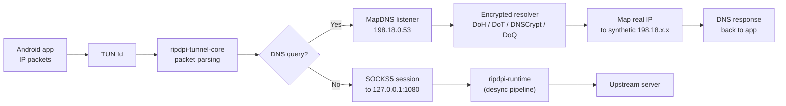
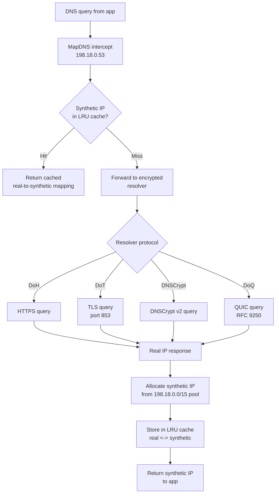

# TUN-to-SOCKS Tunnel

## Role in RIPDPI

The TUN-to-SOCKS tunnel is used only in VPN mode. It takes the Android TUN file descriptor, reads packets from it, and forwards traffic to the local SOCKS5 proxy started by `libripdpi.so`.

When encrypted DNS is enabled, the tunnel also intercepts DNS with a mapped-DNS listener (`198.18.0.53` over the synthetic `198.18.0.0/15` pool), resolves those queries through the shared encrypted resolver, and rewrites follow-up traffic back to the real upstream IPv4 targets before opening SOCKS sessions. The active encrypted DNS path can come from the user's current settings or from a validated remembered VPN policy that replays an exact DoH/DoT/DNSCrypt/DoQ endpoint for the current network.

Supported encrypted DNS protocols: DoH (DNS over HTTPS), DoT (DNS over TLS), DNSCrypt, and DoQ (DNS over QUIC, RFC 9250). DoQ provides 18-22% latency improvement over DoT by combining transport and crypto handshake in a single QUIC round-trip.

The built shared library is `libripdpi-tunnel.so`.

### VPN packet flow

### DNS interception flow

### LRU Eviction Protection for Active Sessions

Active TCP sessions maintain stable synthetic IP mappings by pinning their cache entries against LRU eviction:

- When a TCP session opens (`tcp_accept.rs`), the mapped synthetic IP is pinned in the DNS cache.
- When the session closes (`bridge.rs` on stream completion), the entry is unpinned and becomes eligible for eviction.
- This prevents DoT connections and other long-lived sessions from losing their synthetic IP when the cache fills and evicts older entries.

Implementation:
- `ripdpi-tunnel-core/src/dns_cache/mod.rs` -- pin/unpin API
- `ripdpi-tunnel-core/src/io_loop/tcp_accept.rs` -- pin on session open
- `ripdpi-tunnel-core/src/io_loop/bridge.rs` -- unpin on session close

## App Call Chain

Start path:

`RipDpiVpnService.startTun2Socks()` -> `Tun2SocksTunnel.start(config, tunFd)` -> `jniCreate(configJson)` -> `jniStart(handle, tunFd)` -> native worker thread -> `ripdpi_tunnel_core::run_tunnel()`

Stop path:

`RipDpiVpnService.stopTun2Socks()` -> `Tun2SocksTunnel.stop()` -> `jniStop(handle)` -> `CancellationToken::cancel()` -> worker thread join

Relevant sources:

- `core/service/src/main/kotlin/com/poyka/ripdpi/services/RipDpiVpnService.kt`
- `core/engine/src/main/kotlin/com/poyka/ripdpi/core/Tun2SocksTunnel.kt`
- `native/rust/crates/ripdpi-tunnel-android/src/lib.rs`

## Methods Actually Used

| Method | Defined in | Reached from | Current status | Purpose |
| --- | --- | --- | --- | --- |
| `ripdpi_tunnel_core::run_tunnel` | `native/rust/crates/ripdpi-tunnel-core/src/tunnel_api.rs` | `jniStart(handle, tunFd)` worker thread | Used | Runs the tunnel runtime from the in-memory config and Android TUN fd. |
| `CancellationToken::cancel` | `tokio-util` | `jniStop(handle)` | Used | Requests tunnel shutdown from another thread. |
| `Stats::snapshot` | `native/rust/crates/ripdpi-tunnel-core/src/stats.rs` | `jniGetStats(handle)` | Used | Returns packet and byte counters. |
| tunnel telemetry snapshot assembly | `native/rust/crates/ripdpi-tunnel-android/src/lib.rs` | `jniGetTelemetry(handle)` | Used | Returns tunnel lifecycle, counters, last error, resolver endpoint/latency/fallback fields, and a bounded drained event ring. |

## JNI Surface Exposed to Kotlin

`Tun2SocksTunnel.kt` now exposes a handle-based native contract:

- `jniCreate(configJson)`
- `jniStart(handle, tunFd)`
- `jniStop(handle)`
- `jniGetStats(handle)`
- `jniGetTelemetry(handle)`
- `jniDestroy(handle)`

Compatibility details preserved by the Rust JNI shim:

- `jniStart(handle, tunFd)` still returns `Unit` immediately.
- The Rust bridge owns the worker thread internally, just like the old JNI C layer.
- `jniGetStats(handle)` keeps the array order `[tx_pkt, tx_bytes, rx_pkt, rx_bytes]`, and Kotlin maps it into `TunnelStats`.
- `jniGetTelemetry(handle)` returns a JSON snapshot that Kotlin maps into `NativeRuntimeSnapshot`.

## Runtime Dependencies

The old Android C tunnel stack is gone. The Rust tunnel runtime now builds from in-repo crates and links to:

- `libc.so`
- `libdl.so`
- `libm.so`

The Rust crate graph is centered on:

- `ripdpi-tunnel-core` (includes session and DNS cache as internal modules)
- `tokio`
- `smoltcp`
- `fast-socks5`
- `serde`
- `tokio-util`

## Android-specific Notes

- RIPDPI now starts the tunnel with an in-memory JSON config payload and an already established Android TUN fd.
- The config still points the tunnel to the local SOCKS5 proxy on `127.0.0.1:$port`.
- In encrypted DNS mode the config also enables `mapdns` on `198.18.0.53:53` with a synthetic `198.18.0.0/15` address pool and passes the active encrypted resolver definition into native code.
- `RipDpiVpnService` resolves connection policy before startup and can overlay a remembered VPN-only DNS policy without changing the user's selected app mode.
- Actionable handovers now trigger a full proxy+tunnel restart under the service mutex instead of a DNS-only refresh path, so the SOCKS listener, mapped-DNS resolver, and tunnel are rebound together on the new network.
- `libripdpi-tunnel.so` therefore still depends on `libripdpi.so` already being active.
- `RipDpiVpnService` polls tunnel telemetry while the VPN is running and merges it with proxy telemetry from `libripdpi.so`.

## Passive Tunnel Runtime Telemetry

While the VPN service is running, `Tun2SocksTunnel.telemetry()` calls `jniGetTelemetry(handle)` and receives:

- tunnel state and health
- cumulative session count
- cumulative native error count
- upstream SOCKS5 address
- packet and byte counters mirrored from `Stats::snapshot`
- DNS query counters, cache hits/misses, and DNS failure count
- active resolver id/protocol/endpoint plus last-query latency and rolling average
- resolver fallback active flag and fallback reason when diagnostics or service policy installs a temporary override
- derived network handover class from the Android service layer after callback-driven re-evaluation
- last native error
- a bounded drained event ring

The drained event ring records:
- tunnel start
- explicit stop requests
- clean tunnel stop
- worker errors and worker panic fallback

## Current Test Coverage

The tunnel stack is currently covered by:

- Rust unit, property-based, state-machine, fault-injection, and telemetry-golden tests in `ripdpi-tunnel-android`
- Android instrumentation integration tests for tunnel lifecycle, JNI error paths, and VPN-service restart flows
- local-network Android E2E that exercises VPN mode against the shared fixture stack
- Linux-only privileged real-TUN E2E and TUN soak runs

See [../testing.md](../testing.md) for commands, CI lanes, and soak profiles.
