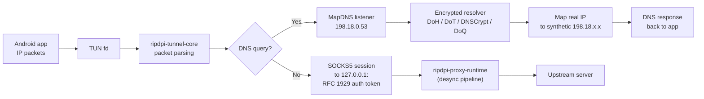
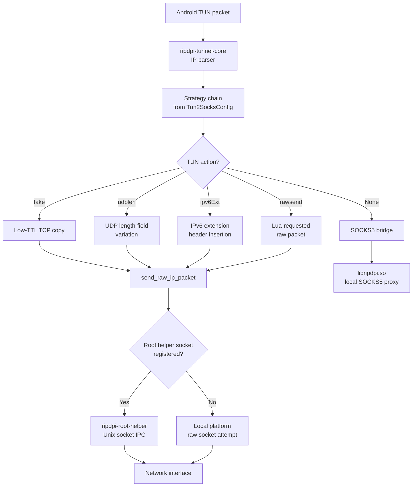
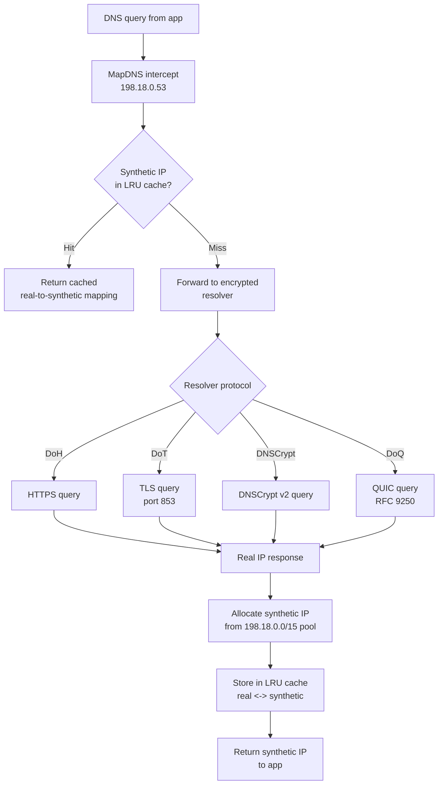

# TUN-to-SOCKS Tunnel

## Role in RIPDPI

The TUN-to-SOCKS tunnel is used only in VPN mode. It takes the Android TUN file descriptor, reads packets from it, and forwards traffic to the local SOCKS5 proxy started by `libripdpi.so`.

When encrypted DNS is enabled, the tunnel also intercepts DNS with a mapped-DNS listener (`198.18.0.53` over the synthetic `198.18.0.0/15` pool), resolves those queries through the shared encrypted resolver, and rewrites follow-up traffic back to the real upstream IPv4 targets before opening SOCKS sessions. The active encrypted DNS path can come from the user's current settings or from a validated remembered VPN policy that replays an exact DoH/DoT/DNSCrypt/DoQ endpoint for the current network.

Supported encrypted DNS protocols: DoH (DNS over HTTPS), DoT (DNS over TLS), DNSCrypt, and DoQ (DNS over QUIC, RFC 9250). DoQ can reduce connection-setup latency versus DoT by folding the transport and crypto handshake into a single QUIC round-trip (an RFC 9250 design property); RIPDPI ships no benchmark substantiating a specific percentage. DoQ is unavailable when the encrypted resolver runs over the SOCKS5 transport (SOCKS5 is TCP-only) — only the Direct/VPN transport reaches the DoQ engine.

The built shared library is `libripdpi-tunnel.so`.

### VPN packet flow


```mermaid
flowchart LR
    A["Android app\nIP packets"] --> B["TUN fd"]
    B --> C["ripdpi-tunnel-core\npacket parsing"]
    C --> D{"DNS query?"}
    D -- Yes --> E["MapDNS listener\n198.18.0.53"]
    D -- No --> F["SOCKS5 session\nto 127.0.0.1:<ephemeral port>\nRFC 1929 auth token"]
    E --> G["Encrypted resolver\nDoH / DoT / DNSCrypt / DoQ"]
    G --> H["Map real IP\nto synthetic 198.18.x.x"]
    H --> I["DNS response\nback to app"]
    F --> J["ripdpi-proxy-runtime\n(desync pipeline)"]
    J --> K["Upstream server"]
```

### TUN egress packet strategies

VPN mode can apply packet strategies before a packet is bridged to the local SOCKS5 session. These actions may emit an additional raw packet while the original flow continues through the ordinary tunnel path.


```mermaid
flowchart TD
    A["Android TUN packet"] --> B["ripdpi-tunnel-core\nIP parser"]
    B --> C["Strategy chain\nfrom Tun2SocksConfig"]
    C --> D{"TUN action?"}
    D -- None --> E["SOCKS5 bridge"]
    D -- fake --> F["Low-TTL TCP copy"]
    D -- udplen --> G["UDP length-field\nvariation"]
    D -- ipv6Ext --> H["IPv6 extension\nheader insertion"]
    D -- rawsend --> I["Lua-requested\nraw packet"]
    F & G & H & I --> J["send_raw_ip_packet"]
    J --> K{"Root helper socket\nregistered?"}
    K -- Yes --> L["ripdpi-root-helper\nUnix socket IPC"]
    K -- No --> M["Local platform\nraw socket attempt"]
    L & M --> N["Network interface"]
    E --> O["libripdpi.so\nlocal SOCKS5 proxy"]
```

The privileged raw-packet path is passed to native code as `rootHelperSocketPath` in `Tun2SocksConfig`. `RipDpiVpnService` only sets that field after `RootHelperManager` has started the helper and confirmed that the Unix socket accepts connections.

See [../packet-strategy-runtime.md](../packet-strategy-runtime.md) for the action matrix and root-helper lifecycle diagram.

### DNS interception flow


```mermaid
flowchart TD
    A["DNS query from app"] --> B["MapDNS intercept\n198.18.0.53"]
    B --> C{"Synthetic IP\nin LRU cache?"}
    C -- Hit --> D["Return cached\nreal-to-synthetic mapping"]
    C -- Miss --> E["Forward to encrypted\nresolver"]
    E --> F{"Resolver protocol"}
    F -- DoH --> G["HTTPS query"]
    F -- DoT --> H["TLS query\nport 853"]
    F -- DNSCrypt --> I["DNSCrypt v2 query"]
    F -- DoQ --> J["QUIC query\nRFC 9250"]
    G & H & I & J --> K["Real IP response"]
    K --> L["Allocate synthetic IP\nfrom 198.18.0.0/15 pool"]
    L --> M["Store in LRU cache\nreal <-> synthetic"]
    M --> N["Return synthetic IP\nto app"]
```

### LRU Eviction Protection for Active Sessions

Active TCP sessions maintain stable synthetic IP mappings by pinning their cache entries against LRU eviction:

- When a TCP session opens (`tcp_accept.rs`), the mapped synthetic IP is pinned in the DNS cache.
- When the session closes (`bridge.rs` on stream completion), the entry is unpinned and becomes eligible for eviction.
- This prevents DoT connections and other long-lived sessions from losing their synthetic IP when the cache fills and evicts older entries.

Implementation:
- `ripdpi-tunnel-core/src/dns_cache/mod.rs` -- pin/unpin API
- `ripdpi-tunnel-core/src/io_loop/tcp_accept.rs` -- pin on session open
- `ripdpi-tunnel-core/src/io_loop/bridge.rs` -- unpin on session close

## App Call Chain

Start path:

`RipDpiVpnService.startTun2Socks()` -> `Tun2SocksTunnel.start(config, tunFd)` -> `jniCreate(configJson)` -> `jniStart(handle, tunFd)` -> native worker thread -> `ripdpi_tunnel_core::run_tunnel()`

Stop path:

`RipDpiVpnService.stopTun2Socks()` -> `Tun2SocksTunnel.stop()` -> `jniStop(handle)` -> `CancellationToken::cancel()` -> worker thread join

Relevant sources:

- `core/service/src/main/kotlin/com/poyka/ripdpi/services/RipDpiVpnService.kt`
- `core/engine/src/main/kotlin/com/poyka/ripdpi/core/Tun2SocksTunnel.kt`
- `native/rust/crates/ripdpi-tunnel-android/src/lib.rs`

## TUN file descriptor lifecycle

The TUN fd travels through two independent ownership tiers that must never alias.

**Tier 1 — Kotlin / original ParcelFileDescriptor (unchanged across all paths)**

`VpnService.Builder.establish()` returns a `ParcelFileDescriptor` wrapped in `ParcelFileDescriptorVpnTunnelSession`. The property `tunFd` returns `descriptor.fd` — a `.fd()` peek, NOT `detachFd()`. Kotlin retains full ownership of the original fd. `VpnTunnelRuntime` closes it exactly once:

- Error unwind (tunnelBridge.start() throws before `tunSession` is assigned): catch block calls `tunnelSession.close()`.
- Normal stop, cancel, handover-restart: `VpnTunnelRuntime.stop()` finally block calls `session.close()` and immediately nulls `tunSession`. The null-guard prevents any second close.

**Tier 2 — Rust / dup (one dup per session, independent fd number)**

The native side never calls `detachFd()`. `adopt_tun_fd` in `session/lifecycle/fd.rs` issues an atomic dup with `O_CLOEXEC` via `fcntl(F_DUPFD_CLOEXEC(0))`, returning `OwnedFd`. The dup has a completely independent kernel fd number from the original.

Required Kotlin API at the call site: `.fd()` peek (NOT `detachFd()`). If `detachFd()` were used instead, Kotlin would lose close responsibility for the original `ParcelFileDescriptor` and `VpnTunnelSession.close()` would become a no-op, silently leaking the fd on all error paths in `VpnTunnelRuntime.start()`.

**Ownership chain for the dup:**

```
adopt_tun_fd() → OwnedFd (RAII live)
  → WorkerLaunch.owned_fd: OwnedFd (RAII live through thread spawn)
    → run_tunnel(tun_fd: OwnedFd)
        let raw = tun_fd.into_raw_fd();   // RAII disarmed; raw lives in async frame
        let tun_async = AsyncDevice::from_fd(raw)?;  // tun-rs Fd{borrow:false} takes ownership
          → tun_async dropped at run_tunnel return → tun-rs Fd::Drop → libc::close(raw)
```

**Failure modes and close responsibility:**

| Failure point | Who closes the dup |
|---|---|
| `fstat` validation fails in `adopt_tun_fd` | `OwnedFd` drop in `adopt_tun_fd` |
| `ensure_tunnel_start_allowed` fails | explicit `drop(owned_fd)` at lifecycle.rs line 55 |
| thread spawn fails in `launch_tunnel_worker` | `WorkerLaunch` drop at the Err arm in lifecycle.rs |
| `AsyncDevice::from_fd` fails inside `run_tunnel` | tun-rs `Fd{borrow:false}` drop inside `DeviceImpl::from_fd` before Err propagates |
| Route setup (`add_default_ipv4/ipv6_route`) fails | `tun_async` (AsyncDevice) drop at run_tunnel return |
| `CancellationToken::cancel()` (normal stop or cancel path) | `tun_async` drop after io_loop_task returns `WaitOutcome::Cancelled` |
| Panic inside `catch_unwind` in worker.rs | async future drop during panic unwind drops `tun_async` → Fd::Drop |

**O_CLOEXEC requirement:** The dup is issued with `O_CLOEXEC` (via `F_DUPFD_CLOEXEC`). `root_helper::register_for_worker` in `worker.rs` may spawn a child process immediately after the dup is created and before `AsyncDevice::from_fd` registers the fd with the tokio reactor. Without `O_CLOEXEC`, the child inherits the TUN fd, which remains open in the child process after `run_tunnel` returns and the parent closes its copy.

**IoUringTunContext note:** `io_loop.rs` defines `IoUringTunContext.tun_fd: OwnedFd` (pub(crate)) for a future batch-write path. This field must be a SEPARATE dup from the fd passed to `run_tunnel`. Never pass the same raw fd number to both; each `OwnedFd` calls `libc::close` independently on drop. This field is `pub(crate)` until the io_uring path is fully wired and audited.

**Consistency with the proxy/pcap fd contract:** The pcap path in `session/pcap.rs` uses `ParcelFileDescriptor.detachFd()` (Kotlin surrenders ownership) + immediate `OwnedFd::from_raw_fd` wrap (Rust takes sole ownership, no dup). The TUN path uses `.fd()` peek (Kotlin retains ownership) + atomic dup-with-CLOEXEC (Rust owns an independent fd). Both patterns share the same invariant: from the moment native code receives a raw fd integer, it is wrapped in an RAII owner before any code path (including panic and early return) can exit without closing it.

## Methods Actually Used

| Method | Defined in | Reached from | Current status | Purpose |
| --- | --- | --- | --- | --- |
| `ripdpi_tunnel_core::run_tunnel` | `native/rust/crates/ripdpi-tunnel-core/src/tunnel_api.rs` | `jniStart(handle, tunFd)` worker thread | Used | Runs the tunnel runtime from the in-memory config and Android TUN fd. |
| `CancellationToken::cancel` | `tokio-util` | `jniStop(handle)` | Used | Requests tunnel shutdown from another thread. |
| `Stats::snapshot` | `native/rust/crates/ripdpi-tunnel-core/src/stats.rs` | `jniGetStats(handle)` | Used | Returns packet and byte counters. |
| tunnel telemetry snapshot assembly | `native/rust/crates/ripdpi-tunnel-android/src/lib.rs` | `jniGetTelemetry(handle)` | Used | Returns tunnel lifecycle, counters, last error, resolver endpoint/latency/fallback fields, and a bounded drained event ring. |
| raw packet emission | `native/rust/crates/ripdpi-runtime-platform/src/experimental.rs` | TUN-egress `fake`, `udplen`, `ipv6Ext`, and Lua `rawsend` actions | Used when action applies | Sends crafted IPv4/IPv6 packets through the registered root-helper socket when available. |

## JNI Surface Exposed to Kotlin

`Tun2SocksTunnel.kt` now exposes a handle-based native contract:

- `jniCreate(configJson)`
- `jniStart(handle, tunFd)`
- `jniStop(handle)`
- `jniGetStats(handle)`
- `jniGetTelemetry(handle)`
- `jniDestroy(handle)`

Compatibility details preserved by the Rust JNI shim:

- `jniStart(handle, tunFd)` still returns `Unit` immediately.
- The Rust bridge owns the worker thread internally.
- `jniGetStats(handle)` keeps the array order `[tx_pkt, tx_bytes, rx_pkt, rx_bytes]`, and Kotlin maps it into `TunnelStats`.
- `jniGetTelemetry(handle)` returns a JSON snapshot that Kotlin maps into `NativeRuntimeSnapshot`.

## Runtime Dependencies

The Rust tunnel runtime builds from in-repo crates and links to:

- `libc.so`
- `libdl.so`
- `libm.so`

The Rust crate graph is centered on:

- `ripdpi-tunnel-core` (includes session and DNS cache as internal modules)
- `tokio`
- `smoltcp`
- `ripdpi-socks5-core` (vendored from `fast-socks5` upstream)
- `serde`
- `tokio-util`

## Android-specific Notes

- RIPDPI now starts the tunnel with an in-memory JSON config payload and an already established Android TUN fd.
- The config points the tunnel to the session-local SOCKS5 proxy endpoint on `127.0.0.1:$port`, where `$port` is the telemetry-resolved ephemeral bind selected by the active proxy session.
- VPN-mode tunnel sessions also use the per-session localhost auth token that the proxy runtime rotates on first start and on full handover restarts.
- In encrypted DNS mode the config also enables `mapdns` on `198.18.0.53:53` with a synthetic `198.18.0.0/15` address pool and passes the active encrypted resolver definition into native code.
- `RipDpiVpnService` resolves connection policy before startup and can overlay a remembered VPN-only DNS policy without changing the user's selected app mode.
- Actionable handovers now trigger a full proxy+tunnel restart under the service mutex instead of a DNS-only refresh path, so the SOCKS listener, mapped-DNS resolver, and tunnel are rebound together on the new network.
- `libripdpi-tunnel.so` therefore still depends on `libripdpi.so` already being active.
- `RipDpiVpnService` polls tunnel telemetry while the VPN is running and merges it with proxy telemetry from `libripdpi.so`.

## Passive Tunnel Runtime Telemetry

While the VPN service is running, `Tun2SocksTunnel.telemetry()` calls `jniGetTelemetry(handle)` and receives:

- tunnel state and health
- cumulative session count
- cumulative native error count
- upstream SOCKS5 address
- packet and byte counters mirrored from `Stats::snapshot`
- DNS query counters, cache hits/misses, and DNS failure count
- active resolver id/protocol/endpoint plus last-query latency and rolling average
- resolver fallback active flag and fallback reason when diagnostics or service policy installs a temporary override
- derived network handover class from the Android service layer after callback-driven re-evaluation
- last native error
- a bounded drained event ring

The drained event ring records:
- tunnel start
- explicit stop requests
- clean tunnel stop
- worker errors and worker panic fallback

## Current Test Coverage

The tunnel stack is currently covered by:

- Rust unit, property-based, state-machine, fault-injection, and telemetry-golden tests in `ripdpi-tunnel-android`
- Android instrumentation integration tests for tunnel lifecycle, JNI error paths, and VPN-service restart flows
- local-network Android E2E that exercises VPN mode against the shared fixture stack
- Linux-only privileged real-TUN E2E in `ripdpi-tunnel-core --test linux_tun_e2e` (requires `RIPDPI_RUN_TUN_E2E=1` and `CAP_NET_ADMIN`); a `linux_tun_soak` target is registered at `tests/linux_tun_e2e.rs` and includes a 10-cycle fd-leak test (`real_tun_no_fd_leak_after_stop`) and a 50-iteration start/stop/handover soak (`real_tun_soak_start_stop_handover`, additionally requires `RIPDPI_RUN_SOAK=1`)

See [../testing.md](../testing.md) for commands, CI lanes, and soak profiles.
