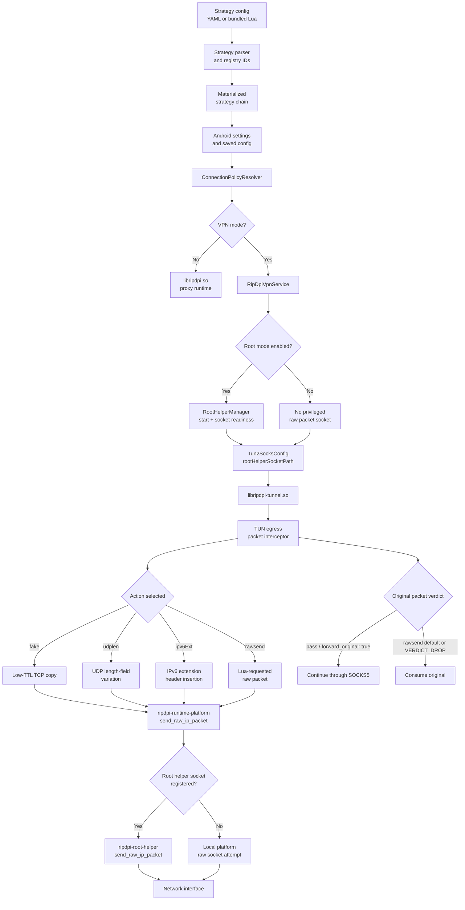
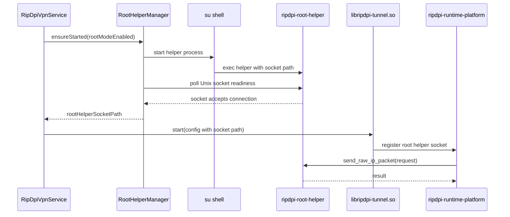
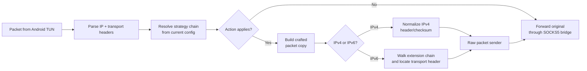

# Packet Strategy Runtime

This document describes the packet-strategy runtime added around the Android VPN path. It covers how saved strategy configs, Lua scripts, TUN-egress packet actions, and the optional root helper cooperate during a running VPN session.

The runtime is local to the device. Strategy configs are parsed by in-repository Rust crates, carried through the Kotlin service layer, and applied by the native tunnel before sessions leave the app process.

## Implemented Surface

The runtime now supports these packet actions in strategy configs:

| Action | Where it runs | Root helper use | Notes |
| --- | --- | --- | --- |
| `fake` | Proxy runtime and VPN TUN egress | Optional for raw packet emission | Can emit a low-TTL TCP copy while the original flow continues through the normal path. |
| `udplen` | VPN TUN egress | Required for raw packet emission on Android | Builds a UDP packet whose length field is larger than the carried payload, then sends the crafted IPv4 packet through the raw-packet path. |
| `ipv6Ext` | VPN TUN egress | Required for raw packet emission on Android | Inserts IPv6 extension headers before the transport header, reparses the extension chain, and sends the crafted IPv6 packet through the raw-packet path. |
| Lua `rawsend` | VPN TUN egress | Required for raw packet emission on Android | Lets a parsed Lua strategy request an explicit raw IPv4 or IPv6 packet send. |

The same registry IDs are accepted by YAML strategy configs and by the app's saved strategy-config workflow. Saved configs can be imported, validated, stored, exported, and applied to the next active service start.

## Runtime Flow



## Root Helper Lifecycle

The root helper is opt-in and only starts when root mode is enabled. The service waits for a connectable Unix socket before publishing the path to native code, so the tunnel does not start with a stale helper path.



Shutdown is bounded. The manager asks the helper to stop, waits briefly, and force-kills only when the process does not exit. On AOSP/userdebug devices, startup tries the normal `su -c` form first and then the `su 0 sh -c` form used by `adb root` style shells.

## TUN Egress Actions

TUN-egress actions run before the original packet is bridged to the local SOCKS5
session. Lua `rawsend` consumes the original packet by default. Set
`forward_original: true` to treat the injected packet as a sidecar; an explicit
`VERDICT_DROP` always consumes the original.



For IPv6 extension-header actions, the tunnel reparses the resulting extension chain after insertion. This keeps destination-port extraction aligned with the packet that is actually emitted.

## Verification

The implemented path was verified on a rooted Android API 34 emulator with rebuilt native artifacts and a pushed `ripdpi-root-helper` binary. Captured egress showed:

- low-TTL TCP fake copy with marker payload
- UDP packet with a larger UDP length field than carried payload
- IPv6 packet with destination-options extension header
- Lua-style raw packet emission with marker payload

Relevant local checks for future changes:

```bash
./gradlew :core:engine:testDebugUnitTest :core:service:testDebugUnitTest -Pripdpi.skipNativeBuild=true
cargo test --manifest-path native/rust/Cargo.toml -p ripdpi-tunnel-core -p ripdpi-root-helper
```

Use the full native build and emulator proof path when changing raw packet construction, root-helper IPC, or TUN packet parsing.
